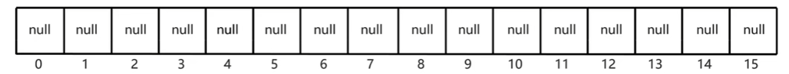
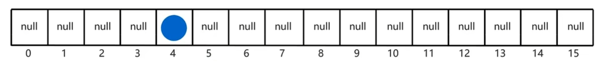
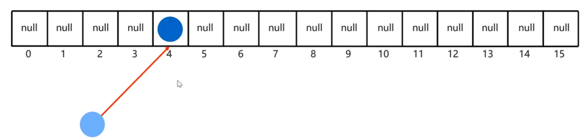
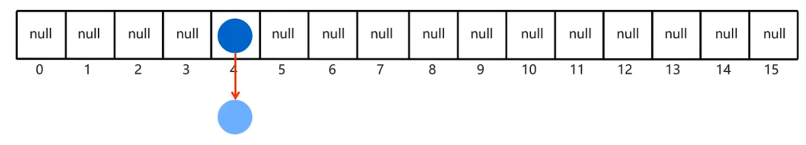
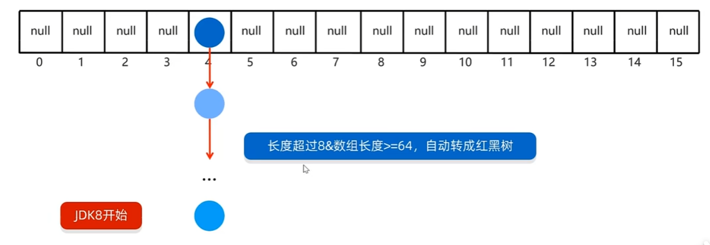

# 底层原理

`HashMap`底层使用哈希表结构，在JDK8以后，哈希表=数组+链表+红黑树。

所以在`HashMap`底层会有一个数组，默认长度为16：

当`Map`中添加一对键值对时，它会将键值对封装为一个`Entry`。

而在计算索引位置的时候，是用键来计算，跟值无关。

假设，第一个`Entry`计算的索引位置是4：

4号位没有元素，所以直接存入。然后，新添加元素，它的索引位置也是4：

4号位上有元素，所以会调用`equals()`进行比较，如果返回`true`表示内容一致，则不存，反之则存入。

在8之前，存入方法为头插法，在8之后，存入方法为尾插法：

而某个位置的节点超过了阈值：

那么会根据数组长度进行判断，如果长度<64，则扩容数组，如果>=64，将链表转换为红黑树。