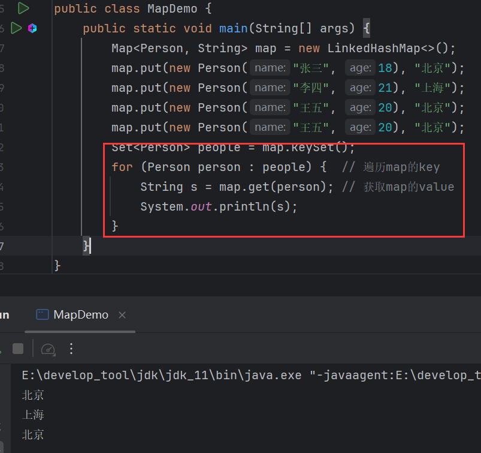
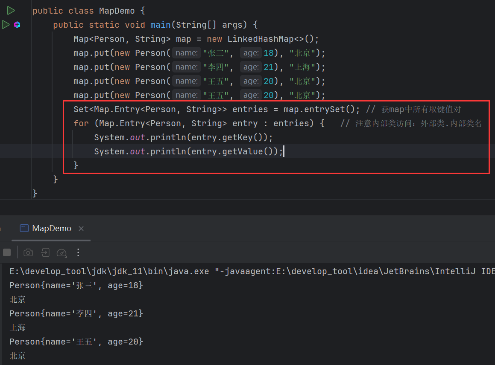
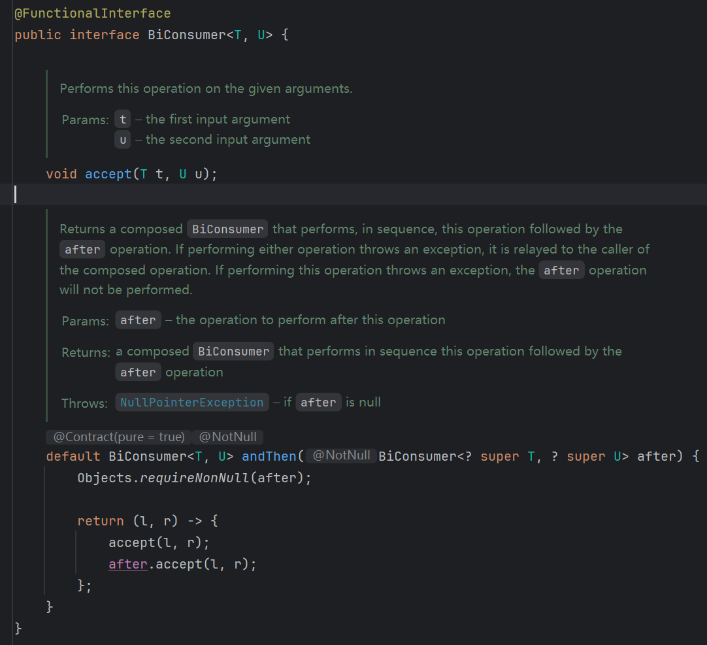
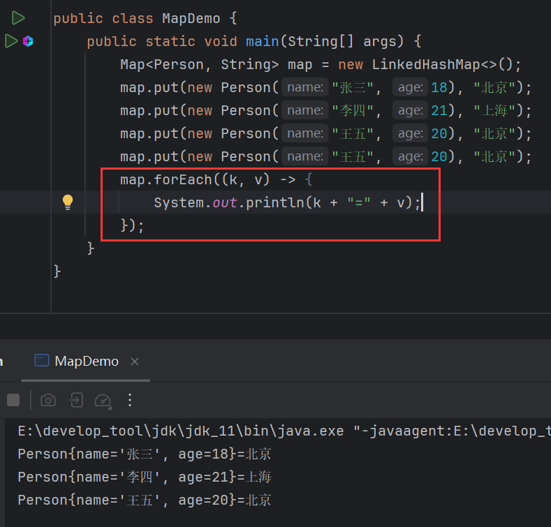
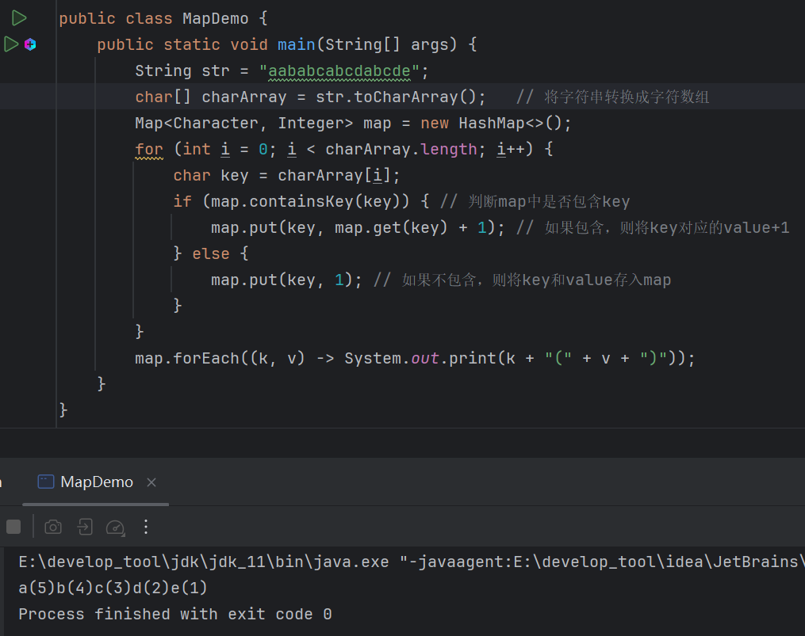
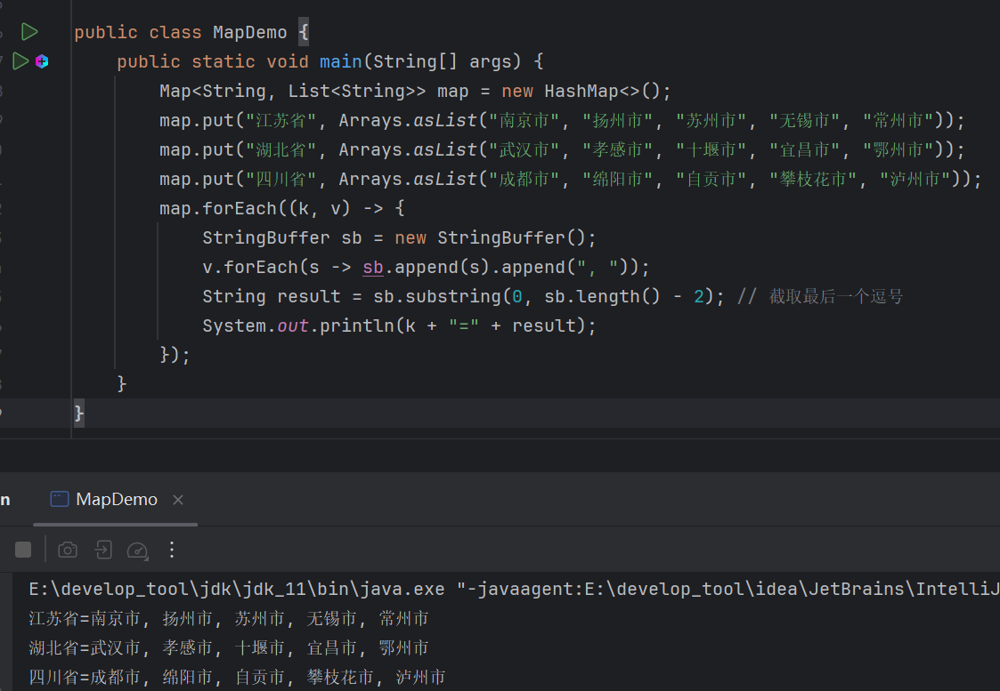

# Map遍历

> 1. 通过键找值。
> 2. 通过键值对对象获取键和值。
> 3. 通过`foreach()`方法遍历。


# 键找值遍历

## get()

```java
v get(Object Key);
```

> `Map`接口的抽象方法，通过键获取对应值。

## keySet()

```java
Set<K> KeySet();
```

> `Map`接口的抽象方法，返回`Map`中的所有键。

键找值遍历方法，就是通过`get()`和`KeySet()`搭配使用：




# Entry遍历

通过键值对对象来遍历，所谓键值对对象就是将就键和值封装为一个对象`Entry`。

`Entry`是`Map`中的内部接口。

`Entry`的方法：

| 方法       | 说明   |
| ---------- | ------ |
| getKey()   | 获取键 |
| getValue() | 获取值 |

## entrySet()

```java
Set<Entry<K, V>> entrySet();
```

> `Map`接口的抽象方法，返回`Map`中的所有键值对。

`entrySet()`结合`getKey()`和`getValue()`就能完成遍历：




# forEach()遍历

```java
default void forEach(BiConsumer<? super K, ? super V> action){};
```

> `Map`接口中的默认方法，遍历`Map`，传入`BiConsumer`。

`BiConsumer`是一个函数式接口：



接收两个泛型，在此情景下，第一个为键，第二个为值：




# 练习

1、字符串"aababcabcdabcde"，请统计字符串中每一个字符出现的次数，并按照以下格式输出输出结果:

```java
a(5)b(4)c( 3)d(2)e(1)
```



次数的修改，是利用相同键会覆盖的特性。

2、定义一个Map集合，键用表示省份名称，值表示市，但是市会有多个。

添加完毕后，遍历结果，格式如下：
```java
江苏省=南京市, 扬州市, 苏州市, 无锡市, 常州市
湖北省=武汉市, 孝感市, 十堰市, 宜昌市, 鄂州市
四川省=成都市, 绵阳市, 自贡市, 攀枝花市, 泸州市
```

