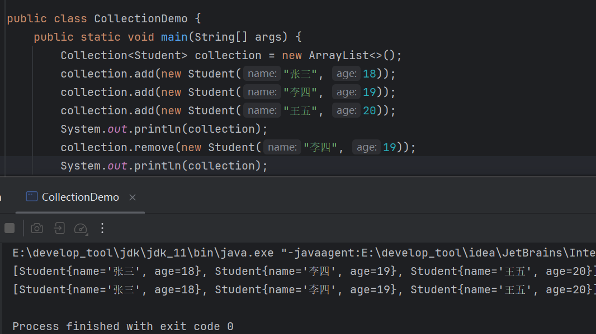
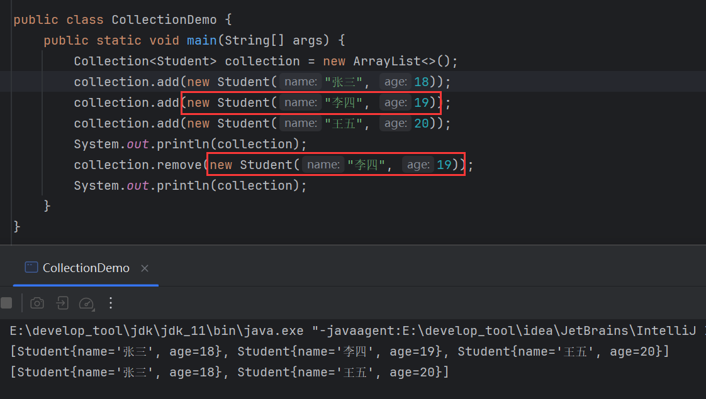

# Collection

> 所有单列集合都实现了`Collection`接口。


# Collection的方法

所有单列集合都实现了`Collection`接口，这些方法也是单列集合共同的方法。

## 创建Collection

`Collection`是一个接口，需要用多态。


## add()

```java
public boolean add(E e){};
```

> 把给定的对象添加到当前集合中，添加成功返回`true`，反之返回`false`。


## clear()

```java
public void clear(){};
```

> 清空集合中所有的元素。


## isEmpty()

```java
public boolean isEmpty(){};
```

> 判断当前集合是否为空。


## remove()

```java
public boolean remove(E e){};
```

> 把给定的对象在当前集合中删除，删除成功返回`true`，反之返回`false`


删除不存在的元素会失败：


删除重复元素，按元素添加顺序删除第一个：


## 

```java
public boolean contains(object obj){};
```

> 判断当前集合中是否包含给定的对象。


## size()

```java
public int size(){};
```

> 返回集合中元素的个数/集合的长度。


## 细节

> `remove()`和`contains()`操作元素依赖于元素对象底层重写`equals()`。

添加自定义对象：


删除元素：



发现没有删除，原因是因为删除的元素地址值不同：


改为相同地址值即可删除：


另一种方法，不比较地址值，而是比较内容，那么重写`equals()`：




`contains()`也一样，只要重写了`equals()`，那么判断的就是内容：

