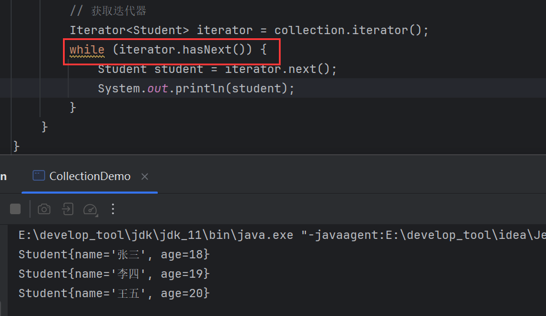
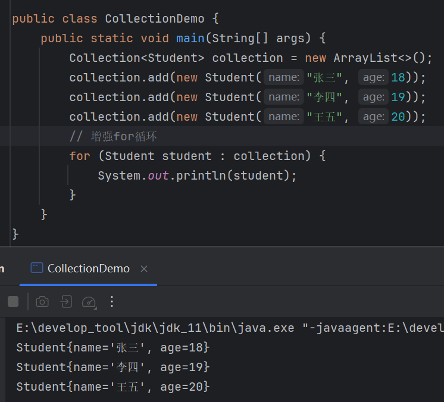

# 集合通用遍历方式

## fori循环的局限

> fori循环不能对无索引集合进行遍历，比如`Set`。

集合的通用遍历方式3种：

1. 迭代器
2. 增强for循环
3. `forEach()`


# 迭代器遍历

迭代器遍历的步骤：

1. 获取迭代器
2. 通过`hasNext()`循环判断是否还有元素
3. 通过`next()`获取元素

## 获取迭代器

`Collection`的方法：

```java
public Iterator<E> iterator(){};
```

> 返回在此`Collection`的元素上进行迭代的迭代器。`Iterator`是一个迭代器接口，该方法返回的是`Iterator`实现类对象。


## next()

```java
public E next(){};
```

> 迭代器中的方法，返回迭代的下一个元素。
>
> **注意**：`next()`会移动迭代器内部的指针到下一个元素。


每调用一次，就取出一个元素：


迭代完后再次调用就会报错：


根据它没有元素迭代会报异常的特性，可以用`while`和`try...catch`优化：


## hasNext()

```java
public boolean hasNext(){};
```

> 如果仍有元素可以迭代返回`true`，反之返回`false`。


将`hasNext()`与`next()`结合：



### 细节

`hasNext()`只检查当前指针位置是否还有元素，但不会移动指针位置，而`next()`才会移动迭代器的指针到下一个元素。

所以，如果在调用 `hasNext()` 后不调用 `next()`，指针就不会移动，`hasNext()` 的结果也不会改变。只有调用了 `next()` 后，指针才会移动，接下来调用 `hasNext()` 时才会检查新位置的元素。


在源码中：


`Itr`是迭代器的实现类，其中`cursor`是指针，默认值为0，也就是指到第一个元素。`hasNext()`就是拿着当前的`cursor`去与集合长度`size`比较，如果不相等，那么还有可迭代元素，反之则没有可迭代元素，而控制`cursor`增加的正是`next()`，它在每一次取出元素之前，都会先让`cursor`+1，这也是为什么`next()`会让指针指到下一个元素。

### 注意

在循环中尽量只调用一次`next()`，因为`next()`会移动指针，如果调用多次的话，那么就不是同一个元素：


第一个`next()`获取的是"张三"，而第二个获取的年龄不是18，而是19。因为指针移动，取到的是第二个学生。当循环继续，到没有元素时就会报错，所以最好用一个变量去接收：


# 增强for循环

> 增强for循环是为了简化迭代器遍历的书写，从JDK5之后出现的，**内部原理还是迭代器**，可以看作是迭代器遍历的语法糖。

语法：

```java
for(元素数据类型 变量 : 数组或集合){
    
}
```



增强for循环编译后的字节码文件：


可以看到底层还是迭代器。


# forEach()

该方法来自单列集合的跟接口`Collection`。

```java
default void forEach(consumer<? super I> action){};
```

> 遍历集合。`Collection`中的默认方法，接收一个函数式接口`consumer`，用于指定每一次遍历后元素的行为。

源码如下：

```java
default void forEach(Consumer<? super T> action) {
    Objects.requireNonNull(action);
    for (T t : this) {
        action.accept(t);
    }
}
```

可以看到，底层使用的是增强for循环，只不过用函数式接口包装了一下，让开发者自己来定义遍历出的元素具体行为。

`Consumer`是一个函数式接口：


因此调用`forEach()`可以传入匿名内部类或者`Lambda`：

