# List\<E>

> `Collection`子接口。

## 特点

1. 存取有序
2. 有索引
3. 可以存入重复值。

通过其实现类`ArrayList`创建`List`：

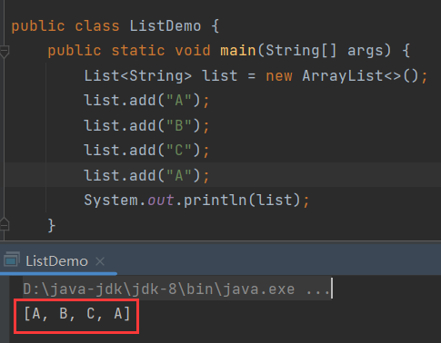

## add()

```java
public void add(int index, E element){};
```

> 在指定索引位置插入元素。

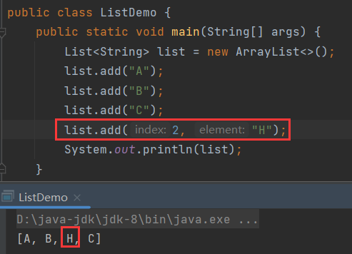

## remove()

```java
public E remove(int index){};
```

> 根据索引删除集合中的元素，返回被删除的元素。

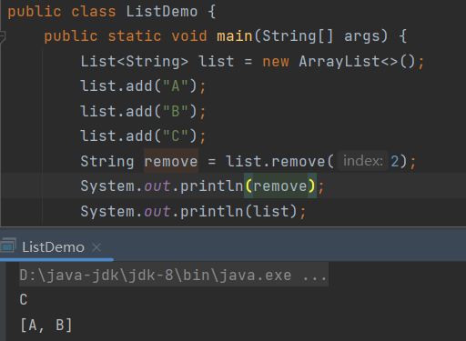

### 细节

在操作整数类集合时需要注意：

`remove()`有两种：

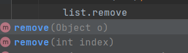

`remove(Object o)`是根据元素删除，而`remove(int index)`是根据索引删除。如果这个集合的泛型是`Integer`，那么在删除时会存在歧义。

比如，当前的集合存储为：


根据元素删除222：

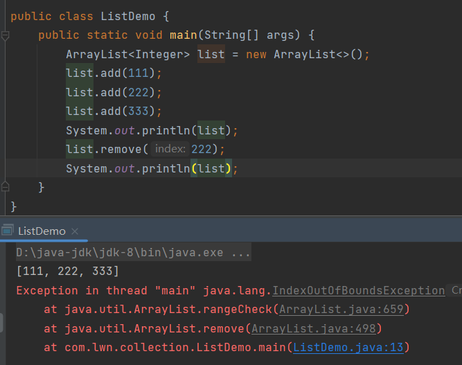

报错，下标越界。这是因为传入的222被当成了调用`remove(int index)`，即根据222索引删除元素，当前集合没有222索引，自然报错。因此如果要调用`remove(Object o)`，那么就需要将222包装成对象，在这个过程中不存在自动装箱，否则就不会调用`remove(int index)`了，因此需要手动装箱：

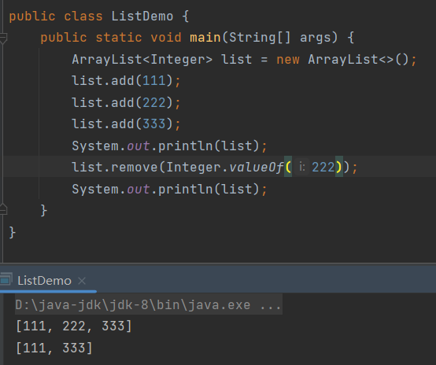

## set()

```java
public E set(int index, E element){};
```

> 修改指定索引位置的元素，返回修改前的元素。

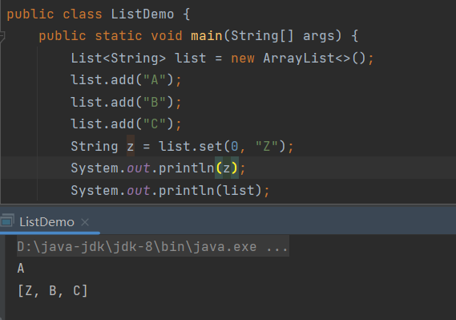

## get()

```java
public E get(int index){};
```

> 返回指定索引位置的元素。

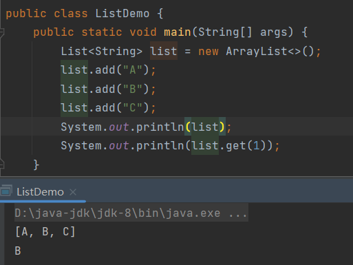


# List的遍历

在集合传统遍历基础上增加了两种遍历方式：

1. 迭代器
2. 增强for循环
3. `forEach()`
4. for循环
5. `ListIterator`\(`List`特有的迭代器)

## ListIterator

> `ListIterator`是`List`特有的迭代器，只能操作`List`，`ListIterator\<E>`是一个接口。

### listIterator()

```java
public ListIterator listIterator(){};
```

> 获取`ListIterator`。

遍历：

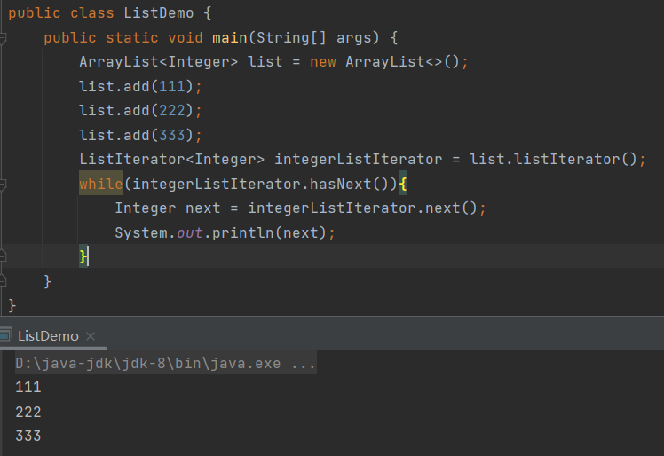

`ListIterator`比普通迭代器多了一些特殊的方法。

### hasPrevious()

```java
public boolean hasPrevious(){};
```

> 逆向检测是否还有可迭代元素。

简单来说，就是从集合的尾部开始倒序判断是否还有元素。

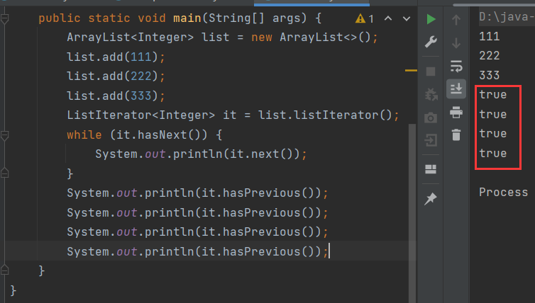

### previous()

```java
public E previous(){};
```

> 反向取出下一个元素，指针向前移动。

与`next()`一样是取出元素和移动指针，不过`previous()`是反向取出元素，指针也是反向移动。

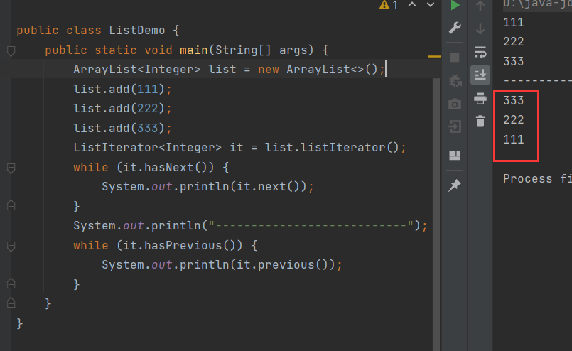

#### 细节

在使用逆向迭代的时候，需要先让指针往后移动。这很好理解，因为逆向迭代是倒序遍历，如果当前指针指向第一个元素，第一个元素的前面是没有元素的，那么如何取出第一个元素前面的元素呢？

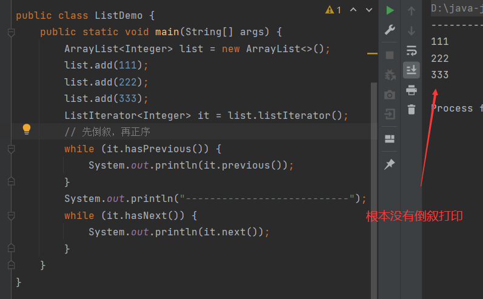

图解：

先正序让指针后移：

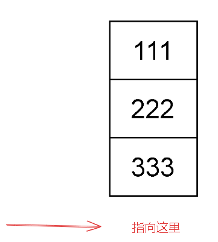

再倒叙，才能取到前面的元素：

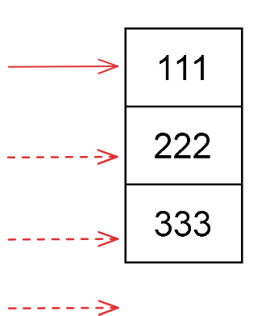

如果一开始就倒叙，不能取出第一个元素之前的元素，因为第一个元素之前都没有元素：

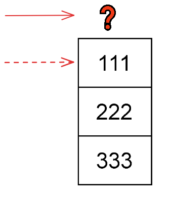

## 并发修改异常

> 在迭代器迭代的过程中，如果**集合对元素**进行增加或删除的操作，那么就会抛出**并发修改异常**：`ConcurrentModificationException`。

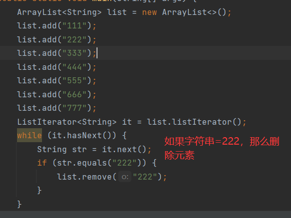

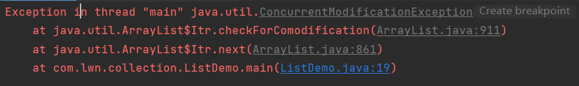

这是因为集合设计者担心开发人员在遍历的过程中增加或删除元素，会造成与原始集合数据不一致问题，进而造成迭代错误，为了避免这个情况发生于是设计了这个异常。

这里的关键点时用**集合来增加和删除对象**才会抛出这个错误，如果一定要在遍历时对集合增加或删除，那么可以使用迭代器提供的增加或删除方法，

### remove()

```java
public abstract void remove(){};
```

> 迭代器的删除方法，不会造成**并发修改异常**。

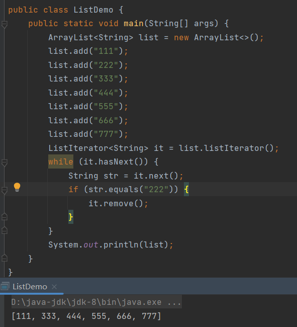

### add()

```java
public abstract void add(E e){};
```

> `ListIterator`迭代器的添加方法，不会造成**并发修改异常**。
>
> **注意**：普通迭代器没有`add()`。

普通的迭代器没有`add()`：

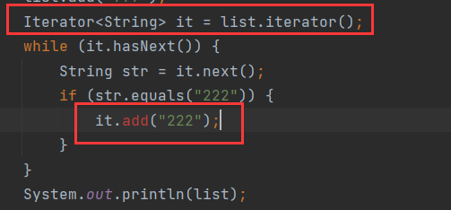

只有`ListIterator`迭代器才有`add()`：

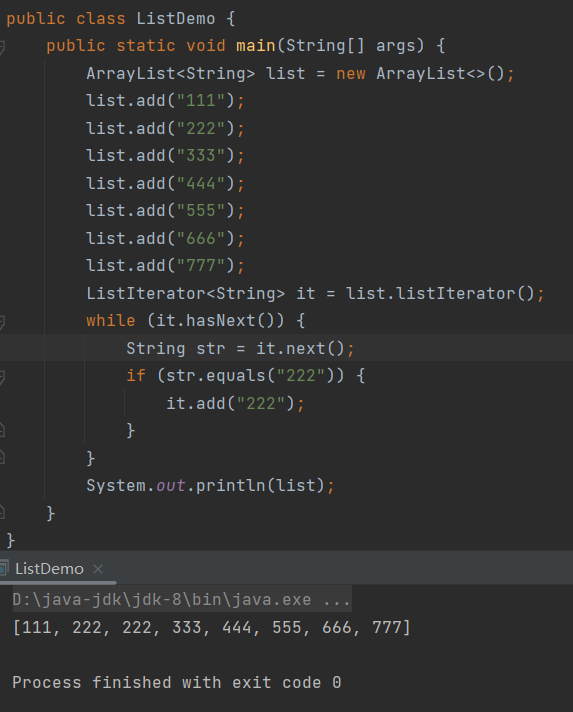

### 注意

如果用集合删除倒数第二个元素，那么不会抛出`ConcurrentModificationException`：

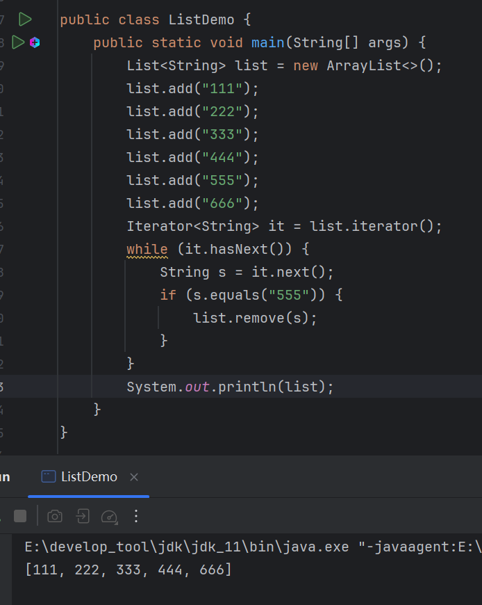

这个异常实际上是由`next()`抛出的，在`ArrayList`中：

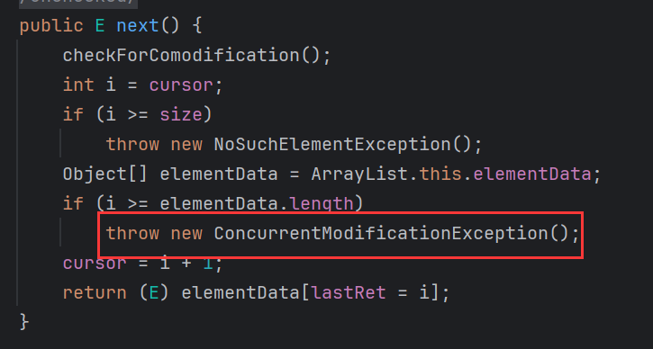

同时它调用的`checkForComodification()`也在抛出这个异常：

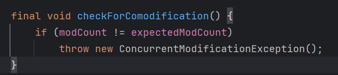

`checkForComodification()`中比较了`modCount`和`expectedModCount`的值，`modCount`表示集合被修改的次数，每次对集合进行结构性修改(添加/删除)时，`modCount` 的值都会增加。

当创建一个迭代器时，会保存当前 `modCount` 的值到 `expectedModCount` 中。所以在迭代的过程中如果通过集合来删除和增加元素，都会增加 `modCount` 的值，这样`modCount` 就不等于 `expectedModCount` ，因此会抛出异常。

而删除倒数第二个元素没有抛出异常，是因为没有触发调用`next()`，即使元素已经被删除了，但是由于`next()`没有执行，那么就不会执行`checkForComodification()`，相应的也就不会抛出异常。

为什么删除倒数第二个元素时，没有触发调用`next()`？

图解：

一开始，指针指向第一个元素：

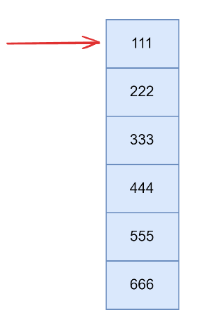

判断当前指针位有元素，进入循环，先移动指针，再取出元素"111"：

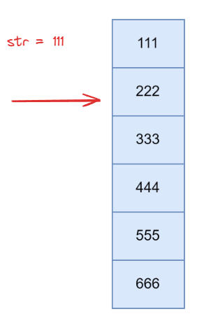

判断"111"不等于"555"，不删除，继续判断当前指针位是否有元素，然后移动指针，取出元素，一直循环往复，直到`str`等于"444"时，由于是先移动指针，再取出值，所以此时，指针在"555"的位置：

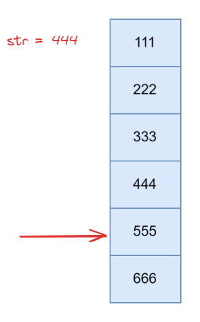

判断指针位有元素，那么进入循环，指针下移，取出"555"：

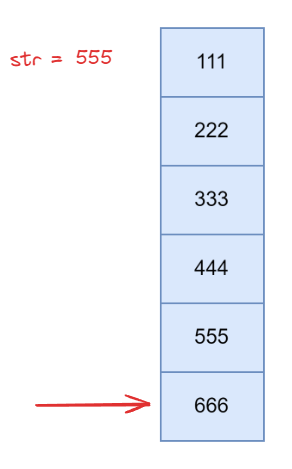

判断"555"等于"555"，进行删除，`ArrayList`底层是用数组来储存元素，当删除中间的元素时，会将后续元素上移，以填补缺口，所以"666"上移，指针指向空元素：

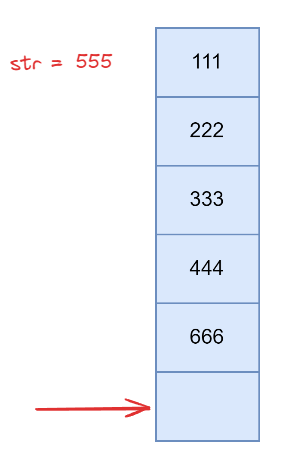

**注意**，由于通过集合删除了元素，所以`modCount` 已经不等于 `expectedModCount` 了，具备了抛出异常的条件，但是由于当前指针指向空元素，那么就不会进行循环，也不会调用`next()`，`next()`既然都没有调用，那么自然不会抛出异常。

综上，之所以删除倒数第二个元素不会抛出异常，是因为删除倒数第二个元素后，倒数第一个元素上移，导致指针指向空元素，也就无法进入循环，更不会执行`next()`，也就无法抛出异常。