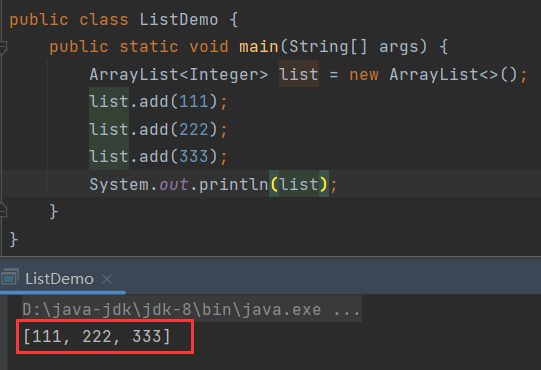

# List\<E>

> 【Collection】子接口。

## 特点

1. 存取有序
2. 有索引
3. 可以存入重复值。

通过其实现类【ArrayList】创建【List】：


## add()

```java
public void add(int index, E element){};
```

> 在指定索引位置插入元素。


## remove()

```java
public E remove(int index){};
```

> 根据索引删除集合中的元素，返回被删除的元素。


### 细节

在操作整数类集合时需要注意：

【remove()】有两种：


【remove(Object o)】是根据元素删除，而【remove(int index)】是根据索引删除。如果这个集合的泛型是【Integer】，那么在删除时会存在歧义。

比如，当前的集合存储为：



根据元素删除222：


报错，下标越界。这是因为传入的222被当成了调用【remove(int index)】，即根据222索引删除元素，当前集合没有222索引，自然报错。因此如果要调用【remove(Object o)】，那么就需要将222包装成对象，在这个过程中不存在自动装箱，否则就不会调用【remove(int index)】了，因此需要手动装箱：


## set()

```java
public E set(int index, E element){};
```

> 修改指定索引位置的元素，返回修改前的元素。


## get()

```java
public E get(int index){};
```

> 返回指定索引位置的元素。


# List的遍历

在集合传统遍历基础上增加了两种遍历方式：

1. 迭代器
2. 增强for循环
3. 【forEach()】
4. for循环
5. 【ListIterator】\(【List】特有的迭代器)

## ListIterator

> 【ListIterator】是【List】特有的迭代器，只能操作【List】，【ListIterator\<E>】是一个接口。

### listIterator()

```java
public ListIterator listIterator(){};
```

> 获取【ListIterator】。

遍历：


【ListIterator】比普通迭代器多了一些特殊的方法。

### hasPrevious()

```java
public boolean hasPrevious(){};
```

> 逆向检测是否还有可迭代元素。

简单来说，就是从集合的尾部开始倒序判断是否还有元素。


### previous()

```java
public E previous(){};
```

> 反向取出下一个元素，指针向前移动。

与【next()】一样是取出元素和移动指针，不过【previous()】是反向取出元素，指针也是反向移动。


#### 细节

在使用逆向迭代的时候，需要先让指针往后移动。这很好理解，因为逆向迭代是倒序遍历，如果当前指针指向第一个元素，第一个元素的前面是没有元素的，那么如何取出第一个元素前面的元素呢？


图解：

先正序让指针后移：


再倒叙，才能取到前面的元素：


如果一开始就倒叙，不能取出第一个元素之前的元素，因为第一个元素之前都没有元素：


## 并发修改异常

> 在迭代器迭代的过程中，如果**集合对元素**进行增加或删除的操作，那么就会抛出**并发修改异常**：【ConcurrentModificationException】。


这是因为集合设计者担心开发人员在遍历的过程中增加或删除元素，会造成与原始集合数据不一致问题，进而造成迭代错误，为了避免这个情况发生于是设计了这个异常。

这里的关键点时用**集合来增加和删除对象**才会抛出这个错误，如果一定要在遍历时对集合增加或删除，那么可以使用迭代器提供的增加或删除方法，

### remove()

```java
public abstract void remove(){};
```

> 迭代器的删除方法，不会造成**并发修改异常**。


### add()

```java
public abstract void add(E e){};
```

> 【ListIterator】迭代器的添加方法，不会造成**并发修改异常**。
>
> **注意**：普通迭代器没有【add()】。

普通的迭代器没有【add()】：


只有【ListIterator】迭代器才有【add()】：

