# 栈

> 栈的形状可以想象成一个弹夹，顶部开口，底部闭口。存储元素的过程就像是将子弹压入弹夹，取出元素的过程就像是将子弹弹出弹夹。所以栈的元素满足**先进后出，先进后出**原则。

栈的顶部，称为**栈顶**，底部称为**栈底**：

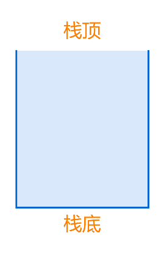

元素进栈出栈的方式为先进后出，先进后出：

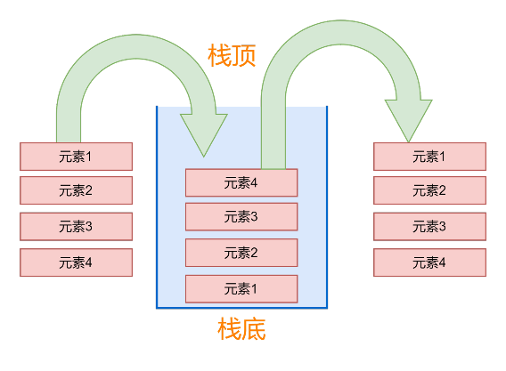

数据存入栈的过程叫做**进栈/压栈**：

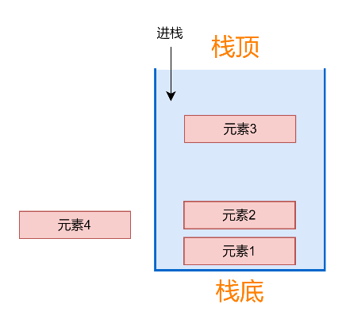

从栈中取出元素的过程叫做**出栈/弹栈**：

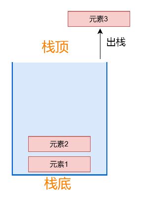

# 队列

> 队列，其形状可以想象成一个管道，入口和出口都是开口的，队列元素满足**先进先出，后进后出**原则，和银行排队类似，排队越靠前，越先办理业务。

队列的入口称为**前端**，出口称为**后端**：

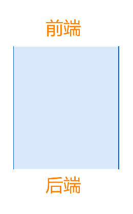

元素的存取过程为先进先出，后进后出：

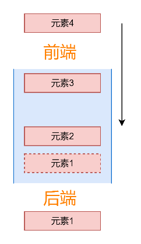

# 数组结构

> 内存连续区域。

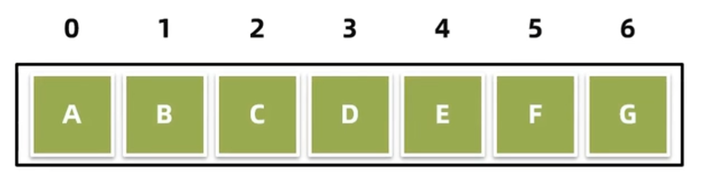

## 优点

- 查询速度快，数据通过地址值和索引定位，查询任意数据耗时相同。

## 缺点

- 新增/删除数据的时候，都有可能大批量的移动数组中其他的元素，因此增删操作效率较低。

比如，删除元素B：

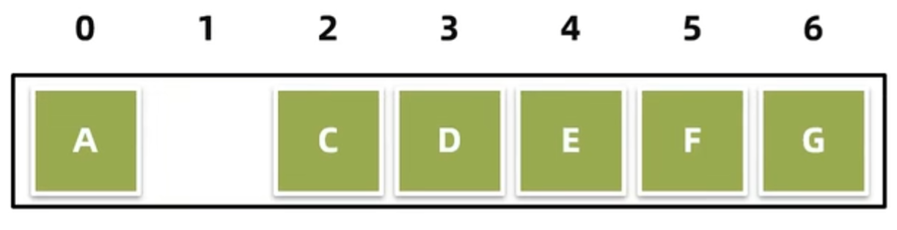

后续的元素就会进位补齐缺口：

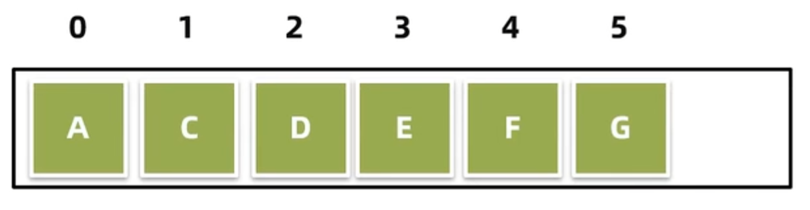

这就造成大批量移动元素。而重新添加B到原位置，又会大批量移动数据，所以数组的增删操作效率较低。

# 链表

在链表中存储的元素是一个节点。即一个对象，内部至少有两个属性，一个记录当前的元素的数据，另一个记录当前节点的下一个节点对象的地址值。

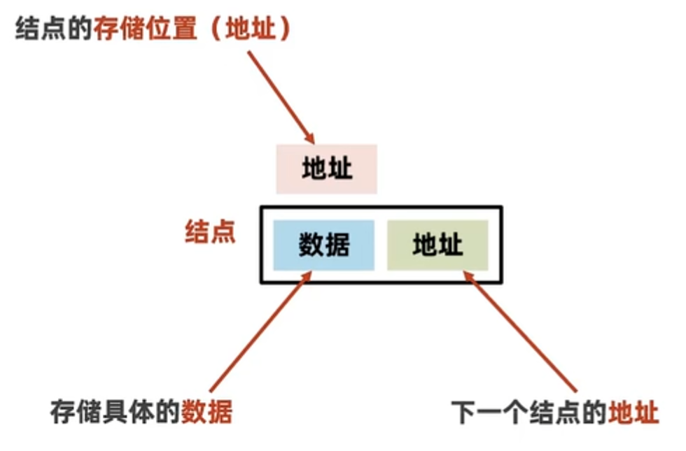

当创建一个链表，会先创建一个根节点：

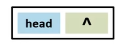

然后创建下一个节点，让根节点指向下一个节点地址：

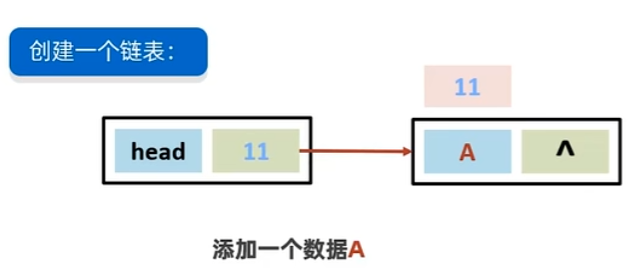

以此类推，最终形成一个链表结构：

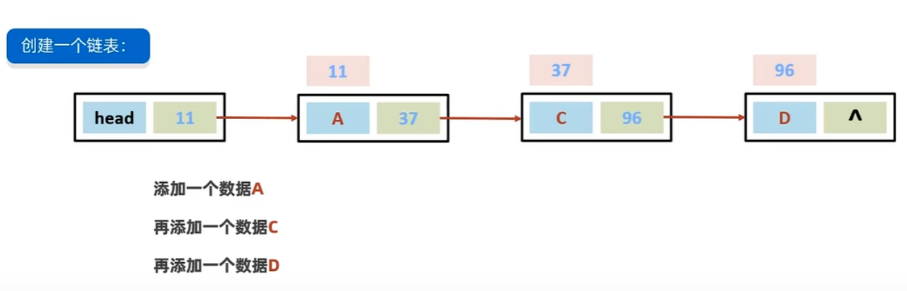

> 链表中的结点是独立的对象，在内存中是**不连续**的，每个结点包含数据值和下一个结点的地址。

## 缺点

- 链表查询慢，无论查询哪个数据都要从头开始找。

因为是从根节点开始记录下一个节点，然后依次链路下去，所以要查询中间元素就需要从根节点开始查找。比如查询元素D，就需要从根节点查到A，再从A查到B，再从B查到C，最终从C查到D。

## 优点

- 增删操作相对于数组较快。

比如当前的链表：

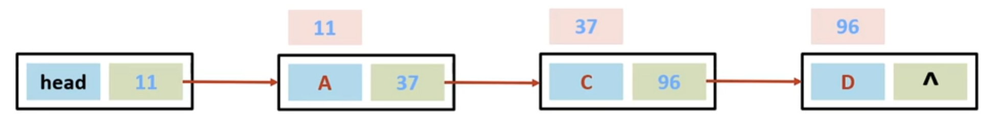

添加一个元素B：

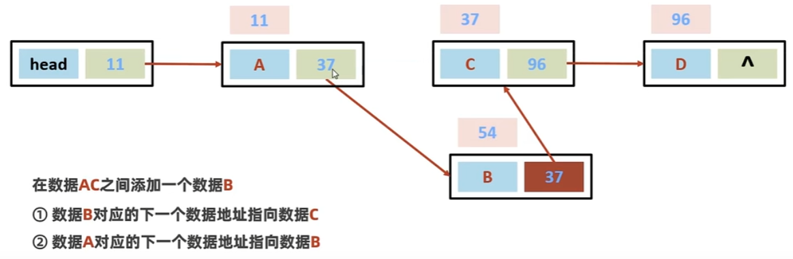

期间并没有大批量的移动元素，所以增加相对数组较快。

同理，删除元素：

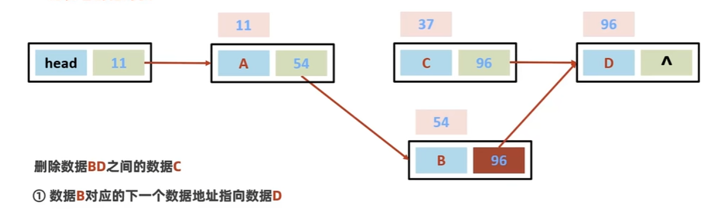

先让B的下一个地址指向D，再将C删除：

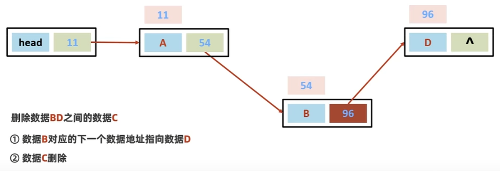

删除的过程中也没有大批量的移动元素，所以删除相对数组较快。

但链表增删还是需要找到对应元素，因此需要从头开始查找，所以也并不是非常快，只是相对数组较快。

## 单向链表

也就是刚刚说过的链表，一个节点只记录下一个节点的地址值：

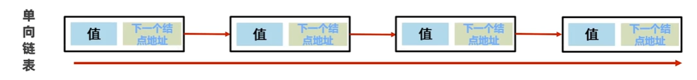

**弊端**：只能从头开始一个一个查找。

## 双向链表

一个节点记录上一个节点和下一个节点的地址值：

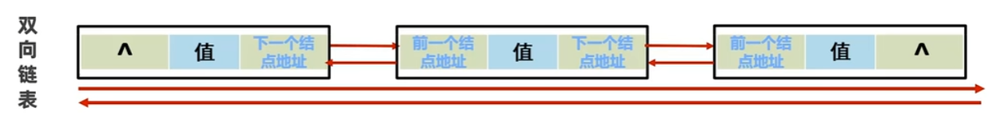

**好处**：查找元素时不但可以从前开始往后找，还可以从后开始往前找。

`LinkedList`底层就用到了双向链表。