# ArrayList

> 底层采用数组结构，查询元素很快，但是增删相等较慢。

在查询较多，但是对集合修改较少的场景下可以采用`ArrayList`。

# 长度可变原理

> `ArrayList`底层是数组结构，数组默认长度为**10**，当数组添加满了之后，会自动扩容为**1.5倍**。

## 如何初始化长度

原数组长度默认为10：

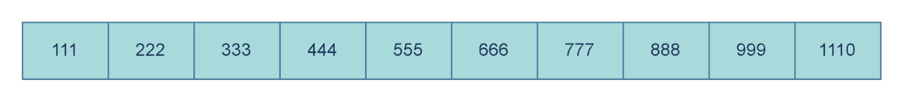

此时再插入新元素，就会新创建一个数组，长度为15，并将原来的数据拷贝到新数组中：

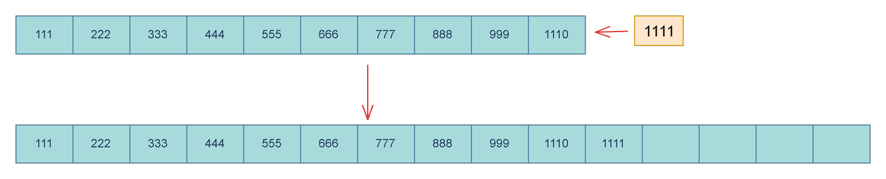

`ArrayList`创建后若没有进行添加操作，那么其数组长度为0：

`ArrayList`的空参构造：

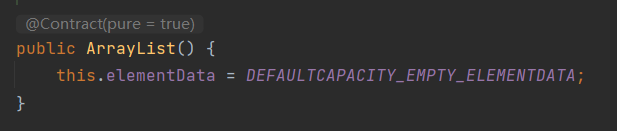

成员变量`elementData`是一个对象数组：

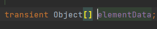

这就是底层数组。

在空参构造中，将`DEFAULTCAPACITY_EMPTY_ELEMENTDATA`的值赋给`elementData`，很明显这是一个常量，这个常量是一个空对象数组：

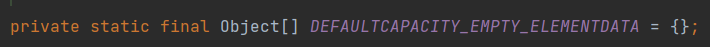

因此，`elementData`指向的也是这个空数组，所以在创建`ArrayList`后若没有进行添加操作，那么其数组长度为0。

`add()`源码：

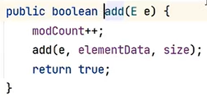

这个方法中将参数传递到了另一个`add()`中，同时还传递了`elementData`和`size`。`elementData`是底层数组，初始化后指向空数组，而`size`是集合长度，为`int`类型，初始化后为0。

重载的`add()`中：

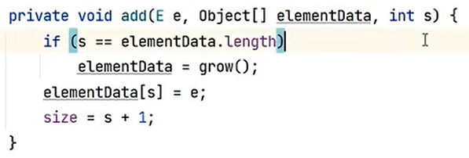

`s`即`size`，比较`size`和底层数组的长度，一开始两者都是0，所以进入条件，又执行了`grow()`，将该方法的返回值赋值给`elementData`。

`grow()`就是扩容的方法：

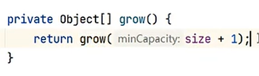

方法中再次调用重载的`grow()`，将`size + 1`传入：

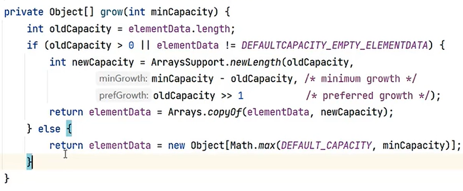

在重载的`grow()`中就是实际执行扩容以及数组创建的操作。

整个的流程是这样的：

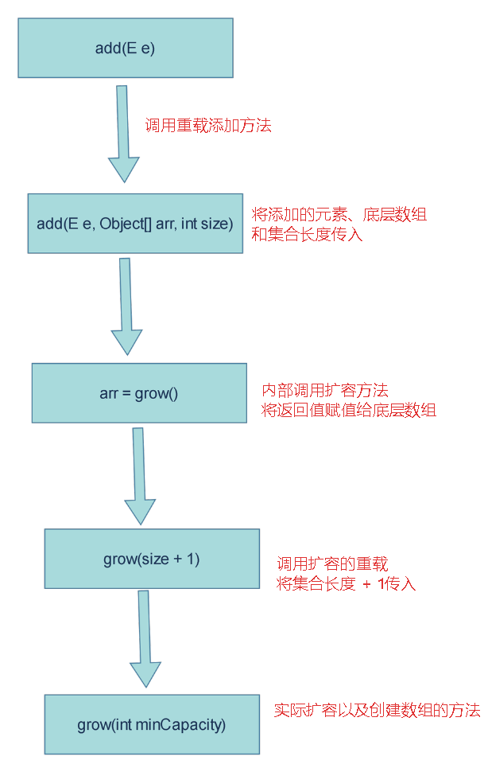

`size`一开始是0，将`size + 1`传入`grow()`中，用变量`minCapacity`去接收：

在方法中，将底层数组的长度赋值给`oldCapacity`，底层数组一开始为0，然后判断，`oldCapacity`等于0，不满足大于0。继续判断，底层数组在一开始本来就是通过`DEFAULTCAPACITY_EMPTY_ELEMENTDATA`赋值的，所以此时两者相等，也不满足条件，那么走`else`分支。

在该分支中创建一个新的数组，采用动态初始化，其长度为`DEFAULT_CAPACITY`和`minCapacity`中的最大值：

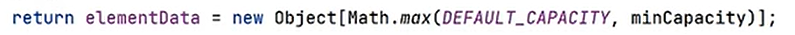

而`DEFAULT_CAPACITY`就是`ArrayList`的默认长度10：

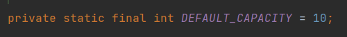

因此判断10和1中的最大值，为10，那么将新数组长度初始化为10，并返回这个数组，最终在重载的`add()`中底层数组指向这个新数组：

所以，这个时候才定下了数组的长度为10。

> 当创建`ArrayList`后，若没有进行添加操作，那么底层数组长度为0，只有添加元素后，才会初始化为默认长度10。

## 如何扩容

当添加的元素超过了默认长度时，假设此时的长度为10，那么`size`就等于10，当添加第11个元素时，就会将`size + 1`即11传入`grow()`中：

此时底层数组的长度为10，那么`oldCapacity`等于10，满足大于0，进入`if`分支，在这个分支中调用了静态方法`newLength()`将三个参数传入：

1. `oldCapacity`，即10。
2. `minCapacity`-`oldCapacity`，`minCapacity`是形参，即11，计算得1。
3. `oldCapacity` >> 1，即右移1位，右移1位就是除2，计算得5。

`newLength()`中：

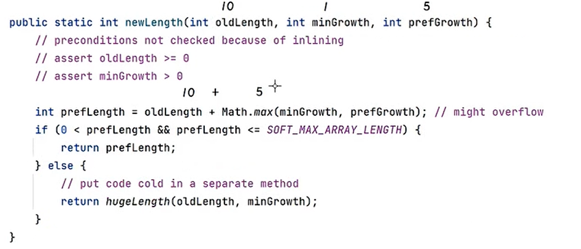

返回第2个形参和第3个形参中的最大值，与第1个形参相加，得15，然后就行判断如果计算的值大于0，且小于等于数组的最大长度，即`SOFT_MAX_ARRAY_LENGTH`(数组不可能无限大它有最大长度)。那么就返回这个值，最终扩容的长度就是15，也就是原来长度的1.5倍。

为什么是1.5倍？

就是因为把旧容量减半之后加上旧容量计算出来的。

## 总结

- 使用空参构造器创建的集合,在底层创建一一个默认长度为0的数组。
- 添加第一个元素时，底层会创建一个新的长度为10的数组。
- 存满时，会扩容1.5倍(旧容量减半+旧容量)。