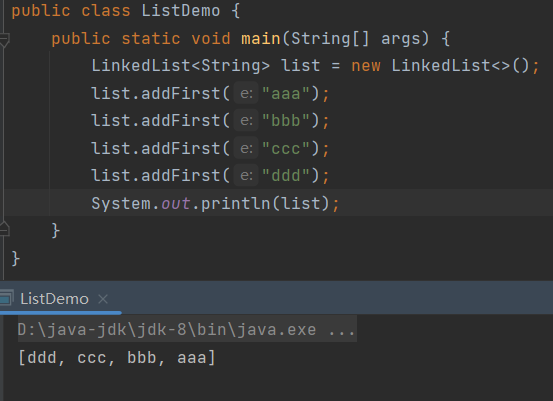
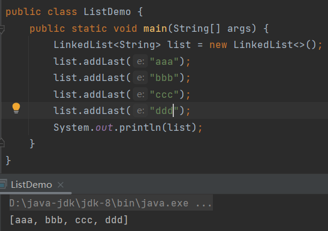
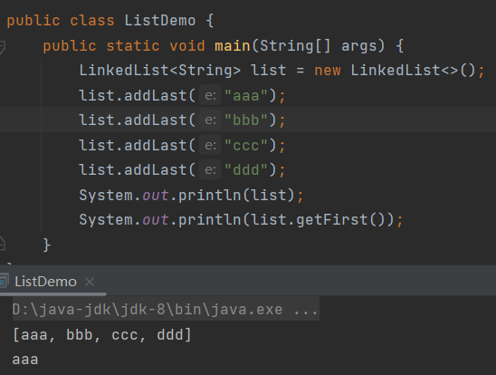
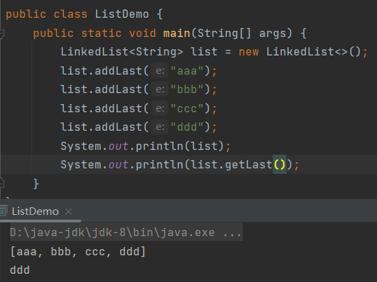
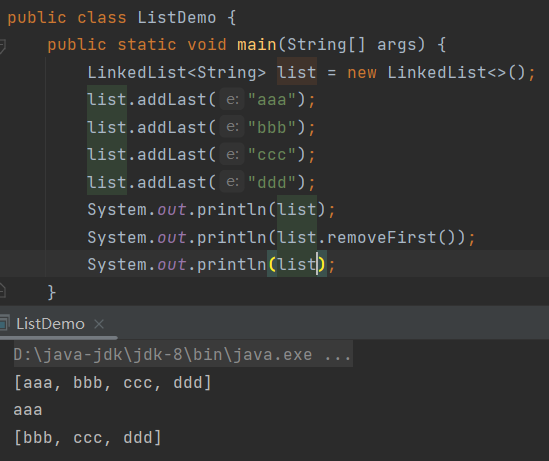
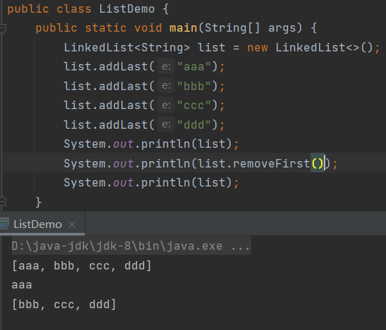
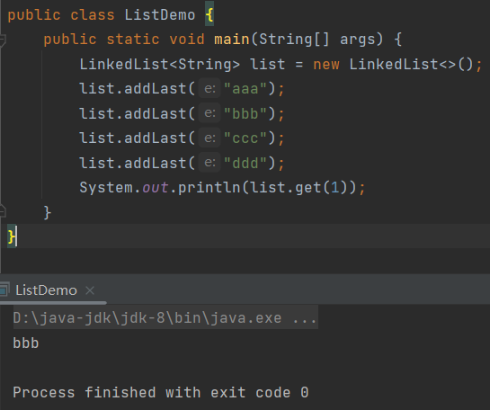
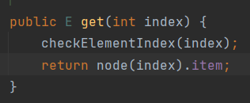
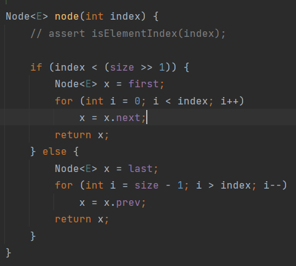

# LinkedList

> `LinkedList`底层基于双链表实现的，查询元素慢，增删首尾元素是非常快的。

正因为首尾操作非常快，所以`LinkedList`也提供了一些首尾操作的方法。

## addFirst()

```java
public void addFirst(E e){};
```

> 头部添加。



## addLast()

```java
public void addLast(E e){};
```

> 尾部添加。



## getFirst()

```java
public E getFirst(){};
```

> 获取头部元素。



## getLast()

```java
public E getLast(){};
```

> 获取尾部元素。



## removeFirst()

```java
public E removeFirst(){};
```

> 删除头部元素。



## removeLast()

```java
public E removeLast(){};
```

> 删除尾部元素。



## 索引获取值

`LinkedList`是`List`的实现类，它同样实现了根据索引获取值：



源码：



将索引传入了`node()`：



首先判断了索引是否小于集合长度的一半，如果是，则说明元素离根节点比较进，然后从根节点开始遍历直至遍历到索引位的元素，然后返回。

反过来，说明离尾节点比较近，那么就从尾节点开始往前遍历，直至索引位的元素。

所以，`LinkedList`的`get()`表面上是根据索引获取值，实际上是从头部或者尾部一个一个遍历查找的。