# 泛型

> JDK5引入的，可以在编译阶段约束操作的数据类型，并进行检查。

## 好处

> 统一数据类型，将运行期的错误提升到编译期。

比如创建一个`ArrayList`，它需要指定一个泛型：

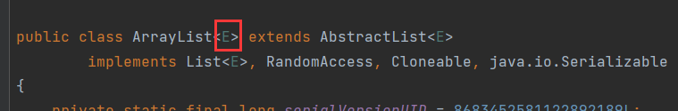

`E`就是根据泛型进行匹配，泛型是什么类型，`E`就是什么类型，在`add()`中就能体现：

指定为字符串，那么`add()`就接收字符串类型：

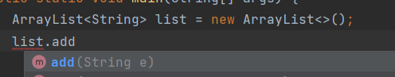

指定为整型，就接收整型：

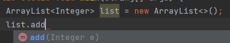

如果不指定泛型，那么默认接收`Object`：

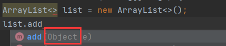

泛型如何将错误提升到编译期？比如创建一个集合：

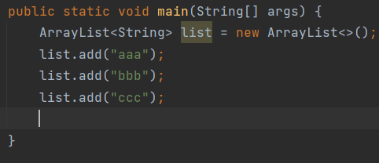

再创建一个迭代器，但不指定泛型：

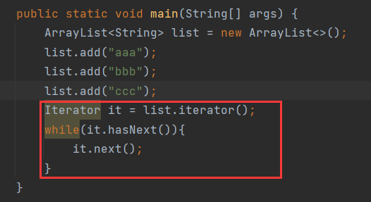

那么`next()`返回的就是`Object`类型的：

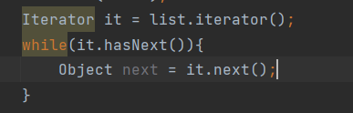

遍历出的元素是字符串，调用字符串的方法：

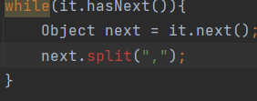

报错了，因为多态编译时看左边，父类`Object`中没有该方法，所以需要向下转型：

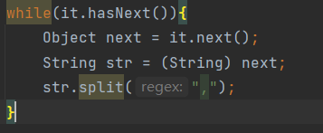

当前集合中存储的是字符串，如果再存储整型，那么就不能指定泛型：

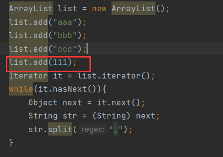

但是运行就会报错，因为向下转型会失败：

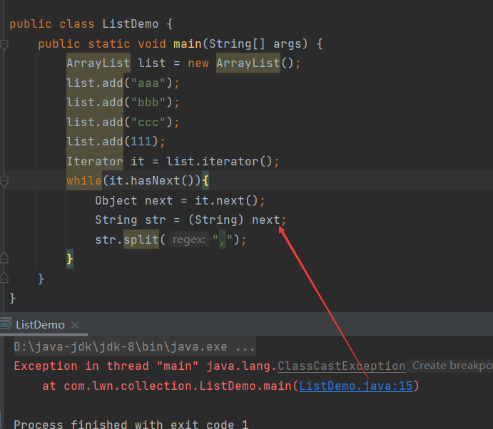

但是一点加上了泛型，那么在编译阶段就提示不能添加整型：

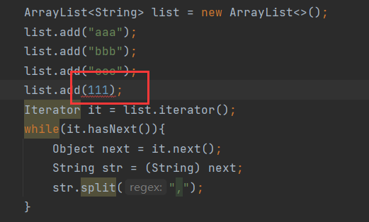

从而避免错误的发生，这就是将运行期的错误提升到编译期。


# 泛型标识符

泛型符号只要保证合法，就可以随意指定：

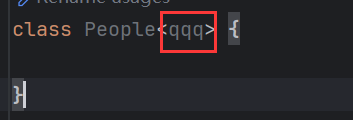

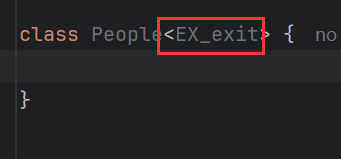

为了见名知意，通常会将符号定义为这些：

- `E`：即element，表示元素。
- `T`：即type，表示类型。
- `K`：即key，表示建，常见于`Map`类型中。
- `V`：即value，表示值，常见于`Map`类型中。


# 泛型重点

学习泛型的重点，就是要清楚，**不同的泛型在什么时机确定类型**。


# 泛型类

在类上加入泛型：

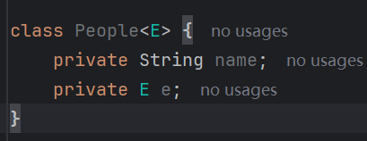

`name`属性可以确定为`String`类型，但是有一些变量没办法在一开始就确定类型，那么可以将该变量的类型声明为泛型：

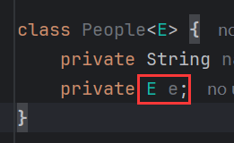

在创建对象时，指定为什么类型，这个变量就是什么类型：

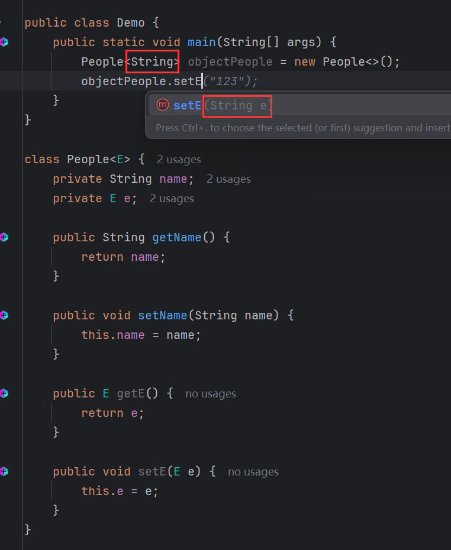

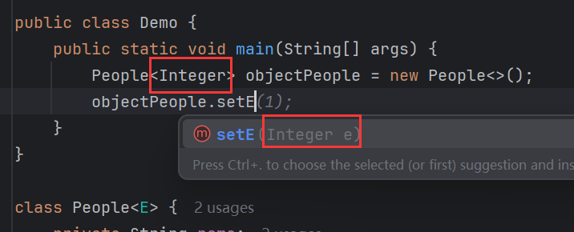

## 类型确认时机

>  泛型类的泛型在创建对象的时候确认类型。

在创建泛型类对象时，需要在`<>`中指定类型，这个时刻就确定了泛型的类型。泛型类中的泛型变量，通过上面的代码可以发现，泛型变量的类型来自于泛型类，也就是说在确定泛型类的类型的时候同时也确定了泛型变量的类型。

## 注意

- 泛型只能声明非静态变量，声明静态变量无效。
- 由于泛型变量的类型来自于泛型类，所以变量定义了泛型，那么类也要定义泛型。


# 泛型方法

泛型可以声明静态和实例方法，两者的声明方式不同，确认类型的时机也不同。

## 泛型实例方法

其实上面的代码已经演示过了，实例方法形参的类型声明为泛型，这就是一个泛型实例方法：

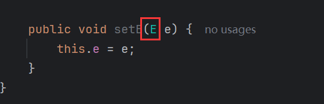

### 类型确认时机

> 泛型类实例化的时候确认，即来至泛型类的类型。

## 泛型静态方法

泛型实例方法的类型来自于泛型类的类型，但是静态方法存在的时候，对象不一定存在，所以泛型静态方法的类型不能从泛型类那里获取，而是由它自己定义，它需要在`static`后面写一个`<>`来定义泛型：

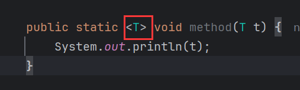

### 类型确认时机

> 泛型静态方法的类型在该方法被调用时确认，类型来自于传入的参数类型。

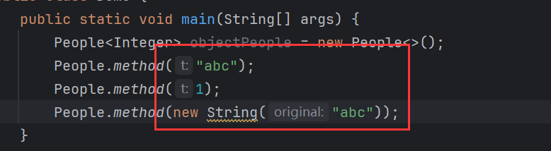

案例：假设有一个方法，打印数组：

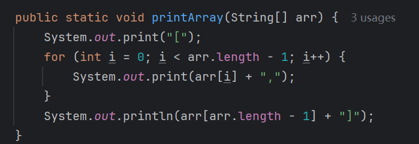

定义三个不同类型的数组，分别传入该方法：

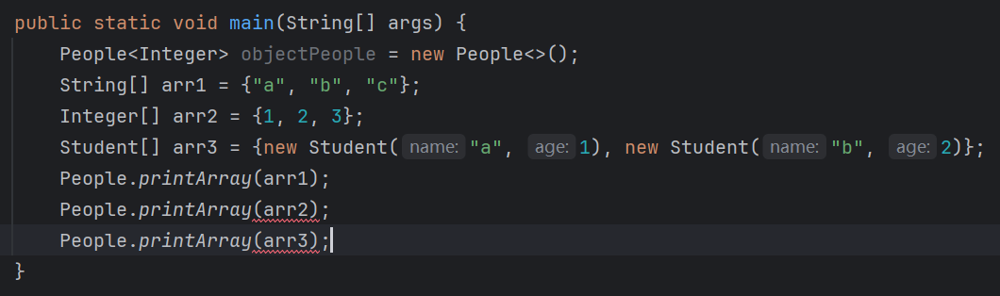

由于方法的形参为`String[]`，所以只能接收字符串数组，这样的方法不够灵活，如果想让该方法接收更多类型的数组，那么可以将其定义为泛型方法：

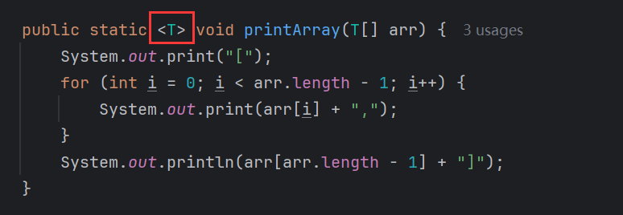

这样就能接收不同类型的数组：

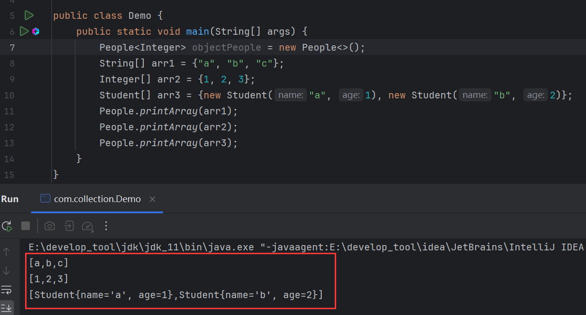

## 多泛型

如果一个方法不知一个泛型参数，那么声明了多少泛型的参数，在`<>`就要声明多少的泛型，中间用`,`分隔：

泛型实例方法：

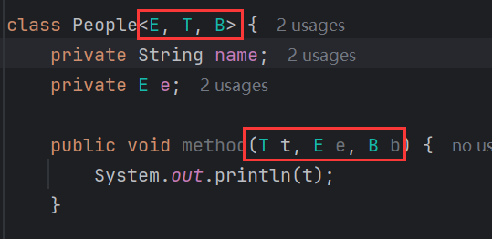

在创建对象时：

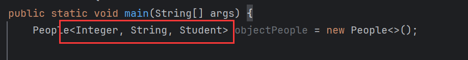

泛型静态方法：

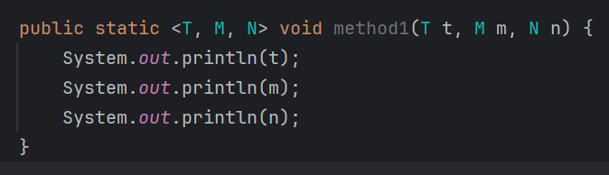

在调用方法时：

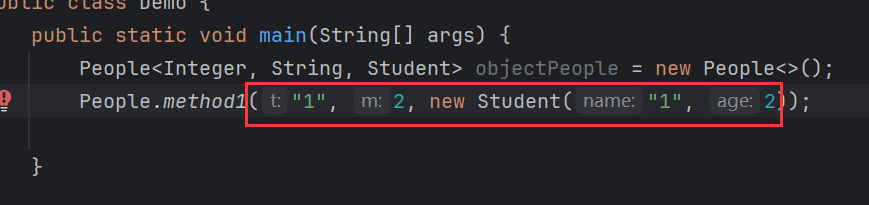

# 注意

> 泛型只能编写引用数据类型。

方法接收泛型数组：

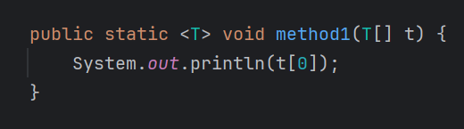

定义数组，但是基本数据类型的数组无法传入方法中：

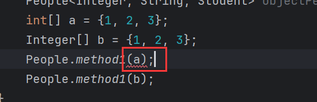

因为泛型只能编写引用数据类型。


# 泛型接口

在接口上声明泛型：

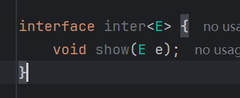

## 类型确认时机

> 泛型接口的类型确认时机由两种：
>
> 1. 在实现类实现接口的时候，由实现类指定泛型类型。
> 2. 在实现类实现接口的时候，实现类也声明泛型，在创建实现类对象时确认实现类泛型类型，接口沿用该类型。

第一种情况：

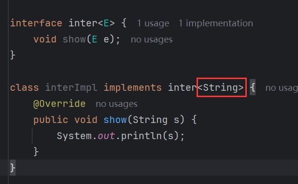

第二种情况，如果实现类也不知到声明接口的为什么类型，那么它自己也可以声明泛型，由调用者来确认。

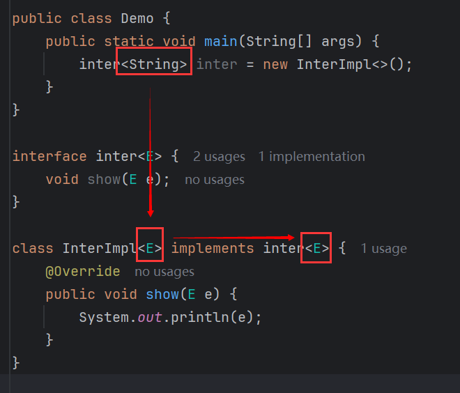

第二种情况，在集合继承和实现体系中比较常见：

`ArrayList`中：

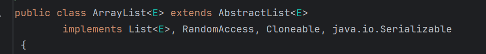

`List`中：

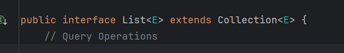


# 泛型通配符

代码材料：

员工类：

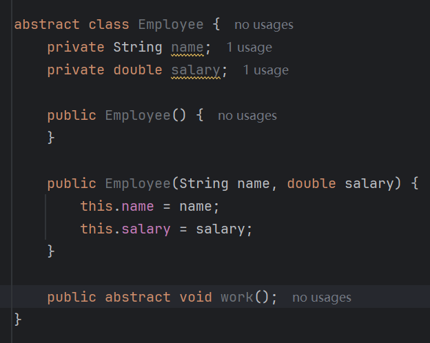

程序员类和经理类：

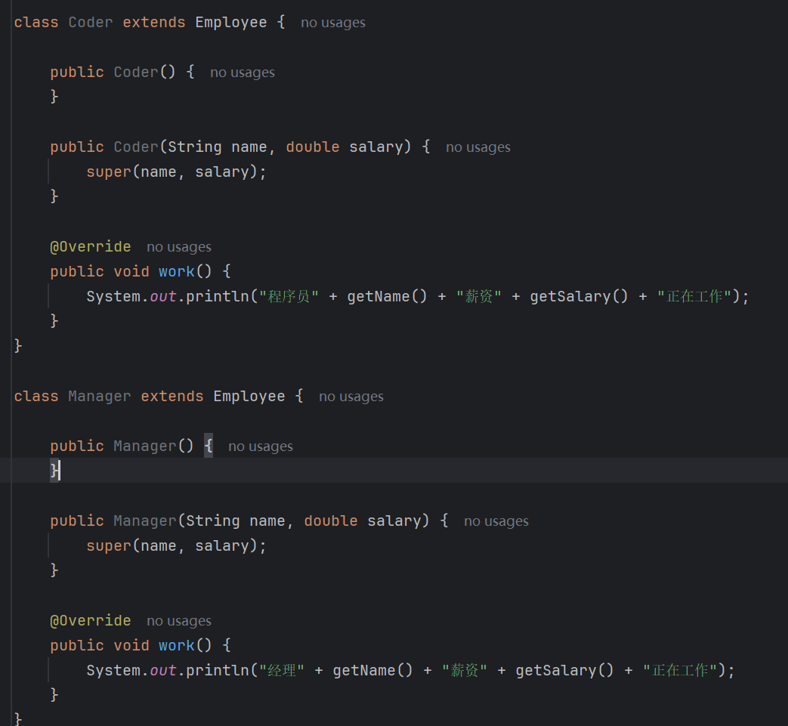

创建两个集合：

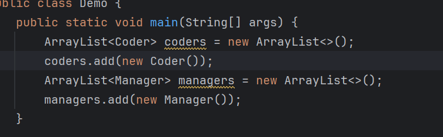

定义一个方法，遍历集合：

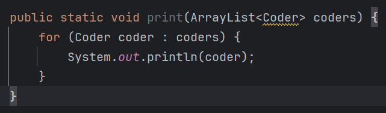

## ?

如果`print()`中的集合类型是`Coder`，那么就不能接收`Manager`，同理，如果类型是`Manager`，那么也不能接收`Manager`。如何既能接收`Coder`也能接受`Manager`呢？这时候就需要使用泛型通配符`?`：

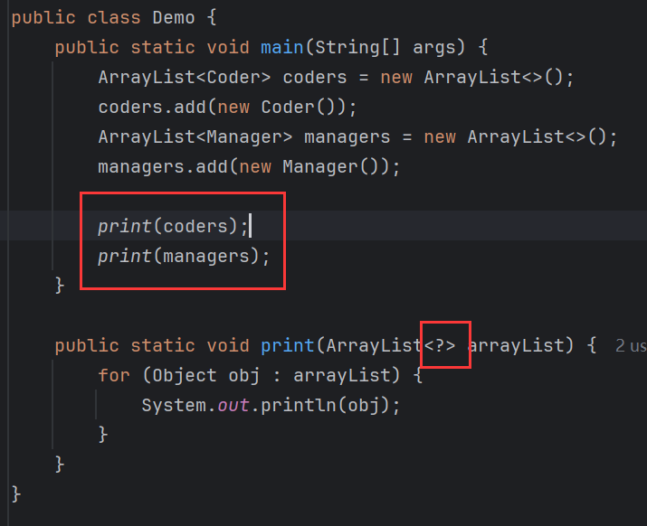

`?`表示任意类型，需要注意，`?`表示任意类型，归根结底它也是一种类型，就跟`String`、`Integer`表示类型一样，不能将`?`与泛型搞混淆，泛型是不知道该声明什么类型就用一个泛型符合去占位，而`?`是去填充这个位置的，就像`String`去填充`<>`表示`String`类型，而`?`去填充`<>`表示任意类型。

用了`?`后，泛型的类型就是`Object`：

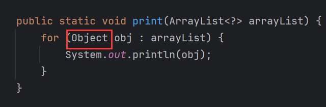

调用`work()`需要向下转型，如果要同时满足`Coder`和`Manager`，那么就转型为`Employee`：

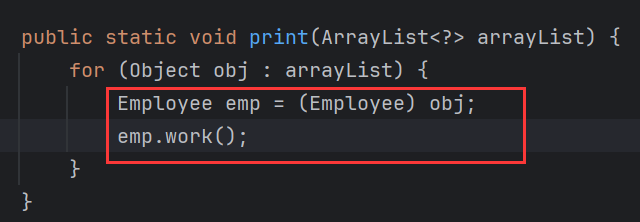

## ? extends 类型

但是这样的方法存在隐患，`?`最终会被转换为`Object`类型，也就是说任何类型的`ArrayList`都能传入这个方法，那么非`Employee`继承体系的`ArrayList`进入，就会发生类型转换异常：

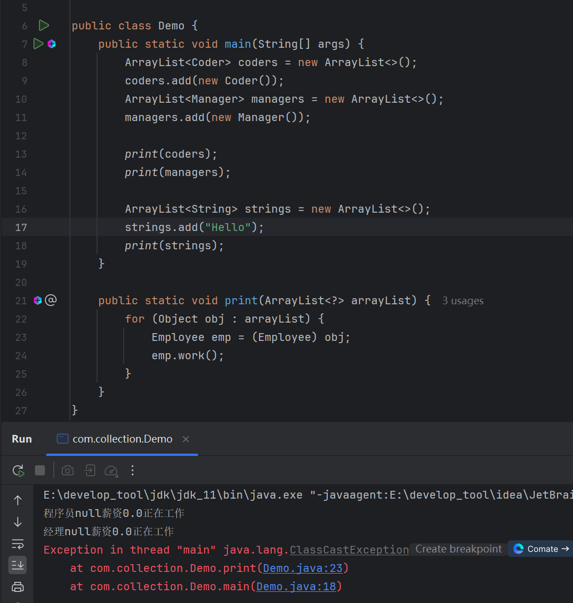

那么就需要将类型限定为`Employee`继承体系的类，可以使用另一个通配符：`? extends 类型`。

> `? extends 类型`表示泛型的类型为指定类型及其子类。

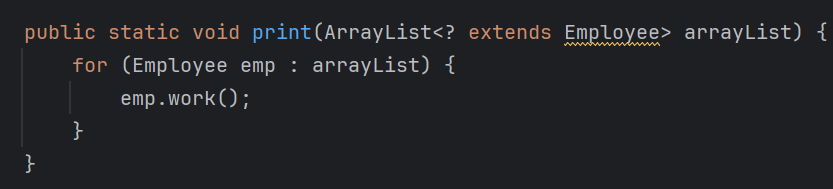

`? extends Employee`，表示`ArrayList`只接收`Employee`及其子类：

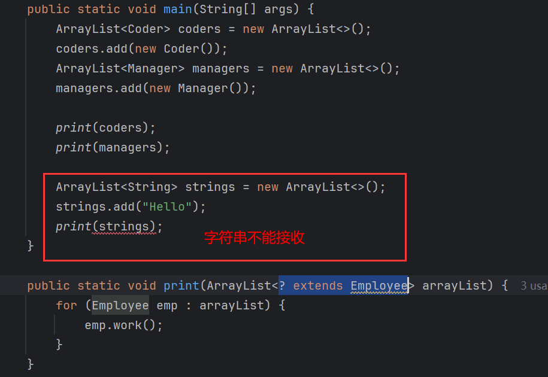

## ? super 类型

> 表示泛型的类型为指定类型及其父类。

与`? extends 类型`反过来：

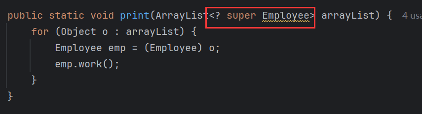

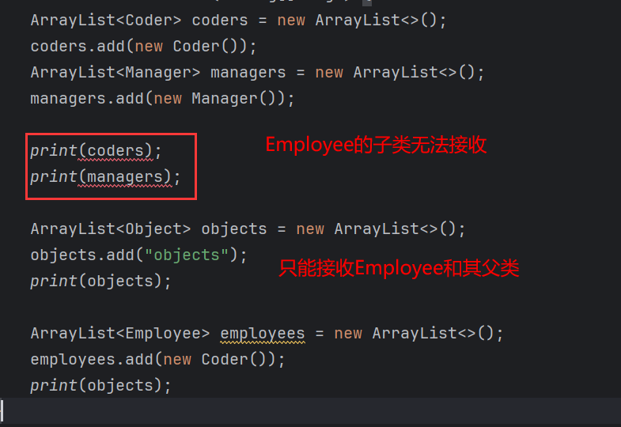

## <? extends T>只读不写

测试代码如下：

```java
public class Test {
    public static void main(String[] args) {
        List<? extends Dog> list = new ArrayList<>();
        for (Dog dog : list) {
			
        }
        list.add(new Dog())	// 编译报错
        list.add(new SubDog())	// 编译报错
    }
}

class Animal {
}

class Dog extends BigDog {
}

class SubDog extends Dog {
}

class SonDog extends Dog {
}
```

只读表示能读取集合元素，但是不能写入元素：

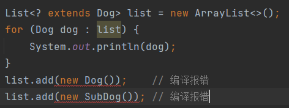

为什么能读？因为`<? extends Dog>`表示泛型为`Dog`或`Dog`的子类，`Dog`的类型一定是`Dog`，而`Dog`子类可以用多态表示为`Dog`类型，因此可以说，集合中的类型全都可以用`Dog`类型表示，编译器可以确定类型，因此可以读。

但是不能写，原因在于编译器无法确认类型，因为`Dog`的子类可以有很多，你到底给哪个子类，编译器无法确认，如果`List<? extends Dog>`的实际类型是`SubDog`，但是你写入`SonDog`会破坏约束，因为`SonDog`不是`SubDog`类型。

## <? super T>可读可写

测试代码如下：

```java
public class Test {
    public static void main(String[] args) {
        List<? super Dog> list = new ArrayList<>();
        for (Object o : list) {
            
        }
        list.add(new Dog());
        list.add(new SubDog());
        list.add(new SonDog());
        list.add(new Animal()); // 编译错误
        list.add(new BigDog()); // 编译错误
    }
}

class Animal {
}

class BigDog extends Animal {
}

class Cat extends Animal {
}

class Dog extends BigDog {
}

class SubDog extends Dog {
}

class SonDog extends Dog {
}
```

`<? super T>`可以读，但是读出来的类型都是`Object`：

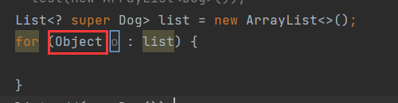

`<? super T>`表示泛型为`T`或`T`的父类，因此只要是`T`的子类都能往里面存：

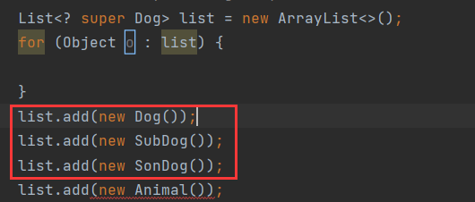

也就是说集合中可能存在多个不同类型的元素，因此遍历的时候只能用`Object`来表示类型。

`<? super T>`也可以写，但是只能写入`T`或`T`的子类型，如果写入`T`父类会导致型编译错误：

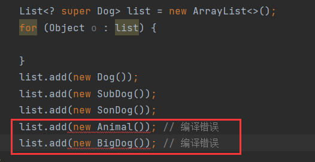

为什么不能写入父类？因为一个类的父类或父类的父类可能多了去了，比如这里的`Dog`，它的父类就有BigDog或者Animal(爷类)，既然它有这么多父类，编译器怎么知道你要给哪个父类，它不能确认类型所以不允许加如Dog的父类。

举个例子：

```java
List<? super Dog> list = new ArrayList<>();
```

这里的`list`泛型为`Dog`或`Dog`的父类，那么集合可以是`List<BigDog>`，也可以是`List<Animal>`，但是编译器无法在编译阶段就确定这个list中的元素到底是`BigDog`还是`Animal`还是其他`Dog`的父类，假设`list`允许加`Dog`的父类，比如：

```java
list.add(Animal);
```

那么在运行阶段，list万一接收到的是`List<BigDog>`，但是加的是`Animal`就会报错，因为`Animal`超出了`BigDog`的范围。

你可能会好奇，既然无法确认`Dog`父类的类型所以不能写入，那么`Dog`子类型也无法确认啊，毕竟`Dog`的子类型也有很多啊，比如这里的`SonDog`和`SubDog`。

确实，在写入的时候，编译器无法确认`Dog`的子类型的具体是哪个，但是我们要知道子类型是可以通过多态表示为父类型的，因此编译器完全可以把子类型确定为`Dog`类型，来达到确认类型的目的。就像贵宾犬是狗，哈士奇也是狗，那么编译器就可以确认为狗类型，但是父类无法通过多态进行**类型统一**，我们就假设大狗是狗的父类，你可以说狗是大狗，也可以狗是动物，但你不能把大狗和动物进行统一。

关键点就在于编译需要确定类型，而类的子类都可以统一为该类(类型确认)，但类的父类们不能统一为一种类型(类型不确认)。

```java
List<? super Dog> list = new ArrayList<>();
Animal animal = new ArrayList<>();
list = animal;	// 可以赋值
```

`<? super T>`限定了两方面，一方面是限定了变量的类型，只能接收`T`或`T`父类的引用，另一方面是限定了创建的对象，也就是堆内存中值只能接收`T`或`T`子类值。

`<? extends T>`不能写，原因我上面也解释过了，因为编译器无法确认类型，而`<? superT>`可以写入`T`或`T`的子类，是因为编译器可以统一类型为`T`，那么为什么`<? extends T>`写输入时，编译器不能统一为`T`呢？因为继承至`T`，那么也就是`T`或`T`的子类型，按理来说应该可以统一为`T`的。

这个还真不一样，首先我们要清楚`<? superT>`的泛型是从`T`开始的，也就是下限为`T`，你不能是`T`的子类，你最小的类型只能是`T`，既你至少是`T`类型的，那么我统一为`T`一定是你的类型或者子类型，那么自然能加进去。

但是`<? extends T>`保的是泛型的上限，也就是你的类型最大只能是`T`，你不能给`T`的父类。因此你的类型只要是`T`的子类，那么随便那种类型都可以，问题就出在这里，因为如果把加入的类型统一为`T`，那假如你的类型是某个子类型，我统一为`T`不就成你父类了吗，那肯定加不进去啊。