# 1 Stream流

> 配合【lambda】表达式，简化集合和数组的操作。

案例：

1、创建一个集合，存储多个字符串元素：

```java
"张无忌";
"张良";
"王二麻子";
"谢广坤";
"张三丰";
"张翠山";
```

2、把集合中所有以"张"开头的元素存储到一个新的集合。

3、把"张"开头的集合中的长度为3的元素存储到一个新的集合。

4、遍历上一步得到的集合中的元素输出。

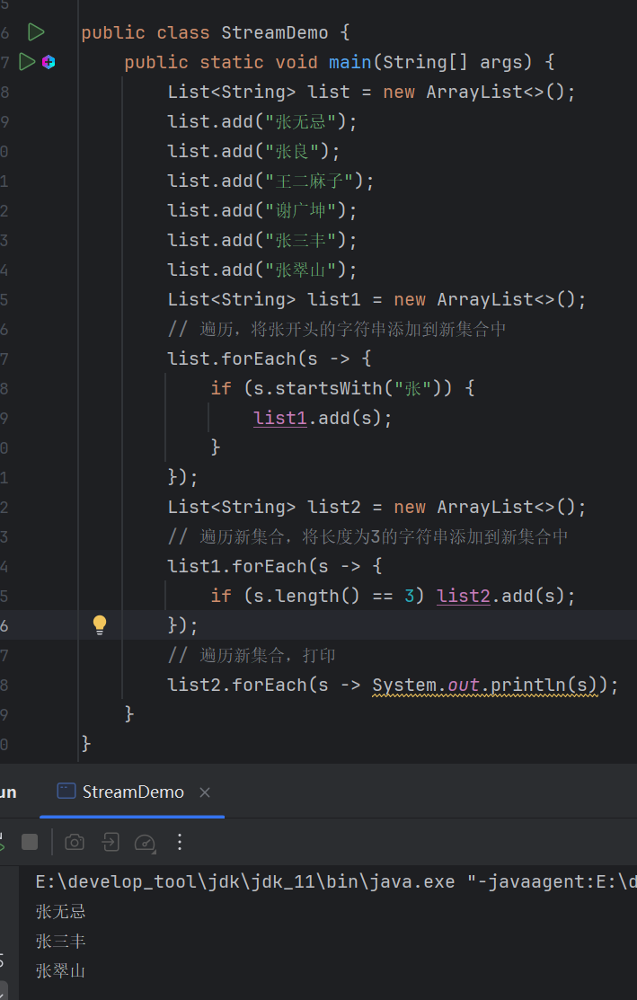

换成【Stream】流，首先调用【Stream()】，将集合中的元素放入【Stream】流中：

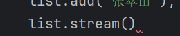

然后调用【filter()】过滤掉流中的数据，满足条件的保留，不满足过滤，首先过滤掉不是张开头的元素：

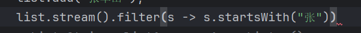

在上一步的基础上。再过滤掉长度不为3的元素：

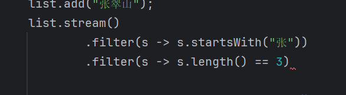

然后调用【forEach()】遍历：

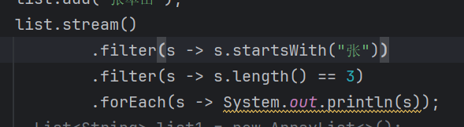

结果：

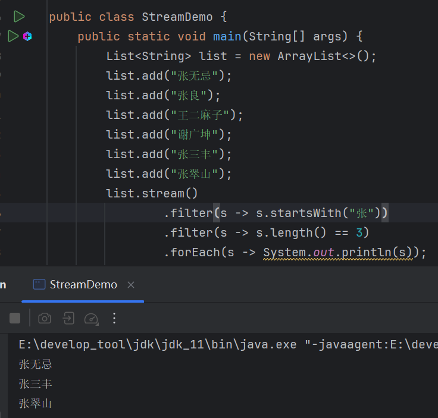

【Stream】流用到的思想是流水线操作，将原材料放到流水线进行一系列的加工，最终变成一个成品。而【Stream】流操作的原材料就是数据，对其进行加工的过程就在在对数据进行处理的过程，比如去重，截取，过滤等等操作，最终数据从这条流水线上下来就需要的样子。

从案例中也可看到，整个【Stream】流操作就是一条链式调用，就跟流水线链路一样。

【Stream】流的学习要点：

> 1. 如果将数据放入流中，即获取流对象。
> 2. 中间方法。
> 3. 终结方法。


# 2 获取流对象

如何将数据放入流中？即如何获取流对象？

数据放入流大致分为3种：

- 集合获取流对象。
- 数组获取流对象。
- 零散数据获取流对象。

## 2.1 单列集合获取流

```java
default Stream<E> stream(){};
```

> 【Collection】接口的默认方法，单列集合获取流。
>
> **注意**：是单列集合。

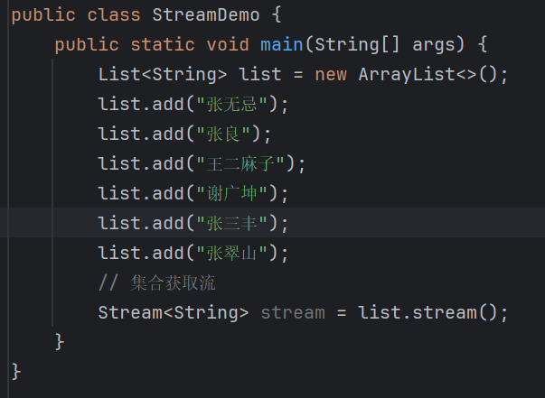

创建了流，就意味着集合中的数据已经放到了流水线上。那么就可以使用(调用)流水线上(流对象)的工具(流对象的方法)对原材料(数据)进行加工操作。

比如调用【forEach()】，遍历元素：

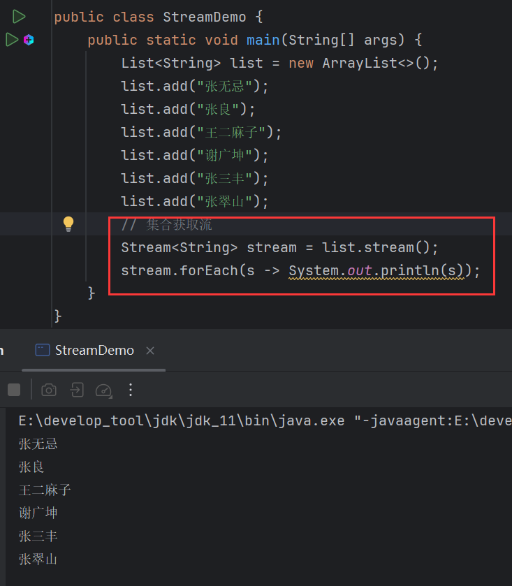

## 2.2 双列集合获取流

如法炮制：

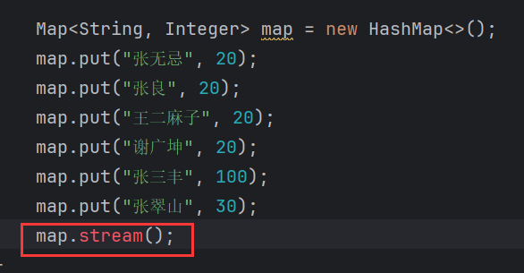

【Map】体系的集合无法直接获取流。

但是可以间接获取流，在【Map】篇章中说到过，【Map】底层数据结构主要针对键，因为可以通过键来获取值，而【Map】有一个方法可以获取所有的键集合，返回一个【Set】，而【Set】刚好是一个单列结合，可以直接调用【stream()】方法来获取流对象。

那么得到了键的流对象，就可以通过操作建来操作对应的值：

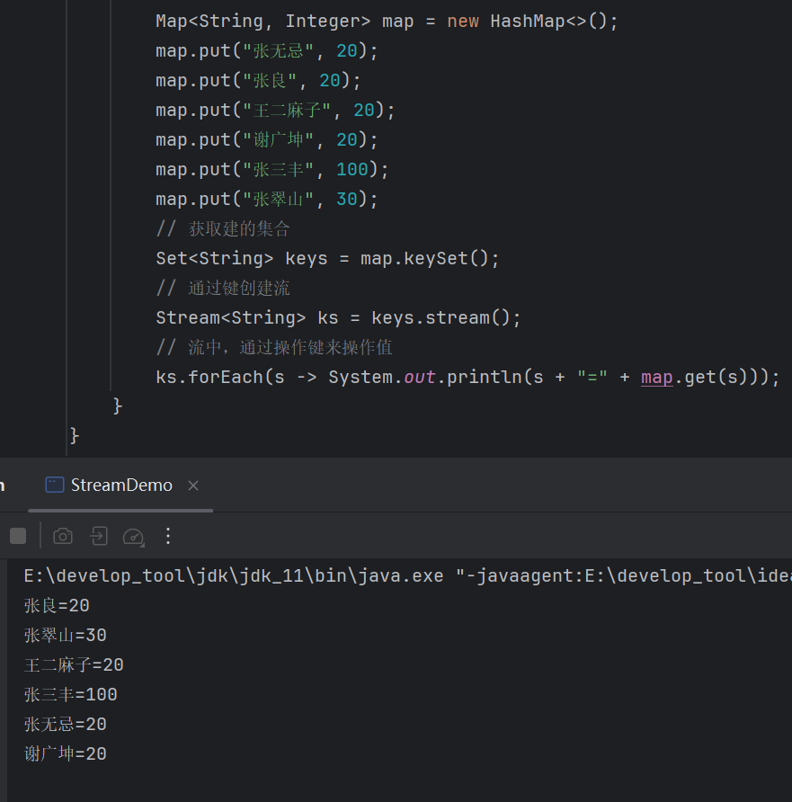

但是这种方式并不推荐，因为只获取了键集合，键和值是分开的，操作不方便。

推荐使用【entrySet()】，因为它返回的是键值对集合，键和值是在一起的：

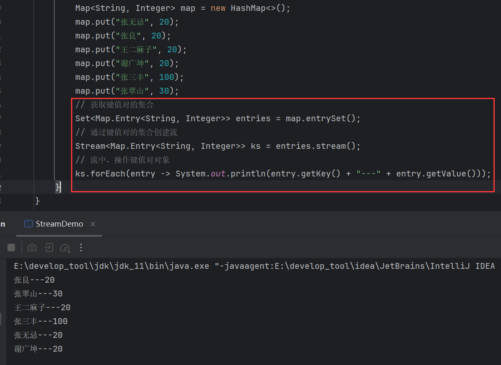

## 2.3 数组获取流

```java
public static <T> Stream<T> stream(T[] arr){};
```

> 通过【Arrays】数组工具类的【stream()】获取流对象，传入一个数组，返回该数组的流。

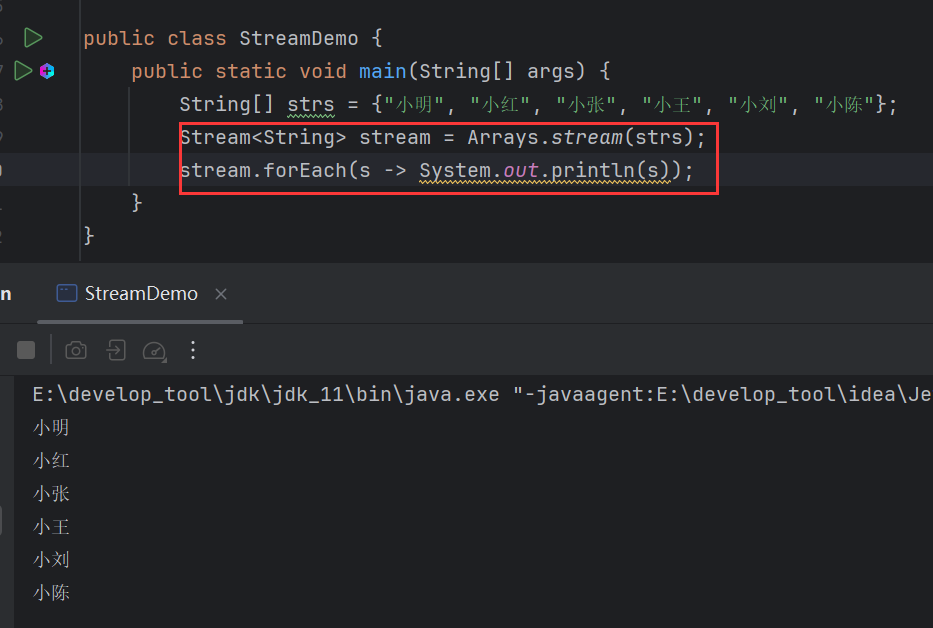

## 2.4 零散数据获取流

```java
public static <T> Stream<T> of(T ...args){};
```

> 【Stream】的静态方法，接收可变参数。

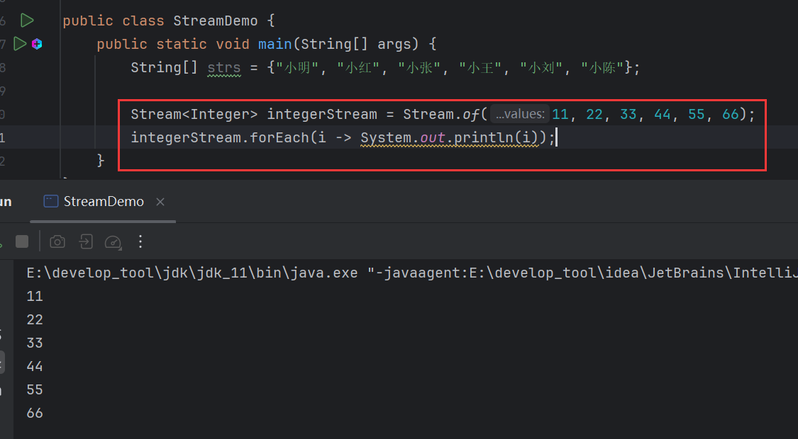

可变参数本质是一个数组，这意味着，可以直接传入数组：

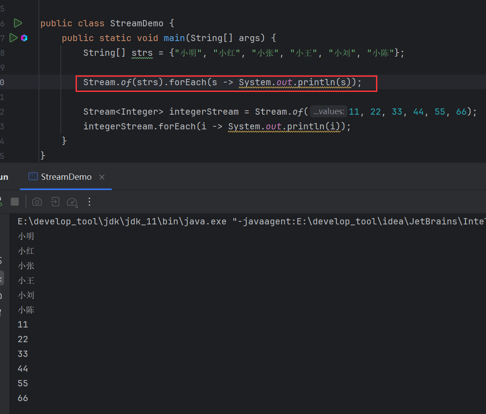


# 3 中间方法

## 3.1 filter()

```java
public Stream<T> filter(Predicate<? super T> predicate){};
```

> 过滤流中的数据，满足条件的数据保留，不满足则过滤。
>
> 返回一个新的流。

【filter()】接收一个函数式接口【Predicate】作为参数：

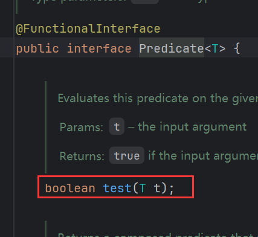

需要重写的【test()】返回一个布尔值。就是根据这个布尔值【filter()】来决定是否过滤掉数据。

过滤掉姓不是张的名字：


重点是【filter()】的返回值，它返回的是一个新的流对象，依然是一个流：

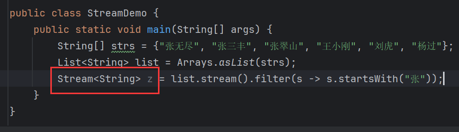

既然是流，那么就可以继续调用流方法，比如，继续过滤：

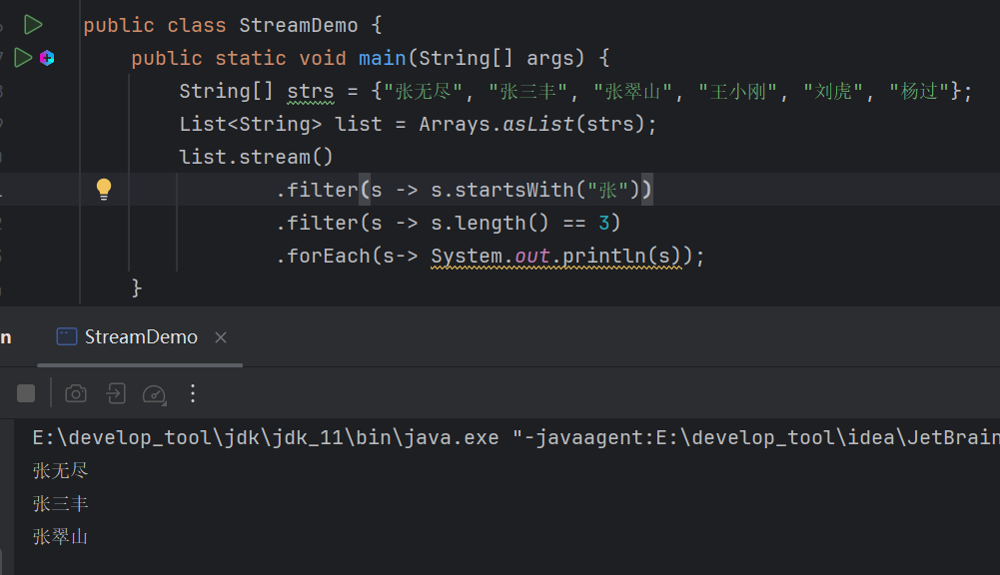

这类方法之所以叫做中间方法，就是因为他们返回的是一个新的流，既然是流就可以继续调用方法操作下去。