# 1 Stream流

> 配合`lambda`表达式，简化集合和数组的操作。

案例：

1、创建一个集合，存储多个字符串元素：

```java
"张无忌";
"张良";
"王二麻子";
"谢广坤";
"张三丰";
"张翠山";
```

2、把集合中所有以"张"开头的元素存储到一个新的集合。

3、把"张"开头的集合中的长度为3的元素存储到一个新的集合。

4、遍历上一步得到的集合中的元素输出。


换成`Stream`流，首先调用`Stream()`，将集合中的元素放入`Stream`流中：


然后调用`filter()`过滤掉流中的数据，满足条件的保留，不满足过滤，首先过滤掉不是张开头的元素：


在上一步的基础上。再过滤掉长度不为3的元素：


然后调用`forEach()`遍历：


结果：


`Stream`流用到的思想是流水线操作，将原材料放到流水线进行一系列的加工，最终变成一个成品。而`Stream`流操作的原材料就是数据，对其进行加工的过程就在在对数据进行处理的过程，比如去重，截取，过滤等等操作，最终数据从这条流水线上下来就需要的样子。

从案例中也可看到，整个`Stream`流操作就是一条链式调用，就跟流水线链路一样。

`Stream`流的学习要点：

> 1. 如果将数据放入流中，即获取流对象。
> 2. 中间方法。
> 3. 终结方法。


# 2 获取流对象

如何将数据放入流中？即如何获取流对象？

数据放入流大致分为3种：

- 集合获取流对象。
- 数组获取流对象。
- 零散数据获取流对象。

## 2.1 单列集合获取流

```java
default Stream<E> stream(){};
```

> `Collection`接口的默认方法，单列集合获取流。
>
> **注意**：是单列集合。


创建了流，就意味着集合中的数据已经放到了流水线上。那么就可以使用(调用)流水线上(流对象)的工具(流对象的方法)对原材料(数据)进行加工操作。

比如调用`forEach()`，遍历元素：


## 2.2 双列集合获取流

如法炮制：


`Map`体系的集合无法直接获取流。

但是可以间接获取流，在`Map`篇章中说到过，`Map`底层数据结构主要针对键，因为可以通过键来获取值，而`Map`有一个方法可以获取所有的键集合，返回一个`Set`，而`Set`刚好是一个单列结合，可以直接调用`stream()`方法来获取流对象。

那么得到了键的流对象，就可以通过操作建来操作对应的值：


但是这种方式并不推荐，因为只获取了键集合，键和值是分开的，操作不方便。

推荐使用`entrySet()`，因为它返回的是键值对集合，键和值是在一起的：


## 2.3 数组获取流

```java
public static <T> Stream<T> stream(T[] arr){};
```

> 通过`Arrays`数组工具类的`stream()`获取流对象，传入一个数组，返回该数组的流。


## 2.4 零散数据获取流

```java
public static <T> Stream<T> of(T ...args){};
```

> `Stream`的静态方法，接收可变参数。


可变参数本质是一个数组，这意味着，可以直接传入数组：


# 3 中间方法

> 之所以叫中间方法是因为这些方法都会返回新的流，既然返回了流，就能继续调用流的方法操作下去，所以叫中间方法。

## 3.1 filter()

```java
public Stream<T> filter(Predicate<? super T> predicate){};
```

> 过滤流中的数据，满足条件的数据保留，不满足则过滤。
>
> 返回一个新的流。

`filter()`接收一个函数式接口`Predicate`作为参数：


需要重写的`test()`返回一个布尔值。就是根据这个布尔值`filter()`来决定是否过滤掉数据。

过滤掉姓不是张的名字：

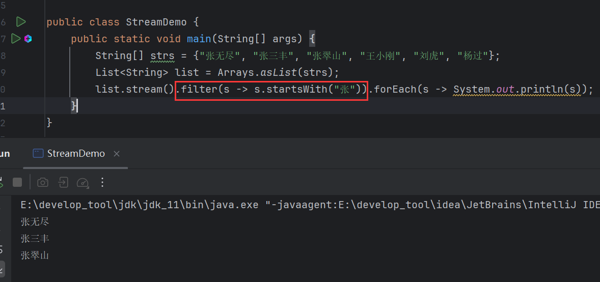

重点是`filter()`的返回值，它返回的是一个新的流对象，依然是一个流：


既然是流，那么就可以继续调用流方法，比如，继续过滤：


这类方法之所以叫做中间方法，就是因为他们返回的是一个新的流，既然是流就可以继续调用方法操作下去。

## 3.2 limit()

```java
public Stream<T> limit(long maxSize){};
```

> 获取流中前几个数据，返回新的流。

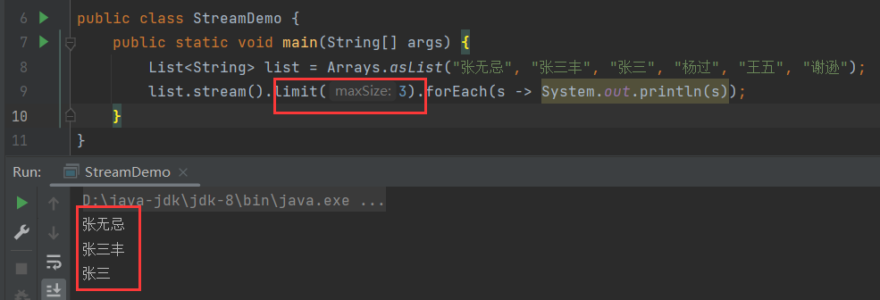

## 3.3 skip()

```java
public Stream<T> skip(long n){};
```

> 跳过流中前几个数据，返回新的流。

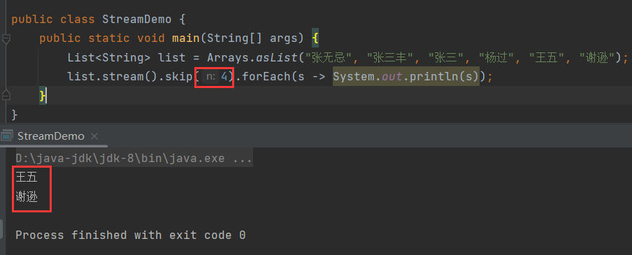

## 3.4 concat()

```java
public static <T> Stream<T> concat(Stream s1, Stream s2){};
```

> `Stream`静态方法，合并两个流，形成新的流。
>
> **注意**：此方法只接收两个流。

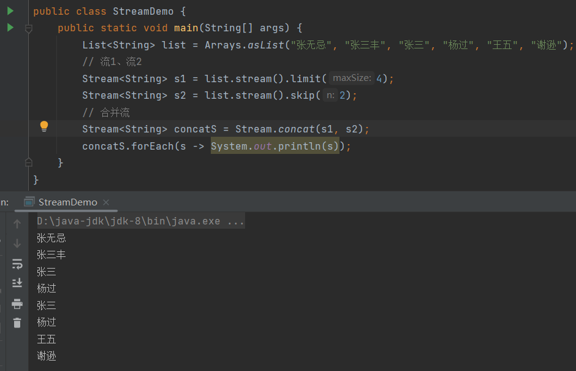

## 3.5 distinct()

```java
public Stream<T> distinct(){};
```

> 去重流中的数据，返回新流。
>
> **注意**：此方法的去重依赖`hashCode()`和`equals()`。

在3.4的基础上：

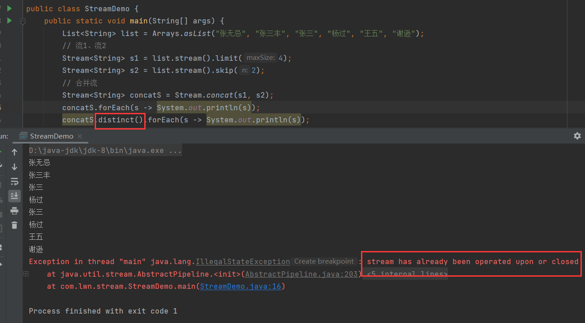

报错了，错误信息为：

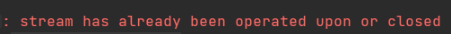

意思是：**流已经关闭**。

流水线工作，是无法回退的，原材料从流水线上下来，是不能再操作的。

在这个案例中，调用`distinct()`之前，`concatS`已经调用了`forEach()`：

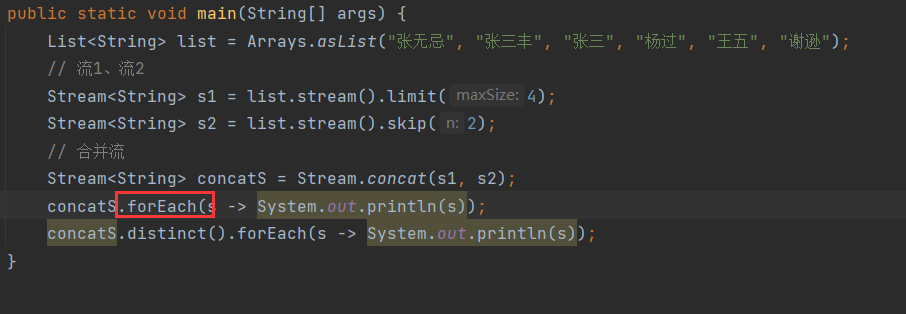

这个方法是流的终结方法，可以理解为流水线上的最后一道工序，此道工序以后，就代表原料已经从流水线上下来了，即终结方法执行完后，数据就会从流中出来，流就会关闭，既然流已经关闭，那么自然不能调用其方法，也就报了流关闭的错误。

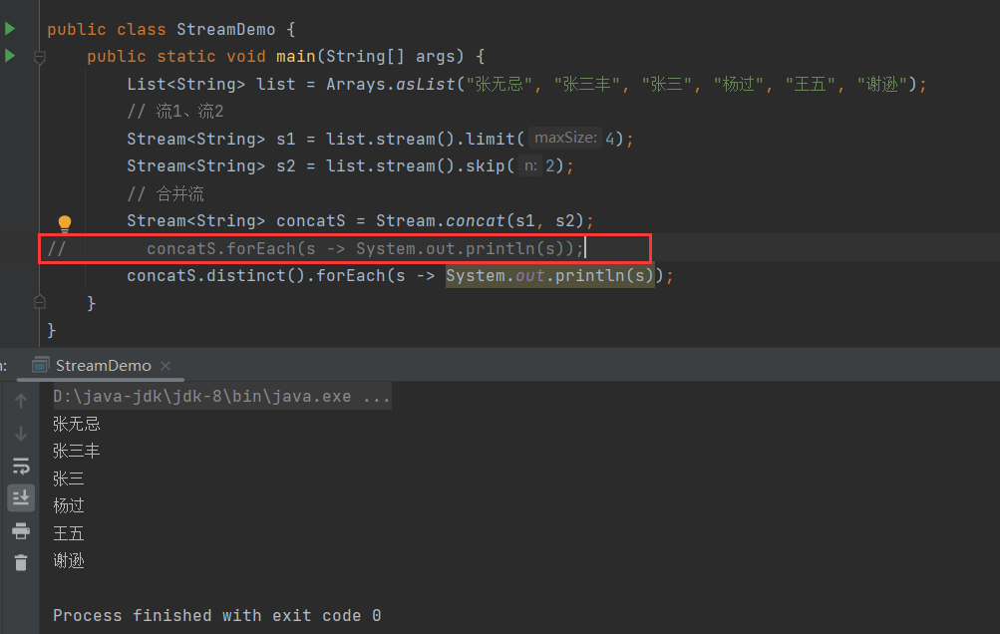

## 3.6 注意

> 流对象一旦被使用，就不允许再次被使用。

3.5中已经说了`forEach()`，另外`concat()`，它会合并两个流对象为一个流，这也是在使用流对象，即原来的流在合并之后就不能再被使用：

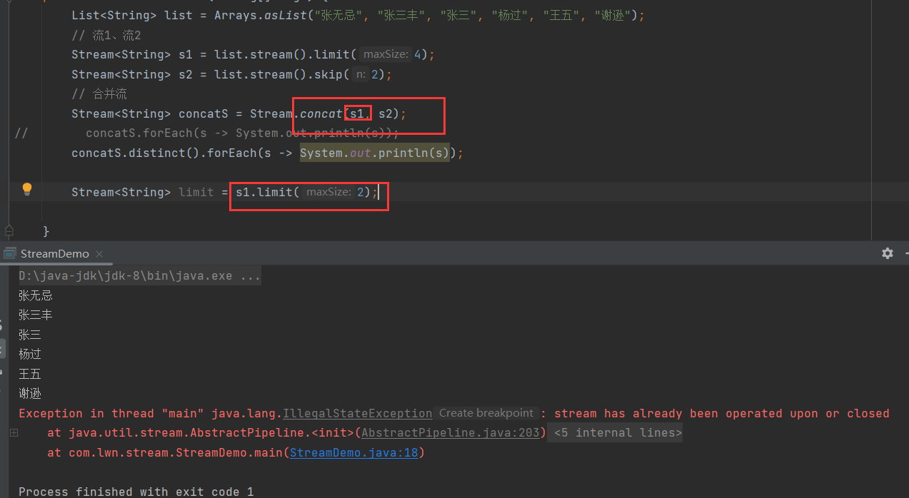


# 4 终结方法

> 流水线中的最后一道工序。这类方法返回的不再是流，所以叫做终结方法。
>
> **注意**：终结方法会关闭流。

## 4.1 forEach()

```java
public void forEach(Consumer action){};
```

> 遍历流中数据。

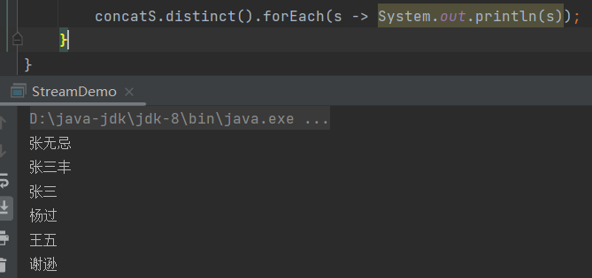

## 4.2 count()

```java
public long count(){};
```

> 统计流中数据个数。

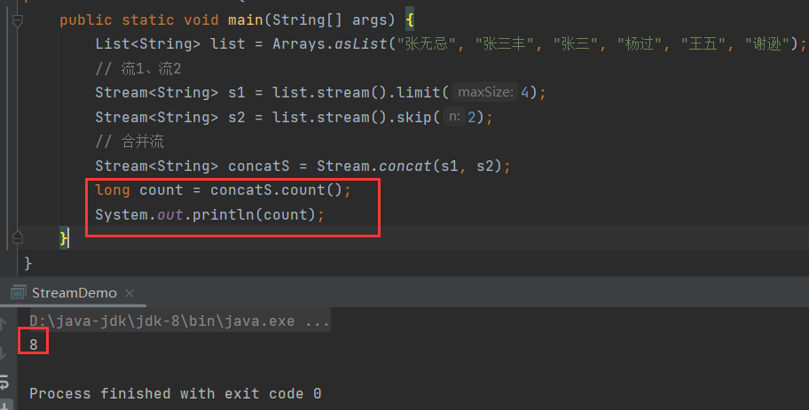


# 5 收集流

> 即将`Stream`操作后的数据再收集到集合中。

在`Stream`中对数据进行操作时，是不会修改数据源的，如果想要将操作后的数据收集形成新数据集，就需要收集操作。

## 5.1 collect()

```java
R collect(Collector collector){};
```

> 收集方法，收集流中数据，指定收集器。

`Collector`收集器，是一个接口，`collect()`需要接收一个收集器对象。

java提供了`Collectors`工具类，可以便捷的获取收集器对象。

其提供了以下方法，以获取不同集合的收集器：

### 5.1.1 toList()

```java
public static <T> Collector toList(){};
```

> 获取`List`集合的收集器，配合`collect()`将流中数据存入`List`集合中。

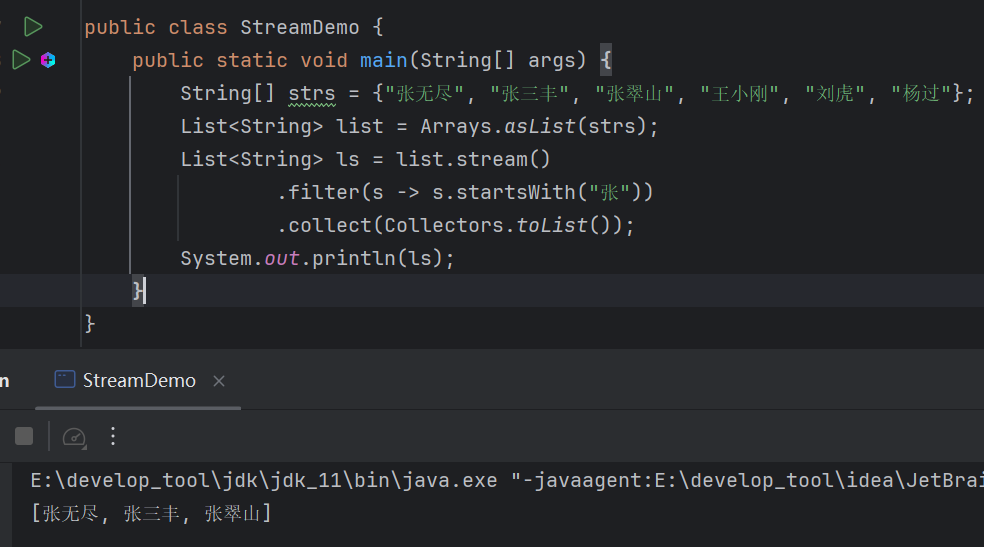

### 5.1.2 toSet()

```java
public static <T> Collector toSet(){};
```

> 获取`Set`集合的收集器，配合`collect()`将流中数据存入`Set`集合中。

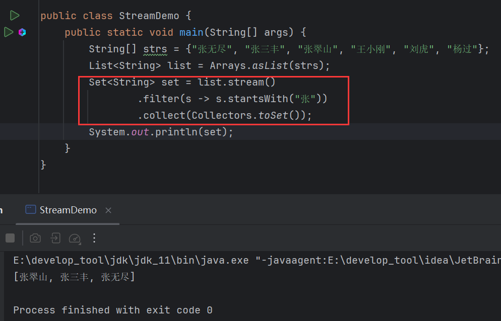

### 5.1.3 toMap()

```java
public static <T, K, U> Collector<T, ?, Map<K,U>> toMap(
	Function<? super T, ? extends K> keyMapper,
    Function<? super T, ? extends U> valueMapper
){};
```

> 获取`Map`集合的收集器，配合`collect()`将流中数据存入`Map`集合中。

此方法接收两个参数，都是`Function`接口的实现类对象。

`Function`是一个函数式接口：

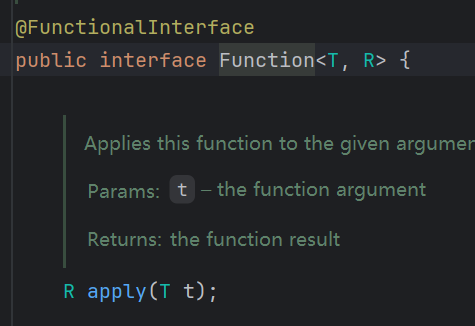

接收一个泛型，返回一个泛型。

简单来说，这两个参数就是用于指定`Map`中的键和值。

泛型中的`T`来自于流中数据的类型，`K`、`U`则为自定义类，即`T`为源数据类型，`K`、`U`为目标数据类型。

用匿名内部类演示更直观：

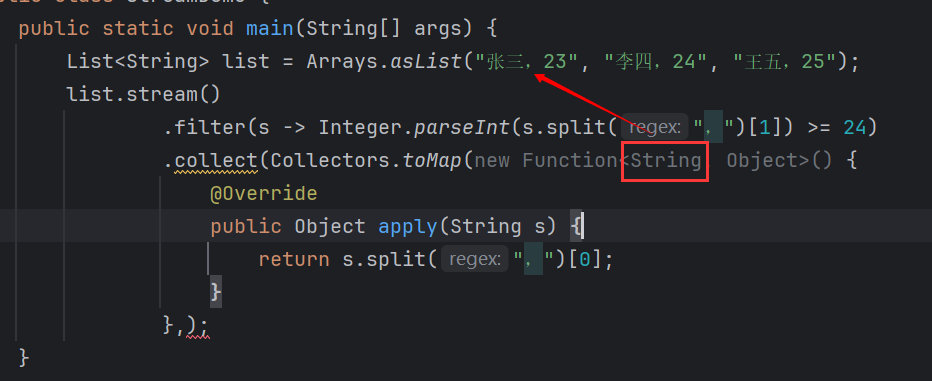

`T`来自于源数据类型，源数据是字符串，因此`T`的类型就是字符串，而`K`的类型是自定义的，此处定义为`Object`，`apply()`的返回值类型就是`Object`。如果指定为其他类型，`apply()`返回类型就会对应改变：

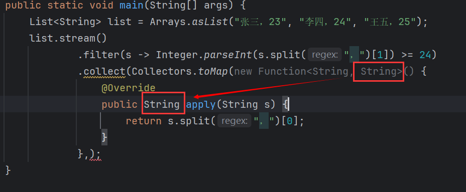

`U`同理。

总结：

>- `T`，流中源数据类型。
>- `K`，键的类型，自定义，第一个`Function`用于计算出键。
>- `U`，值得类型，自定义，第二个`Function`用于计算出值。

案例：

集合中的数据：

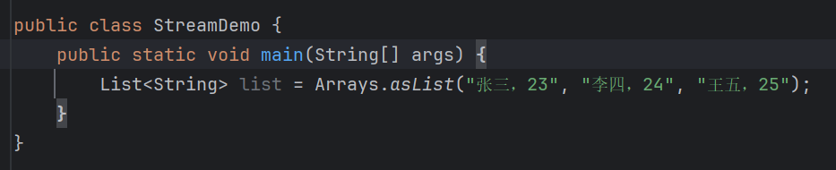

将年龄大于等于24的人筛选出来，放到`Map`中，姓名为键，年龄为值。

首先，筛选出年龄大于等于24的人：

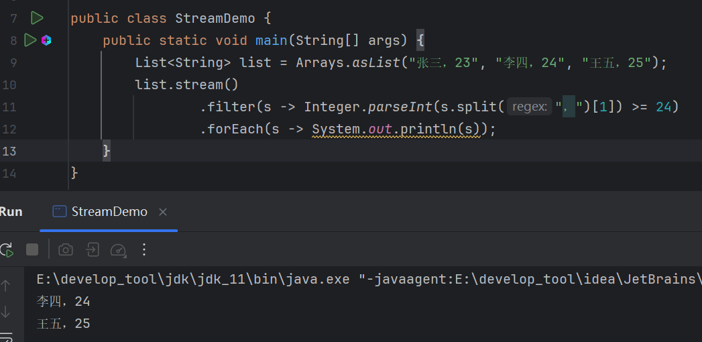

然后收集到`Map`中，键为姓名，类型为`String`，年龄为值，类型为`Integer`：


# 6 案例

现在有两个`ArrayList `集合，分别存储6名男演员和6名女演员，要求完成如下的操作:

- 男演员只要名字为3个字的前两人
- 女演员只要姓林的，并且不要第一个
- 把过滤后的男演员姓名和女演员姓名合并到一起
- 把上一步操作后的元素作为构造方法的参数创建演员对象，遍历数据
- 演员类`Actor`，里面有一个成员变量，一个带参构造方法，以及成员变量对应的`get`、`set`方法

```java
// 男
["周润发", "成龙", "刘德华", "吴京", "周星驰", "李连杰"];
// 女
["林心如", "张曼玉", "林青霞", "柳岩", "林志玲", "王祖贤"];
```

演员类：

```java
public class Actor {
    private String name;

    public Actor(String name) {
        this.name = name;
    }

    public Actor() {
    }

    public String getName() {
        return name;
    }

    public void setName(String name) {
        this.name = name;
    }

    @Override
    public String toString() {
        return "Actor{" +
                "name='" + name + '\'' +
                '}';
    }
}
```

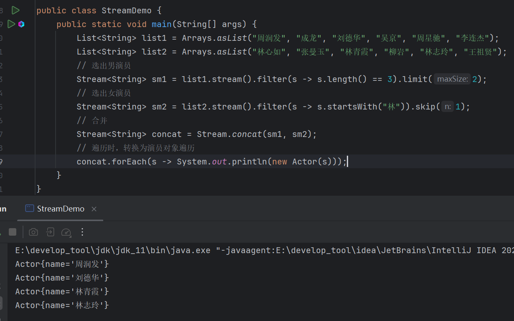