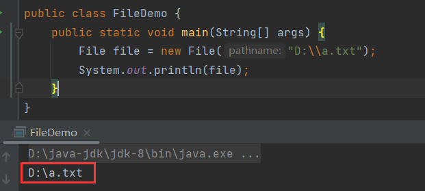
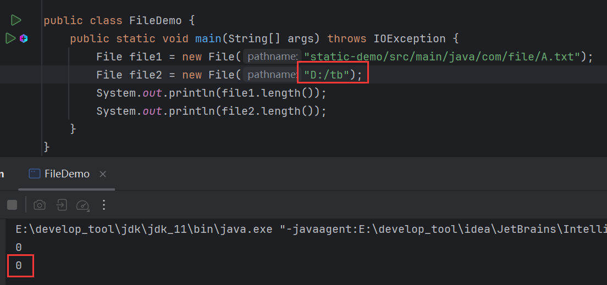
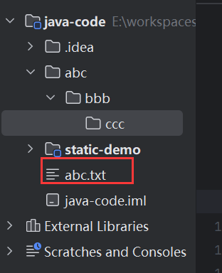

# 1 File类

> 在java中，【File】表示**文件**和**文件夹**。

## 1.1 File的构造

构造一：

```java
public File(String pathname){};
```

> 根据文件路径创建文件对象。

关联D盘下的文件：


此时，D盘下没有该文件，但是执行不会报错：



> 【File】类关联文件和文件夹，即使文件和文件夹不存在也不会报错，因为【File】提供了创建文件和文件夹的方法。

构造二：

```java
public File(String parent, String child){};
```

> 根据父级路径和子级路径封装【File】对象。


构造三：

```java
public File(File parent, String child){};
```

> 根据父级【File】对象和子级路径封装成【File】。


## 1.2 相对路径和绝对路径

> **绝对路径**：从盘符根目录开始，一直到某个具体的文件或文件夹。

比如：


从根目录D盘开始，到具体的Download目录，简单来说就是路径写全。

> **相对路径**：若在idea中，则相对于当前项目。


调用【getAbsolutePath()】获取绝对路径，打印出的路径是项目路径：


可见，当前项目中封装的相对路径是相对于项目的。

相对路径创建文件，文件存在项目路径下：


如果想让文件创建在当前目录下：


而目录又在当前项目下，因此可以用相对路径省略项目路径部分：


除了用【\】作为分隔符，还可以用【/】，只不过【\】是转义符，需要用【\】转义，为【\\\】。

## 1.3 isDirectory()

```java
public boolean isDirectory(){};
```

> 判断此路径名表示的【File】是否为文件夹。


## 1.4 isFile()

```java
public boolean isFile(){};
```

> 判断此路径名表示的【File】是否为文件。


## 1.5 exists()

```java
public boolean isFile(){};
```

> 判断文件或文件夹是否存在。


## 1.6 length()

```java
public long length(){};
```

> 返回文件的大小(字节数量)。


**注意**：此方法计算文件夹的字节数是错误的，这是该API设计的问题：



实际大小：


## 1.7 getAbsolutePath()

```java
public String getAbsolutePath(){};
```

> 返回文件或文件夹的绝对路径。


## 1.8 getPath()

```java
public String getPath(){};
```

> 返回定义文件对象时使用的路径，也就是构造方法中指定的路径。


## 1.9 getName()

```java
public String getName(){};
```

> 返回文件或文件夹的名称，带后缀。


## 1.10 lastModified()

```java
public long lastModified(){};
```

> 返回文件或文件夹最后修改时间，返回毫秒值。


如果文件或文件夹不存在，则返回0。


## 1.11 案例

键盘录入一个文件夹路径，如果输入错误就给出提示，并继续录入，直到正确为止。

文件夹路径不存在或路径为文件路径均为错误路径。


改进，封装为方法：


# 2 创建/删除

## 2.1 creatNewFile()

```java
public boolean creatNewFile(){};
```

> 创建一个新的空文件，创建成功返回【true】，反之返回【false】。

带后缀和不带后缀的文件都能创建：


若文件已存在，则创建失败：


## 2.2 mkdir()

```java
public boolean mkdir(){};
```

> 创建文件夹，只能创建1级文件夹，创建成功返回【true】，反之返回【false】。


此案例中尝试用文件名来创建文件夹，最终创建了文件夹，可见只要名称合法就会被理解为创建文件夹，.显然是一个合法名。

**同时也说明，创建文件还是文件夹，并不看名称，而是看调用什么方法。**

若文件存在，则创建失败：


若尝试创建多级文件夹，则创建失败，毕竟此方法只能创建1级文件夹：


## 2.3 mkdirs()

```java
public boolean mkdirs(){};
```

> 创建文件夹，能创建多级文件夹，创建成功返回【true】，反之返回【false】。


## 2.4 delete()

```java
public boolean delete(){};
```

> 删除文件或文件夹，删除成功返回【true】，反之返回【false】。
>
> **注意**：【delete()】只能删除空文件夹，若文件夹中有文件或文件夹，则不能删除。

删除前：


删除后：


【delete()】只能删除空文件夹，若文件夹中有文件或文件夹，则不能删除：


删除文件：



