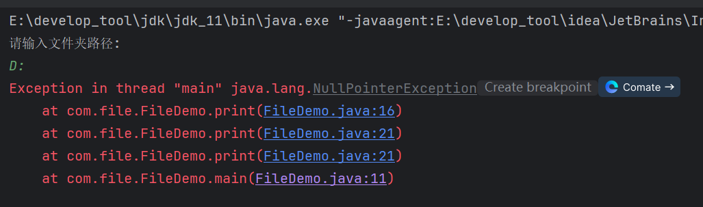

# 1 File类

> 在java中，`File`表示**文件**和**文件夹**。

## 1.1 File的构造

构造一：

```java
public File(String pathname){};
```

> 根据文件路径创建文件对象。

关联D盘下的文件：


此时，D盘下没有该文件，但是执行不会报错：


> `File`类关联文件和文件夹，即使文件和文件夹不存在也不会报错，因为`File`提供了创建文件和文件夹的方法。

构造二：

```java
public File(String parent, String child){};
```

> 根据父级路径和子级路径封装`File`对象。


构造三：

```java
public File(File parent, String child){};
```

> 根据父级`File`对象和子级路径封装成`File`。


## 1.2 相对路径和绝对路径

> **绝对路径**：从盘符根目录开始，一直到某个具体的文件或文件夹。

比如：


从根目录D盘开始，到具体的Download目录，简单来说就是路径写全。

> **相对路径**：若在idea中，则相对于当前项目。


调用`getAbsolutePath()`获取绝对路径，打印出的路径是项目路径：


可见，当前项目中封装的相对路径是相对于项目的。

相对路径创建文件，文件存在项目路径下：


如果想让文件创建在当前目录下：


而目录又在当前项目下，因此可以用相对路径省略项目路径部分：


除了用`\`作为分隔符，还可以用`/`，只不过`\`是转义符，需要用`\`转义，为`\\\`。

## 1.3 isDirectory()

```java
public boolean isDirectory(){};
```

> 判断此路径名表示的`File`是否为文件夹。


## 1.4 isFile()

```java
public boolean isFile(){};
```

> 判断此路径名表示的`File`是否为文件。


## 1.5 exists()

```java
public boolean isFile(){};
```

> 判断文件或文件夹是否存在。


## 1.6 length()

```java
public long length(){};
```

> 返回文件的大小(字节数量)。


**注意**：此方法计算文件夹的字节数是错误的，这是该API设计的问题：


实际大小：


## 1.7 getAbsolutePath()

```java
public String getAbsolutePath(){};
```

> 返回文件或文件夹的绝对路径。


## 1.8 getPath()

```java
public String getPath(){};
```

> 返回定义文件对象时使用的路径，也就是构造方法中指定的路径。


## 1.9 getName()

```java
public String getName(){};
```

> 返回文件或文件夹的名称，带后缀。


## 1.10 lastModified()

```java
public long lastModified(){};
```

> 返回文件或文件夹最后修改时间，返回毫秒值。


如果文件或文件夹不存在，则返回0。


## 1.11 案例

键盘录入一个文件夹路径，如果输入错误就给出提示，并继续录入，直到正确为止。

文件夹路径不存在或路径为文件路径均为错误路径。


改进，封装为方法：


# 2 创建/删除

## 2.1 creatNewFile()

```java
public boolean creatNewFile(){};
```

> 创建一个新的空文件，创建成功返回`true`，反之返回`false`。

带后缀和不带后缀的文件都能创建：


若文件已存在，则创建失败：


## 2.2 mkdir()

```java
public boolean mkdir(){};
```

> 创建文件夹，只能创建1级文件夹，创建成功返回`true`，反之返回`false`。


此案例中尝试用文件名来创建文件夹，最终创建了文件夹，可见只要名称合法就会被理解为创建文件夹，.显然是一个合法名。

**同时也说明，创建文件还是文件夹，并不看名称，而是看调用什么方法。**

若文件存在，则创建失败：


若尝试创建多级文件夹，则创建失败，毕竟此方法只能创建1级文件夹：


## 2.3 mkdirs()

```java
public boolean mkdirs(){};
```

> 创建文件夹，能创建多级文件夹，创建成功返回`true`，反之返回`false`。


## 2.4 delete()

```java
public boolean delete(){};
```

> 删除文件或文件夹，删除成功返回`true`，反之返回`false`。
>
> **注意**：`delete()`只能删除空文件夹，若文件夹中有文件或文件夹，则不能删除。
>
> **慎重：`delete()`删除的文件或文件夹不会去回收站，故不能撤回！！！**

删除前：


删除后：


`delete()`只能删除空文件夹，若文件夹中有文件或文件夹，则不能删除：


删除文件：


# 3 遍历方法

## 3.1 listFiles()

```java
public File[] listFiles(){};
```

> 获取当前目录下所有的**1级文件对象**返回`File`数组。

如何理解1级文件对象？举个例子，在当前目录下：


如果使用`listFiles()`，那么只会将aaa、A.txt、B.txt封装到`File[]`中去，aaa文件夹中的子文件不会封装到数组中。像aaa、A.txt、B.txt这种**在当前文件夹下**就是1级文件对象，而aaa里面的子文件对象就不是1级文件对象。


aaa中的子文件对象并没有封装到数组中，也就没有打印出来。

## 3.2 案例

键盘录入文件夹路径，找出目录下所有.java文件。


判断文件的后缀名是否为.java文件即可。重点是忽略文件夹，如果当前的对象是文件夹，那么截取的文件对象名称不一定有.，这块容易报错。

如果不只是找出当前目录下的.java文件，还有找出子文件夹下面的.java文件该怎么办呢？这就需要用到递归思想了，对文件夹进行递，当遇到文件就停止，往前归。

aaa目录：


bbb目录：


使用递归完成文件夹遍历：


`endsWith()`，判断是否以传入的字符串为后缀。

## 3.3 注意

如果遍历D盘：



报错了，显示空指针。最终错误指向16行：


分析得出`File[]`数组有可能为`null`。这其实是调用`listFiles()`的一个注意实事项：

> - 当调用者`File`表示的**路径不存在**时，返回`null`。
> - 当调用者`File`表示的**路径是文件**时，返回`null`。
> - 当调用者`File`表示的**路径是一个空文件夹**时，返回一个长度为0的数组。
> - 当调用者`File`表示的路径是**需要权限才能访问**的文件夹时，返回`null`。

所以，原因就是D盘中存在需要权限才能访问的文件夹，因此访问此文件夹时`listFiles()`返回了一个空数组，，导致报错。


解决方法就是加非空判断：


## 3.4 自定义删除文件

使用递归删除文件夹下所有文件夹：


删除后，只删除了文件，没有删除文件夹：


只需在循环遍历后，再执行一次删除即可：


现在连test-副本都删除了：


因为循环遍历中只是递归删除了文件，所以出了循环意味着该目录下的所有文件都以删除，该目录变成了空目录，可以直接删除。

## 3.5 统计文件夹大小

递归统计文件夹大小：


## 3.6 统计文件类型个数


用递归统计，用`Map`来存放：


**注意**：文件即使没有后缀后也是可以存在的，只是文件类型未知。另外获取后缀名时，从最后一个.开始，因为文名中允许存在.。