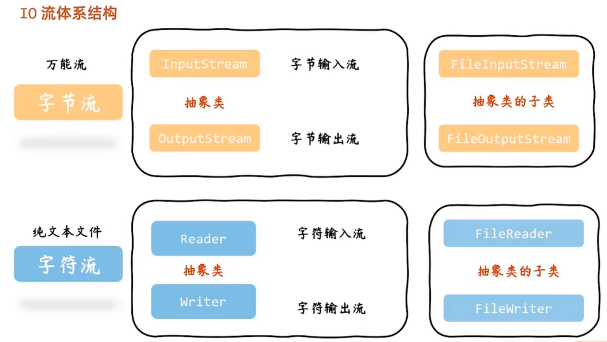

# 1 IO流

> I：即input，输入的意思。
>
> O：即output，输出的意思。
>
> 输入可以理解为读取，输出可以理解为写入。

读取什么呢？即java程序能从文件中读取数据到内存中，java程序开启一个**输入流管道**，读取文件的内容，通过管道读取到内存中。

写入什么呢？即java程序可以将读取的内容写入到文件中，或者写入自定义的新内容到文件中，java程序开启**输出流管道**，将内容通过管道写入到目标。

## 1.1 应用场景

IO流应用总结起来就是**数据传输**：

- **场景1**：读写配置文件，日志文件等。
- **场景2**：客户端于服务器之间的通信，底层也是基于IO流。
- **场景3**：文件上传和下载。

## 1.2 IO流体系结构

在java中，IO流对象分为两大类：

1. 字节流
2. 字符流

字节流也叫万能流，因为计算机中文件存储都是字节，所以字节流能操作这些文件。字节流在操作纯文本文件时容易出现乱码问题，所以诞生了字符流。

因此，对于纯文本文件用字符流，反之都用字节流。

**字节流体系：**

字节流中有两个抽象类：

- `InputStream`：字节出入流，读取数据。
- `OutputStream`：字节输出流，写入数据。

它们的子类：

- `FileInputStream`
- `FileOutputStream`

**字符流体系：**

字符流中也有两个抽象类：

- `Reader`：字符输入流，读取数据。
- `Writer`：字符输出流，写入数据。

它们的子类：

- `FileReader`
- `FileWriter`

体系图：

