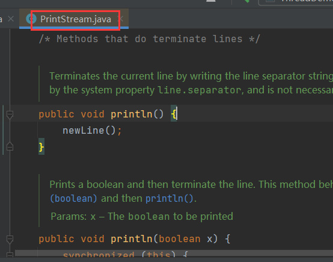

# 1 打印流

打印流可以实现方便、高效的打印数据到文件中去，并且可以指定字符编码，可以实现打印什么数据就是什么数据，例如打印整数97写出去就是97。

打印流可以原样写出，字节流中写出97，那么实际写出的是a，中间做了字符转换，而打印流是写出什么，就是什么。

打印语句：

```java
System.out.println(String str);
```

这个`println()`就是打印流中的方法：



而`System`中`out`就是一个`PrintStream`类型的静态变量：


打印流`PrintStream`的父类是`OutputStream`，可见它是一个字节流：


## 1.1 标准输出流

`PrintStream`又叫做标准输出流，这标准指的是控制台，也就是说输出流的方法默认指向控制台。

## 1.2 标准输出流

`PrintInput`，标准输入流，即读取控制台中的数据。在获取键盘录入时，`Scanner`的构造中需要传入`System.in`，这个`in`就是一个`PrintInput`类型的变量：


## 1.3 标准错误输出流

也是一个`PrintStream`，不过用它打印出的数据带有颜色，表示错误信息：


## 1.4 构造

用`System.out`获取的打印流默认指向控制台，若想指向文件，可以使用构造：

```java
public PrintStream(OutputStream out){};
```

> 打印流直接通向字节输出流管道。


```java
public PrintStream(File file){};
```

> 打印流直接通向文件对象。


```java
public PrintStream(String filepath){};
```

> 打印流直接通向文件路径。


## 1.5 println()

```java
public void println();
```

> 若打印流关联文件，则将内容原样写入文件，带有换行。

### 1.5.1 print()

```java
public void println();
```

> 不带换行。


## 1.6 指定字符编码

在构造的第二个参数中可以传入字符编码：

```java
public PrintStream(String filepath, String csn){};
```


## 1.7 追加写

追加写开关`PrintStream`虽然不能指定，但是它接收`OutputStream`参数，可以通过`OutputStream`来指定：


