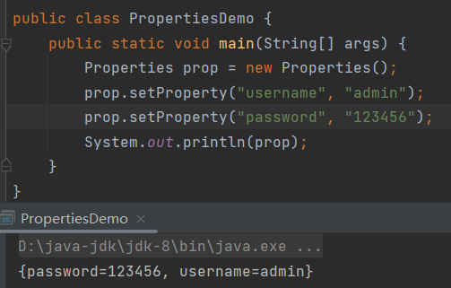
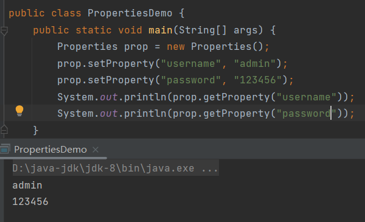
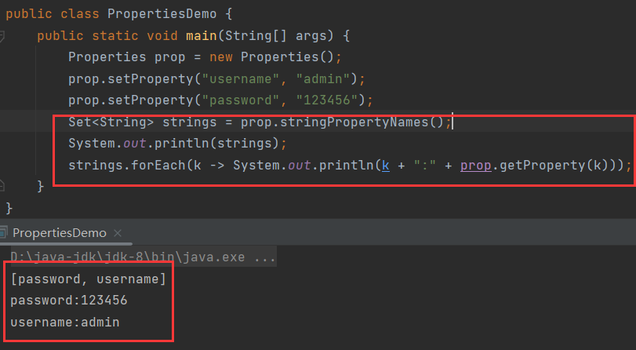
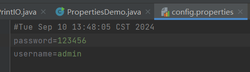
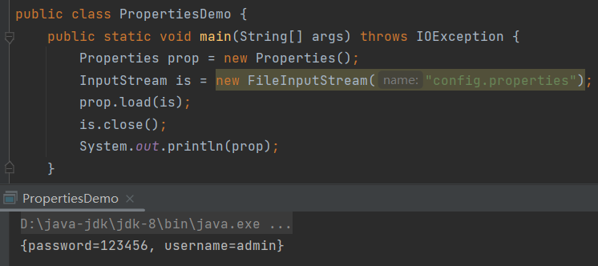
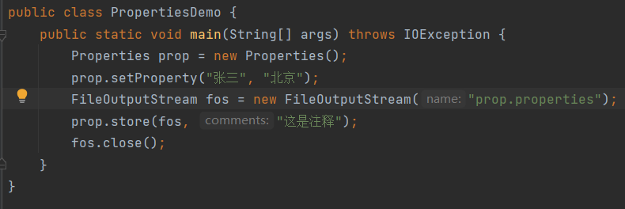
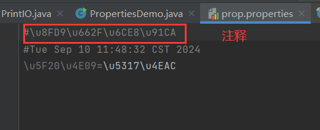
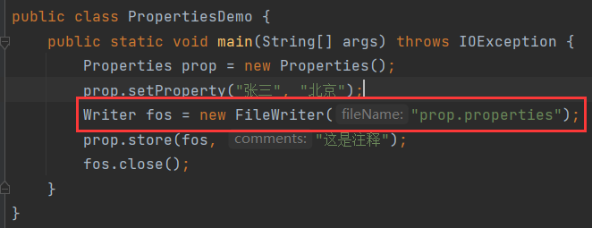
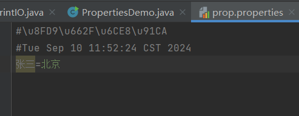

# 1 Properties

该集合提供了跟IO流相关的方法，因此放到IO流章节。

> `Properties`类表示一组持久的属性。`Properties`可以保存到流中或从流中加载。属性列表中的每个键及其对应的值都是一个字符串。

- 持久表示数据持久化，即数据持久化保存，也就是保存在文件中。
- 保存到流中或从流中加载，即可以将集合中数据保存到文件中，或从文件中读取到集合中。
- 键值对都是一个字符串，反映出`Properties`是一个双列集合。
- `Properties`的父类是`Hashtable`，`Hashtable`是`HashMap`的前身。
- `Hashtable`于1.1版本出现，而`HashMap`在1.2时出现。
- `Hashtable`与`HashMap`的区别是：`Hashtable`是同步，线程安全的，而`HashMap`虽然也是同步，但它线程不安全。

## 1.1 应用场景

> 常用于加载配置文件。

## 1.2 构造

```java
public Properties(){};
```

> 创建一个空集合。


# 2 集合的方法

## 2.1 setProperty()

```java
public Object setProperty(String key, String value){};
```

> 添加(修改)一个键值对。同`Map`中的`put()`。



## 2.2 getProperty()

```java
public String getProperty(String key){};
```

> 根据键获取值。



## 2.3 stringPropertyName()

```java
public Set<String> stringPropertyName(){};
```

> 返回集合中所有的键。




# 3 IO相关方法

## 3.1 load()

```java
void load(InputStream in){};
```

> 从流中加载数据到集合(字节流)。





### 3.1.1 重载1

```java
void load(Reader r){};
```

> 从流中加载数据到集合(字符流)。


## 3.2 store()

```java
void store(OutputStream out, String comments){};
```

> 将集合的键值对写出到文件(字节流)。第二个参数表示注释。

文件的后缀最好是properties，否则容易出现格式错误：





文件中的内容看起来像乱码，其实是Uniocde码。

### 3.2.1 重载1

```java
void store(Writer w, String comments){};
```

> 将集合的键值对写出到文件(字符流)。

如果不想文件中看见Unicode码，那么可以用字符流：



