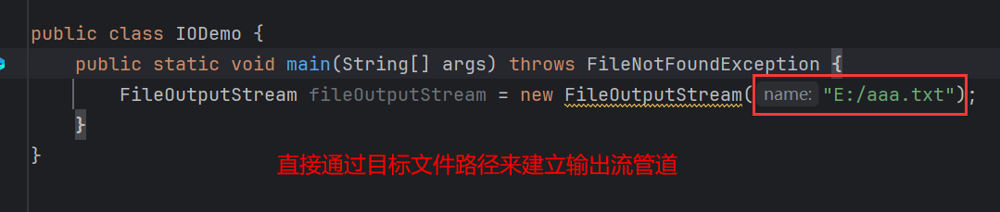

# 1 FileOutputStream

> 字节输出流，即java程序与目标之间建立管道，然后通过管道将内容**以字节的形式**写入到目标。由于写入的是字节，所以不同字符集会显示不同的字符。


即，该类的作用就是让程序与文件之间建立管道然后通过将内容以字节形式写入文件中。

## 1.1 构造方法

如何建立管道？

直接创建对象，关联相关文件即可。

**构造1**：

```java
public FileOutputStream(String filepath){};
```

> 输出流关联文件，文件路径以字符串形式给出。



构造方法会抛出`FileNotFoundException`即文件找不到，如果在未创建文件的情况下运行：


并不会报错，反而会帮助创建该文件：


但是，如果指定的盘符不存在，就会抛出该异常：


**构造2**：

```java
public FileOutputStream(File file){};
```

> 输出流关联文件，文件路径以`File`形式给出。


## 1.2 write()

创建对象只是建立起该文件的管道，写入内容还得调用方法。

```java
public void write(int b){};
```

> 见名知意，即写入数据的方法，传入字节。


### 1.2.1 重载1

```java
public void write(byte[] b){};
```

> 传入字节数组，一次性写入多个内容。


字符串的方法`getBytes`可以将字符串转换为字节数组，这样就可以直接写入字符串：


### 1.2.2 重载2

```java
public void write(byte[] b,int index, int len){};
```

> 写出字节数组的一部分，第二个参数表示开始写入的位置，第三个参数表示写入多少给字节，并不是结束位置。


## 1.3 细节

> `FileOutputStream`写入数据，如果文件不存在，那么会创建文件，但是如果文件已存在，那么会清空文件内容再写入数据，即覆盖。

## 1.4 追加写入

```java
public FileOutputStream(String filepath, boolean append){};
```

> 即构造方法第二个参数传入`true`表示追加写入。


执行：


内容追加：


## 1.5 关闭流

> 流对象使用完毕后，需要关闭流，否则占用系统资源。


文件写入内容，然后进入死循环：


此时，如果删除文件，就会报错：


原因就是因为使用了流建立了该文件的管道，然后在写入完数据后没有关闭管道，而java程序又进入了死循环导致程序一直不能停止，进而导致一直占据该文件资源。

```java
public void close(){};
```

> 关闭流。


删除成功：


如果在死循环之前关闭流，那么即使程序因死循环无法停止，也由于提前关闭了管道释放了该资源，而能正常删除该文件。

## 1.6 标准流关闭写法

`finally`语句，即在`try...catch`基础上增加的代码块，无论什么情况下都会执行。如果遇到错误，那么`catch`块执行，`finally`也会执行。如果没有错误，`try`块执行，`finally`块也会执行。

IO流会抛出`IOException`异常，正确的做法不是向上抛出，而是`try...catch`捕获，下面是标准流关闭代码：


**1、为什么关闭流要定义在`finally`中？**

无论什么情况下`finally`中的代码都会执行，保证流一定能关闭。

**2、为什么要在`try`外面定义字节输出流对象，而不在`try`里面？**

因为如果在`try`里面定义，那么作用域不够，`finally`中的对象无法使用，所以需要定义在`try`外提升作用域：


**3、在`finally`中为什么不直接调用关闭方法，反而先判断字节输出流对象是否为`null`？**

因为为了提升作用域，将输出流对象放在`try`外，并初始化为`null`，如果在`try`中创建对象语句执行之前遇到错误，那么创建对象语句就不会执行，导致此时的输出流为`null`最后执行`finally`若不进行判空操作就会抛出空指针异常。


**4、为什么输出流对象要初始化为`null`？**

因为在方法中如果只定义了变量没有赋予任何值，那么这个变量是没有值的。所以在`finally`中的输出流对象就可能是未初始化的：


即便在`try`中创建了对象给变量赋值，但是结合问题3中的情况，假设在创建对象之前报错，那么走到`finally`输出流对象依旧是未初始化。

**5、为什么在`finally`中还要`try...catch`？**

因为`close()`也会抛出异常：


综上，这就是标准流关闭的处理。这种写法是在JDK7之前的标准写法。

但是在JDK7以后，为了简化这种写法，引入了一种语法糖：`try-with-resources`：

```java
try(需要调用close()的对象) {
    // 代码逻辑
} catch(异常类型 对象名) {
    // 异常处理逻辑
}
```

这种语法不用要求手动关闭，只需要将需要调用`close()`的对象放入`try()`中就能实现自动关闭：


但是并非所有对象都能往`try()`中放：


只有实现了`AutoCloseable`接口并重写了`close()`，才能放进去：


而且重写的`close()`会自动执行：

