# 1 FileInputStream

> 字节输入流，即读取数据。java程序与被读取文件建立管道，数据通过管道**以字节的形式**读取到内存中。

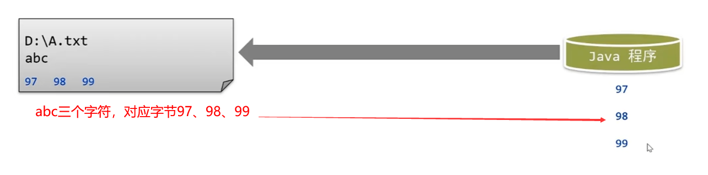

## 1.1 构造方法

通过创建对象与文件建立连接。

**构造1：**

```java
public FileInputStream(String filepath){}
```

> 输入流关联文件，文件路径以字符串形式给出。

**构造2：**

```java
public FileInputStream(File file){}
```

> 输入流关联文件，文件路径以`File`形式给出。

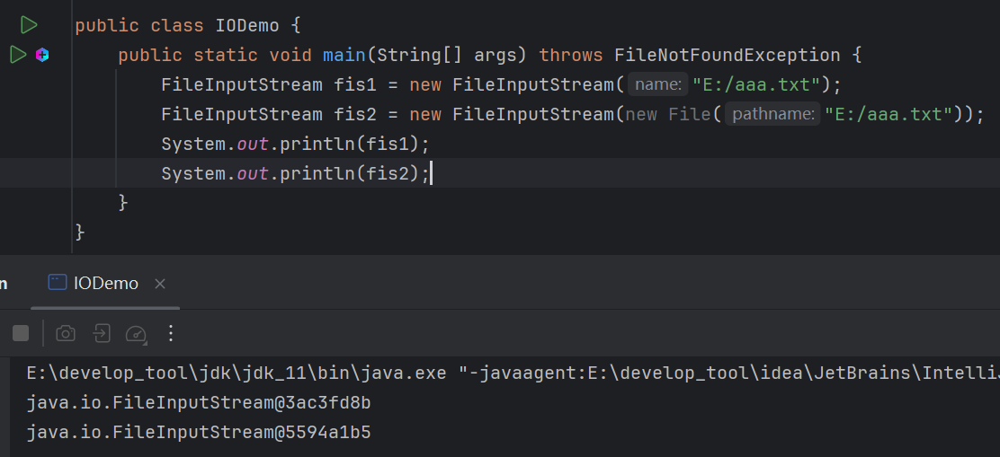

### 1.1.1 注意

> 输入流如果关联的文件不存在，会抛出异常。毕竟输入流是读取数据，并不会创建文件。

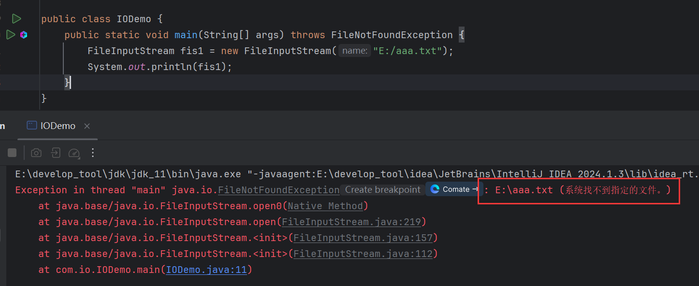

> 如果关联的不是文件而是文件夹，也会抛出异常，显示拒绝访问。

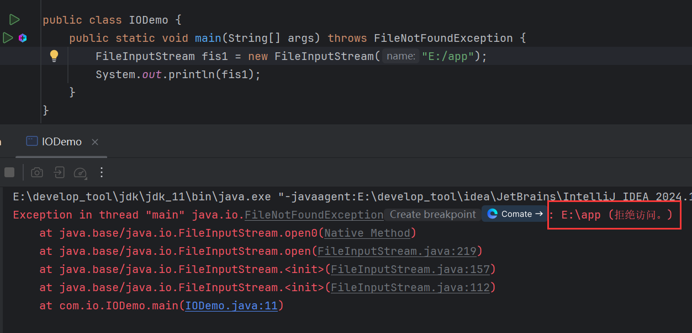

## 1.2 read()

```java
public int read(){};
```

> 读取一个字节并返回，读取完毕返回-1。

一次读取一个字节：

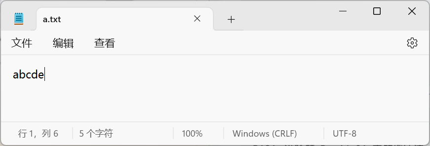

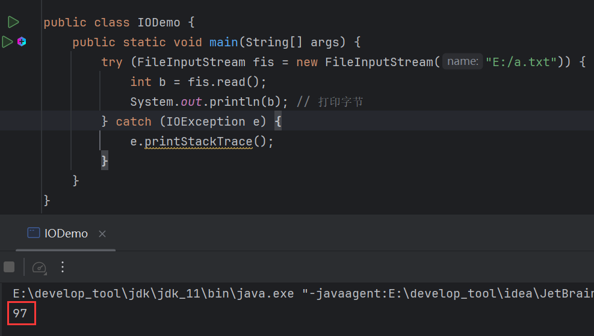

再次调用就获取下一个字节：

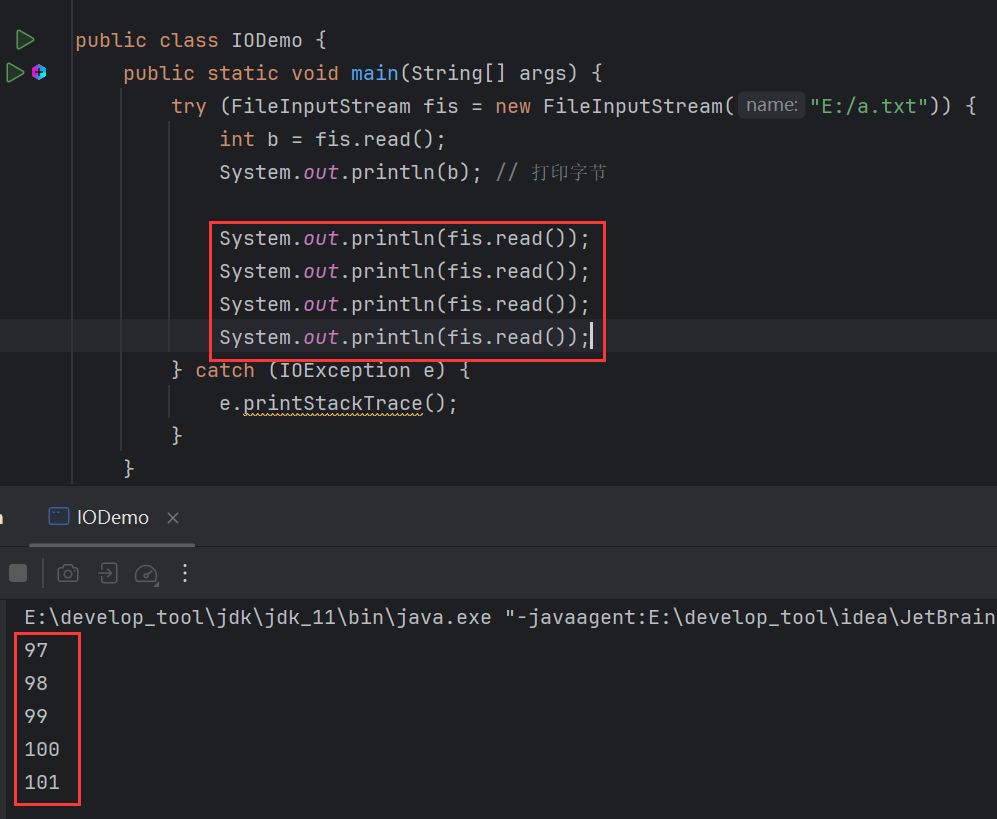

若数据读取完毕，再次读取则和返回-1：

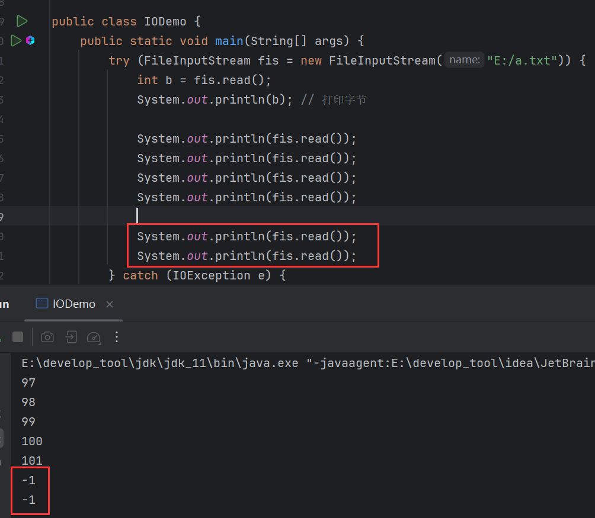

循环读取：

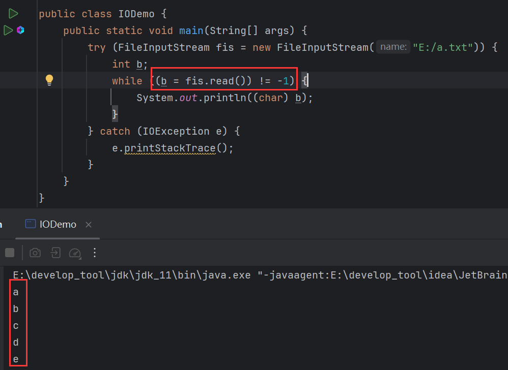

### 1.2.1 重载1

```java
public int read(byte[] b){};
```

> 读取字节，放到传入的数组中，返回读取到的有效字节个数，读取完毕，返回-1。

一次读取多个：

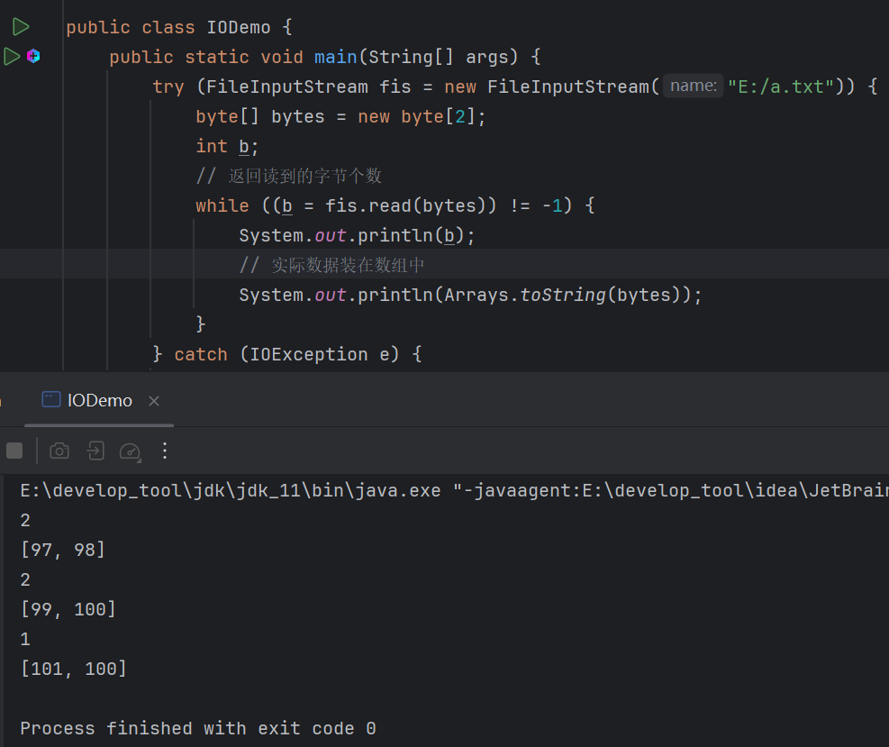

第三次读取时，还剩下一个字节，所以数组中的第2个元素100实际上上上一轮读取的残留元素。

### 1.2.2 String构造

如何避免使用残留字节，同时将字节数组转换为字符串？

可以使用`String`的构造方法：

```java
public String(byte[] b, int index, int length){}
```

> 将字节数组转换为字符串。
>
> - 参数1：字节数组。
> - 参数2：起始索引。
> - 参数3：转换的个数。

将返回的实际读取到的字节个数作为`length`，就能避免使用残留字节：

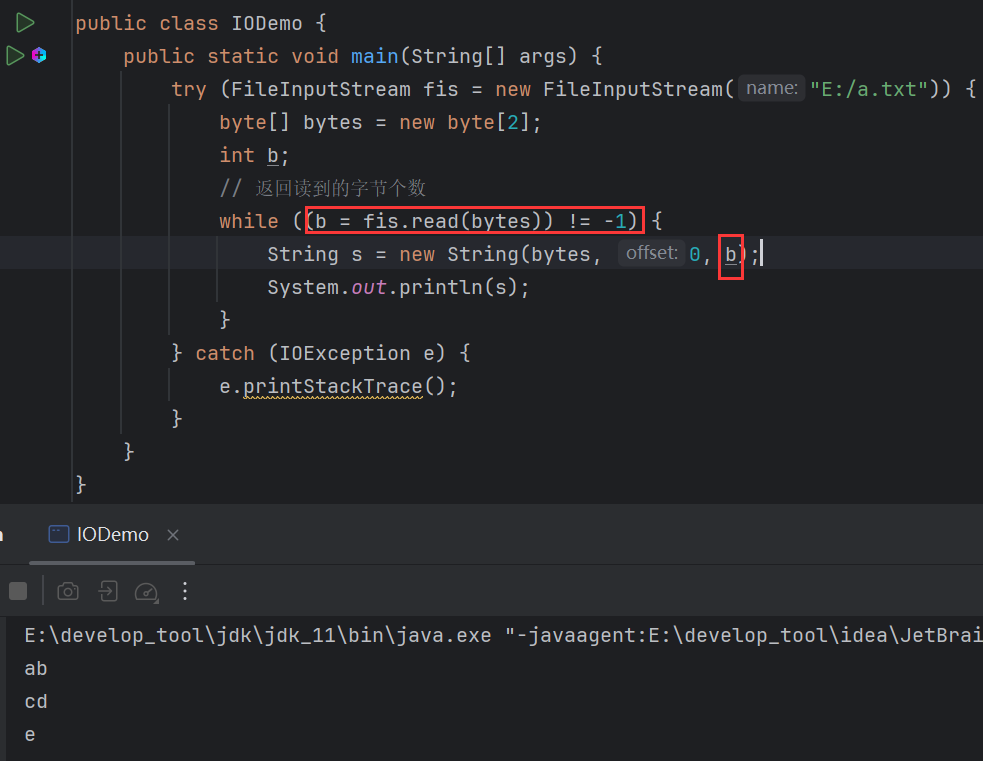


# 2 案例

将D盘下的图片拷贝到E盘根目录下：

1. 创建输入流对象读取文件。
2. 创建输出流对象关联数据目的。
3. 读写操作。
4. 关流释放资源。

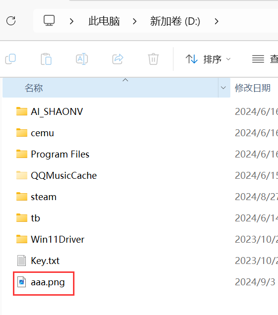

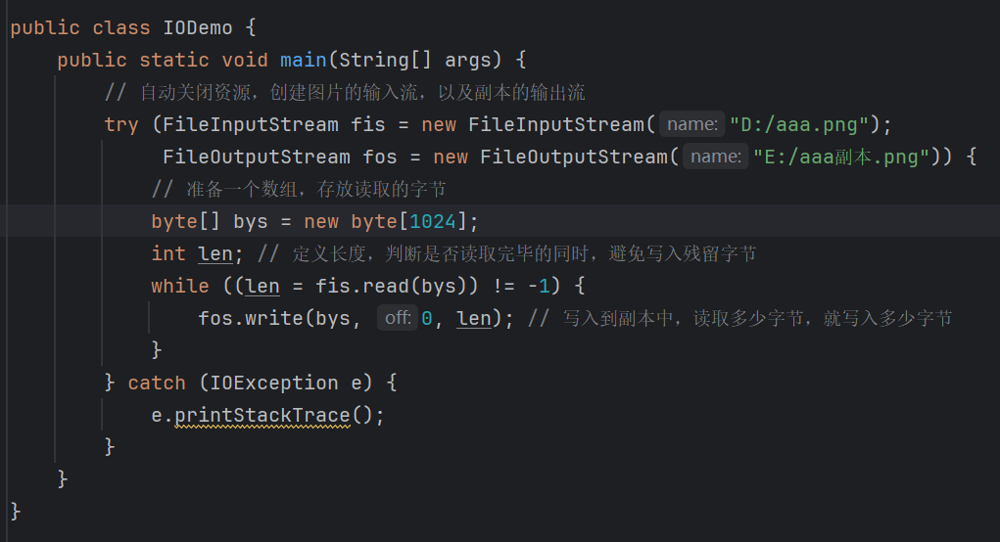

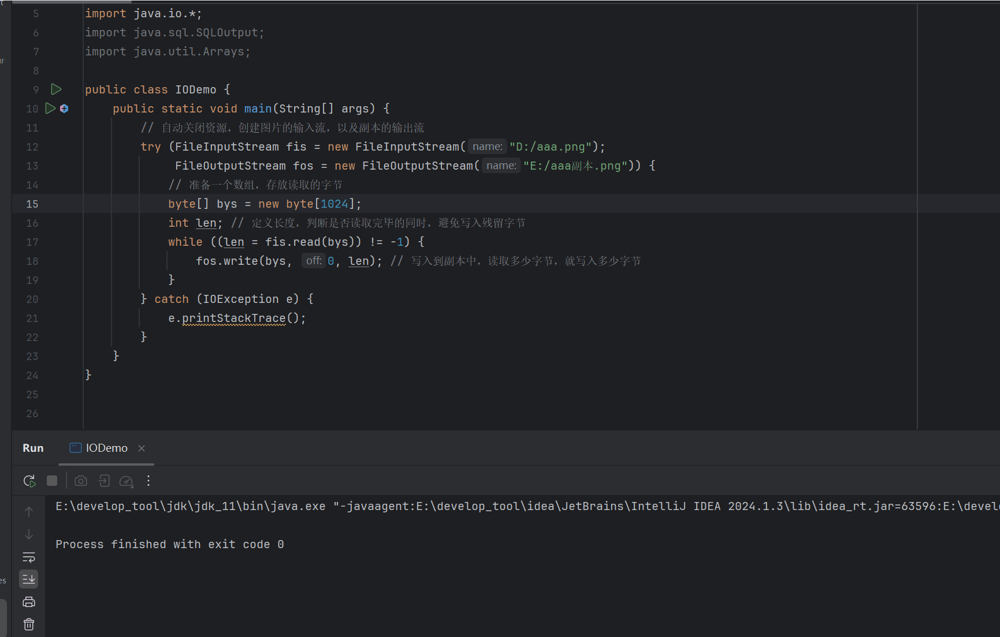