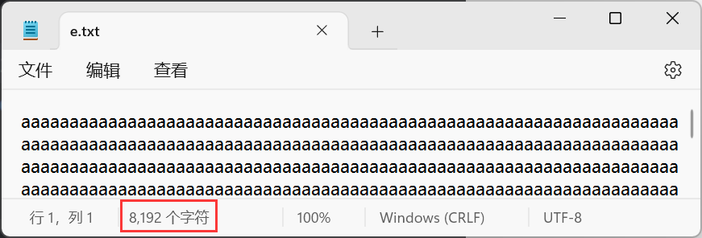

# 1 字节缓冲流

> 字节缓冲流在源代码中**内置了字节数组**，可以提高读写效率。

## 1.1 构造方法

**缓冲输入流：**

```java
public BufferedInputStream(InputStream in){};
```

> 对传入的字节输入流进行包装。

**缓冲输出流：**

```java
public BufferedOutputStream(OutputStream out){};
```

> 对传入的字节输出流进行包装。

## 1.2 注意

> 缓冲流**不具备读写的功能**，它们只是对普通流对象进行包装，真正和文件建立联系的是普通流对象。这也是为什么缓冲流构造方法中需要传入普通流对象。

## 1.3 示例

通过文件拷贝，演示缓冲输出和输出流：


通过示例代码可以看出，缓冲流读写操作与普通流无异，都是调用`read()`和`write()`。

### 1.3.1 关闭流细节

用缓冲流包装普通流以后，直接关闭缓冲流即可，不必再关闭普通流。因为关闭缓冲流的同时，连带着普通流也一起关闭了。

## 1.4 耗时对比

使用缓冲流拷贝：


使用普通流拷贝：


可以看出，这个案例中缓冲流确实快于普通流。

## 1.5 缓冲流读写过程

缓冲流底层内置数组：

缓冲输入流：


会创建一个长度为8192的数组。

缓冲输出流：


也会创建长度为8192的数组。

事实上，缓冲流的读写过程，并不是直接读与直接写，在调用读写方法时看起来像是从文件中读取字节到内存，又从内存中写入到文件：


其实，真正的读写过程是：

- 读取时，先将数据读取到内置数组中，调用`read()`是**从数组中读取，而不是直接从文件中读取。**
- 写入时，先将数据写入到内置数组中，调用`write()`是**从数组中写入文件，而不是直接写入文件。**

图解：

假设用缓冲流读取文件，文件大小1w字节。那么首先需要普通流与文件建立联系：


然后通过缓冲流包装，底层创建8192长度的数组：


当读取时，会一次性读取8192个字节，将数组装满：


上面说过，调用`read()`并不是直接从文件中读取，而是从内置数组中读取，调用一次，读取数组中的一个字节，当把数组中有效字节读取完毕后，再次调用时，又会先装满数组，然后再从数组中读取一个字节出来。

用debug观察：


而缓冲流写入，首先是通过普通流与目标文件建立联系：


然后缓冲流包装：


写入数据时，字节并不是直接写入到文件中，而是先写入到缓冲输出流的内置数组中，当写入的字节装满并超过数组，才会一次性的将数组中的字节写入到目标文件中：


比如，这个示例，写9182个字节到文件中：


先写一个字节：


文件中是没有内容的：


因为这次写入是写入到内置数组中，数组没有装满是不会写入到文件中的。

如果写8192个字节：


文件依旧没有内容：


当把数量改成8193：


这次，文件中就有内容了：



所以，即便数组装满了也不会写入，只要超过了8192个字节，才会写入。当超过数组容量时，数组已经装不下了，所以就会先将数组中的数据写入文件，清空数组，才能继续装数据。

但是，如果写入的数据并没有超过8192，岂不是不能写入？

其实，只要关闭流，就会写入，如果不关流，那么不会写入。因为在关流中的方法中会先判断数组中是否还有，没有写入的数据，如果有就会写入文件，然后再关流。


## 1.6 效率测试

拷贝的四种方法：

1. 普通流+单个字节读取写入。
2. 普通流+字节数组读取写入。
3. 缓冲流+单个字节读取写入。
4. 缓冲流+字节数组读取写入。

**1、普通流+单个字节读取写入：**


耗时：197872毫秒。

**2、普通流+字节数组读取写入：**


耗时：359毫秒。

**3、缓冲流+单个字节读取写入：**


耗时：768毫秒。

**4、缓冲流+字节数组读取写入：**


耗时：72毫秒。

图解：

第一种：


从文件读取一个字节到程序，然后再从程序写入一个字节，一次只读一个字节，写一个字节，效率差是必然的。

第二种：


从文件中一次性读取1024个字节到程序中，然后一次性写入1024个字节，相比于第一种，效率提升了很多。

第三种：


首先，是一次性读取8192个字节到缓冲输入流的数组中，然后再将数组中的字节，写入到缓冲输出流的数组中，此处**是一个字节，一个字节的写入输出流的数组**，然后当缓冲输出流的数组装满且操过了数组，再一次性写入到文件中。

关键点在于，缓冲输出流和输出流的数组之间在做搬运操作，无非搬运快慢的问题：


既然是数组之间在做搬运操作，那么依然要搬运8192次，这样的效率不会低吗？

其实不会很低，因为这里的操作是在内存中进行的，内存中的计算速度是很快的。

第四种：


其实，在第三种的图解中就说过了，关键点在于，缓冲输出流和输出流的数组之间在做搬运操作，无非搬运快慢的问题，上面是一个字出数组，然后将这个字符写进数组，如果一次性从数组中读取出多个字节，然后再一次性写入到数组中，速度自然就提升了。这是通过提高搬运速度来提高整体速度。

所以，定义一个数组，让缓冲输入流的数组读取的时候一次性读多个数据放到自定义数组中，然后再将数组中的数据一次性写入缓冲输出流的数组中。

既然第四种方法效率最高，是不是可以无脑使用？

其实不一定，如果将第二种的数组容量定义大一些，效率可以匹敌第四种：


甚至比第四种还要快，而且代码更加简洁，不用使用缓冲流进行一遍包装。

其实说来说去，使用什么方法，还是得依情况而定。
