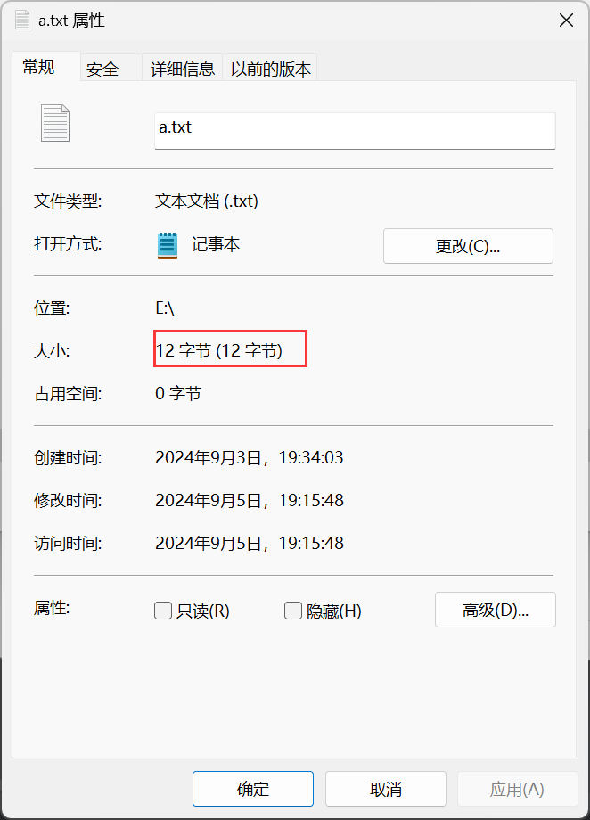
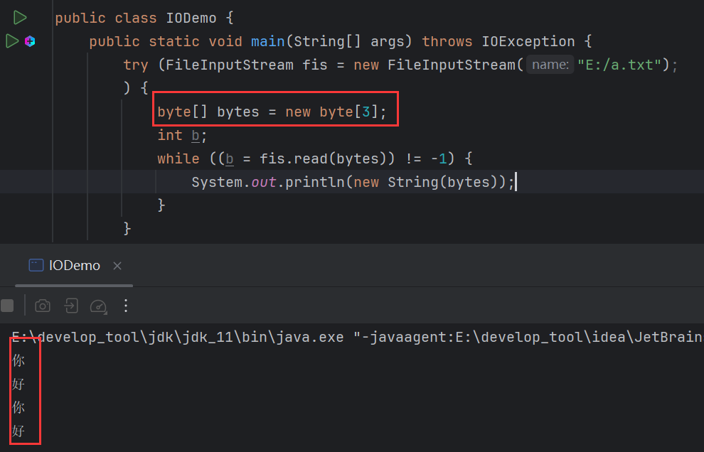
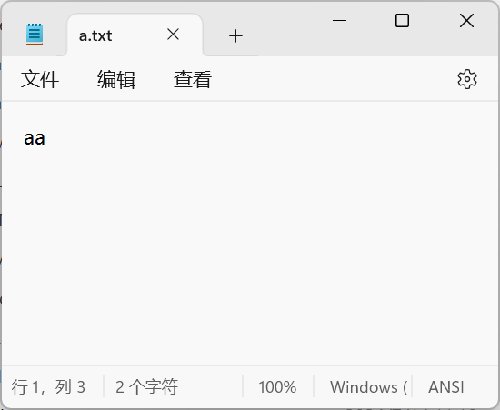
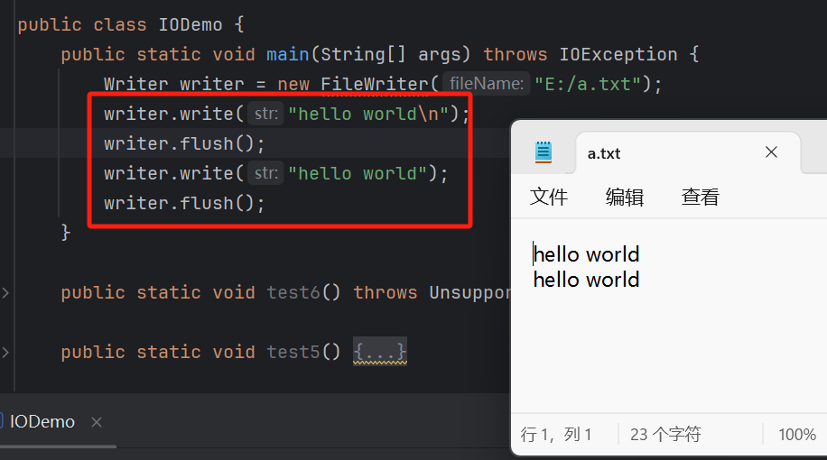

# 1 字节流乱码问题


读取字节，转换为字符并打印：


显示的字符是乱码。这是因为文件中的内容是中文，而整个文件一共4个字符：


文件大小为12字节：



可以推测出，一个中文字符占3个字节，而在读取时是一个字节的读取，所以在转换为字节时才会出现乱码：


既然一个中文占3个字节，那么一次性读取3个字节就可以显示正确的字符：



但是字符的字节个数会根据字符集编码的不同而不同，无法做到统一，况且即便事先知道字符有多少个字节，若内容中不只有中文，还有标点符号，也会导致出现乱码，因为标点符号不一定与中文的字节数一致，比如英式标点：


计算得标点占1个字节，这就导致读取时出现乱码：


由于标点占1个字节，因此在读取完"你好"两个字符后，再次读取3个字节就是标点的1个字节和第2个"你"的前两个字节，导出出现的乱码。

所以字节流处理文本文件时容易出现乱码。


# 2 FileReader

> 用于读取纯文本文件，解决中文乱码问题。

## 2.1 构造

**构造1：**

```java
public FileReader(String filepath){};
```

> 字符输入流关联文件，路径以字符串形式给出。

**构造2：**

```java
public FileReader(File file){};
```

> 字符输入流关联文件，路径以`File`形式给出。

## 2.2 read()

```java
public int read(){};
```

> 读取单个**字符**，返回`Unicode`编码值，为该字符的整数表示形式，可以被转换为字符。


### 2.2.1 重载

```java
public int read(char[] chars){};
```

> 读取到字符数组中，返回读取到的有效字符个数。


## 2.3 解决乱码的原理

### 2.3.1 字符集

> 指多个字符的集合。

如ASCII编码表：


- **GB2312字符集：**1980年发布，1981年5月1日实施的简体中文汉字编码国家标准。收录7445个图形字符，其中包括6763个简体汉字。

- **BIG5字符集：**台湾地区繁体中文标准字符集，共收录13053个中文字，1984年实施。

- **GBK字符集：**2000年3月17日发布，收录21003个汉字。包含国家标准GB13008-1中的全部中日韩汉字，和BIG5编码中的所有汉字。

在windows系统中，默认中文字符集就是GBK，只不过显示为ANSI，即显示为ANSI，实际为GBK：


单就中文字符集就这么多，其他语言也有自己的字符集，如何统一？

**Unicode字符集：**国际标准字符集，它将世界各种语言的每个字符定义一个唯一的编码，以满足跨语言、跨平台的文本信息转换。

java使用的字符集就是Unicode字符集。

### 2.3.2 字符编码

> 字符编码是指一种映射规则，根据这个规则可以将某个字符映射成其他形式的数据以便在计算机中存储和传输。
>
> 简单来说就是**字符到字节的规则**。

在GBK中：

- 每个中文占用2个字节。
- 每个英文占1个字节。

当前字符集GBK：


两个汉字占4个字节：


一个英文占1个字节：




中文标点占2个字节，因为标点占1个字节：


在Unicode中：每个中文占用3个字节。

Unicode中有很多中编码规则，常见如：

- UTF-16：用2~4个字节保存。
- UTF-32：固定使用4个字节保存。
- UTF-8：用1~4个字节保存。

所谓UTF就是Unicode Transfer Format，Unicode转换格式首字母缩写。

其中UTF-8是比较常用的，因为其比较灵活，根据不同语言存储不同字节数据，在UTF-8中：

- ASCII，占用1个字节。
- 拉丁文、希腊文、阿拉伯文等，占用2个字节。
- **中日韩文、中东文、简体中文等，占用3个字节。**
- 其他语言，占用4个字节。

### 2.3.3 编码

> 编码：字符转字节。

编码使用`String`提供的`getBytes()`：

```java
public byte[] getBytes(){}
```

> 使用**平台默认字符编码**方式，对字符串编码。 


**细节：**中文占3个字节，其中第一个字节一定是负数，其余两个有可能是正数。

```java
public byte[] getBytes(String charsetName){}
```

> 使用**指定的字符编码**方式，对字符串编码。


### 2.3.4 解码

> 解码：字节转字符。

解码，使用`String`的构造方法：

```java
public String(byte[] bytes){}
```

> 使用**平台默认字符编码**方式，对字符串解码。

```java
public String(byte[] bytes, String charsetName){}
```

> 使用**指定的字符编码**方式，对字符串解码。


第二个数组是GBK字节，而解码用的是默认编码规则UTF-8，编码和解码的规则不一样就会出现乱码，指定为GBK编码规则，则正确解码：


### 2.3.5 原理

读取文件:


断点执行：


在`FileReader`内部有一个字节数组，长度为8192，跟缓冲流一样，`FileReader`在读取时，也会事先将字节读入数组中，把数组装满。


在读取时取出字节。只不过取的时候有处理，会先判断取出的字节的符号，如果是正，说明不是汉字，那么直接返回，如何为负数，根据汉字字节首个字节为负的情况，判断这个字节为汉字的首字节，然后就会根据字符编码决定继续读几个(若传入了字符编码参数，则依据参数，否则依据平台默认编码)。此处用到UTF-8，所以汉字占3个字节，因此从负字节开始，读取3个字节出来：


然后通过计算转换为Unicode码返回。


这个Unicode码就是这个汉字所对应的编码，通过这个编码就能映射出这个汉字。

综上，`FileReader`内部也是有一个字节数组的，长度为8192，在调用读取方法时，会先读取8192个字节将数组装满，然后返回字节，返回的时候会根据字节的符号判断是否为汉字，以进行不同的处理，若为正则不是汉字，直接返回，如果为负则为汉字首字节，再根据字符编码取出余下的字节，通过计算返回Unicode码，通过这个Unicode码就能映射出该汉字。

正是因为判断字节符号以读取不同个数字节的处理，才使得`FileReader`能处理乱码问题。


# 3 FileWrite

> 字符输出流，解决乱码问题。

## 3.1 构造

**构造1：**

```java
public FileWrite(String filepath){};
```

> 字符输出流关联文件，路径以字符串形式给出。

**构造2：**

```java
public FileWrite(String filepath, boolean append){};
```

> 追加写入的开关。

**构造3：**

```java
public FileWrite(File file){};
```

> 字符输出流关联文件，路径以`File`形式给出。

**构造4：**

```java
public FileWrite(String filepath, boolean append){};
```

> 追加写入的开关。

## 3.2 write()

```java
public void write(int c){};
```

> 写出单个字符。
>
> 虽然参数接收`int`类型，即需要传入字节数，但其实`int`类型可以接受字符，所以传入单个字符是可以的。


### 3.2.1 重载1

```java
public void write(char[] c){};
```

> 写出一个字符数组。


### 3.2.2 重载2

```java
public void write(char[] c, int index, int len){};
```

> 写出数组的一部分，从索引开始，写多少个。


### 3.2.3 重载3

```java
public void write(String str){};
```

> 写出字符串。


### 3.2.4 重载4

```java
public void write(String str, int index, int len){};
```

> 写出字符串的一部分，从索引开始，写多少个。


### 3.2.5 细节

> 如果`FileWrite`不关闭流，则可能不会写入到文件。


因为，`FileWrite`也有一个内置字符数组，长度为8192：


跟缓冲流一样，在写入时，会先将字节写入内置数组中，只有内置数组装不下了才会写入到文件中，如果未装满数组，要想写入就需要关流，因为关流操纵会将数组中剩余字节写入。

## 3.3 flush()

```java
public void flush(){}
```

> 将`FileWrite`内置数组中的数据推送到文件中。

`flush()`可以在不关闭流的情况下推送内置数组中的数据：


与`cloes()`的区别就是，推送完后，可以继续写入：

