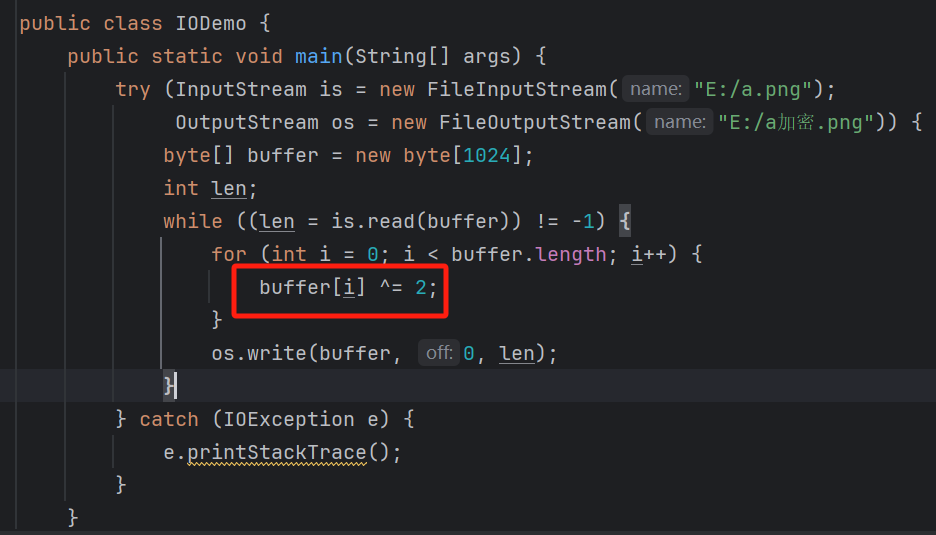
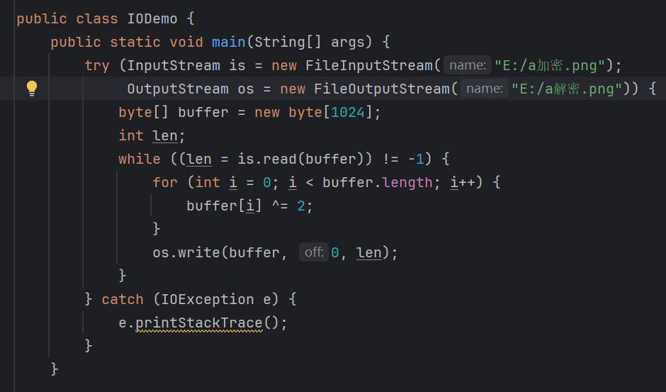
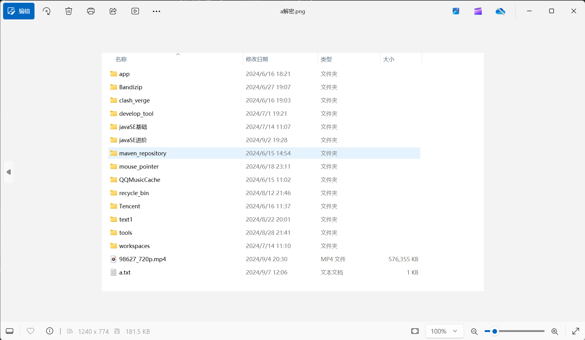
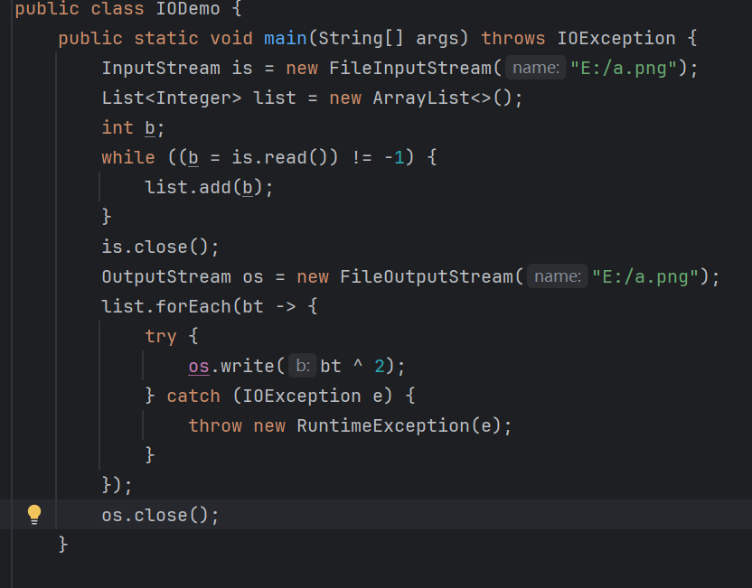
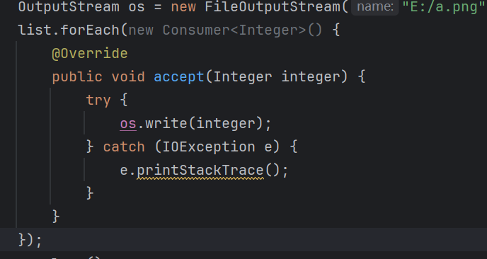
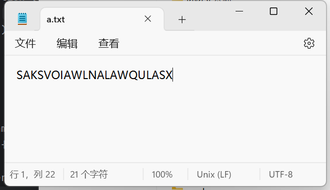
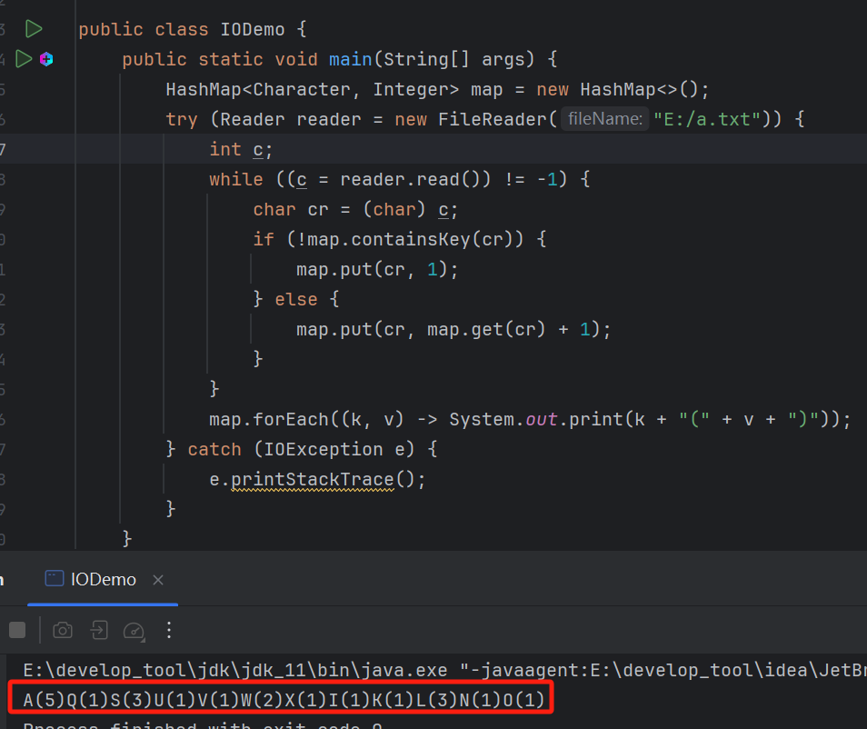

# 1 图片加密和解码

加密思路：改变原始文件中的字节，原文件就无法打开了。比如：字节^2。

解密思路：将文件中的字节还原成原始字节即可。比如：字节再次^2，数据异或两次不变。

加密：




解密：





还可以改成这样，加密和解密不生成新文件，就改变原文件：



为什么【lambda】需要捕获异常，不是在【main()】中已经抛出了异常了吗？

其实是【lambda】重写的方法捕获异常，【main()】虽然抛出了异常，但这只是针对【main()】：



【lambda】是匿名内部类的语法糖，重写【accept()】中调用【write()】需要对异常进行处理。


# 2 统计字符数

统计文件中每一个字符出现的次数，随后展示在控制台。
效果：A(1)B(2)C(3)。






# 3 复制文件夹

```java
public class CopyDemo {
    public static void main(String[] args) {
        String srcDir = "E:/d/dd/x"; // 被复制的目录
        String destDir = "D:/";        // 目标目录
        File srcFile = new File(srcDir);
        File destFile = new File(destDir);
        fileCopy(srcFile, destFile); // 调用fileCopy方法，开始复制
    }

    public static void fileCopy(File srcDir, File destDir) {
        File newDir = new File(destDir, srcDir.getName()); 
        newDir.mkdirs(); // 在指定目录下创建同名目录
        File[] files = srcDir.listFiles();
        for (File file : files) {
            if (file.isDirectory()) {
                if (file.listFiles() != null) fileCopy(file, newDir);
            } else {
                String name = file.getName(); // 文件名
                if (name.startsWith(".txt")) { // 如果是txt文件，则使用字符流进行复制
                    charCopy(file, new File(newDir, name));
                } else { // 如果是其他文件，则使用字节流进行复制
                    byteCopy(file, new File(newDir, name));
                }
            }
        }
    }
	
    /*字节流写入写出*/
    public static void byteCopy(File src, File dest) {
        try (InputStream is = new FileInputStream(src);
             OutputStream os = new FileOutputStream(dest)) {
            byte[] bytes = new byte[1024];
            int len;
            while ((len = is.read(bytes)) != -1) {
                os.write(bytes, 0, len);
            }
        } catch (IOException e) {
            e.printStackTrace();
        }
    }

    /*字符流写入写出*/
    public static void charCopy(File src, File dest) {
        try (Reader r = new FileReader(src);
             Writer w = new FileWriter(dest)) {
            char[] chars = new char[1024];
            int len;
            while ((len = r.read(chars)) != -1) {
                w.write(chars, 0, len);
            }
        } catch (IOException e) {
            e.printStackTrace();
        }
    }
}
```

