# 1 字符缓冲流

> 字节缓冲流在源代码中内置了字符数组，可以提高读写效率。
>
> **注意：**缓冲流不具备读写功能，它只是对普通的流对象进行包装真正和文件建立关联的，还是普通的流对象。

分为输入和输出：

- `BufferedReader`
- `BufferedWriter`

## 1.1 构造

```java
// 缓冲输入流
public BufferedReader(Reader reader){}
// 缓冲输出流
public BufferedWriter(Write write){}
```

> 包装字符流为缓冲流。

拷贝，单字符读取，套路一样：

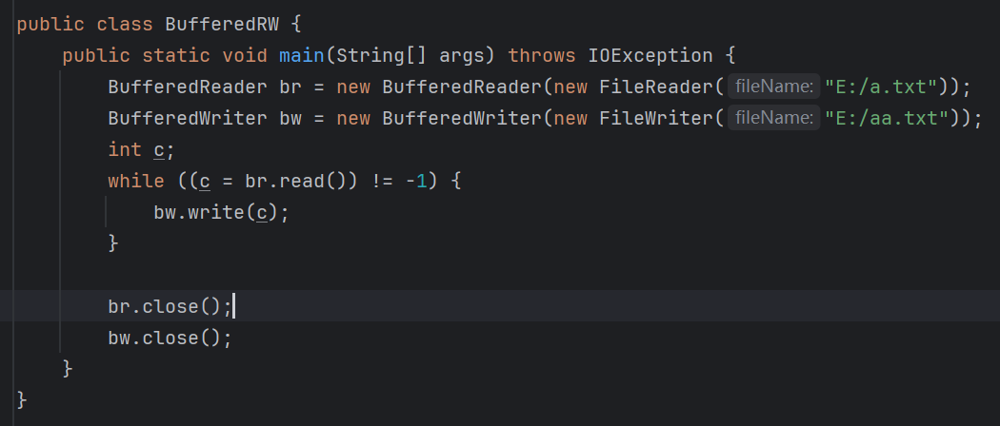

## 1.2 内置数组

跟字节缓冲流一样，字符缓冲流也内置了数组，为字符数组，长度也是8192个，每次读和写都是先读到数组中，再从数组中写入：

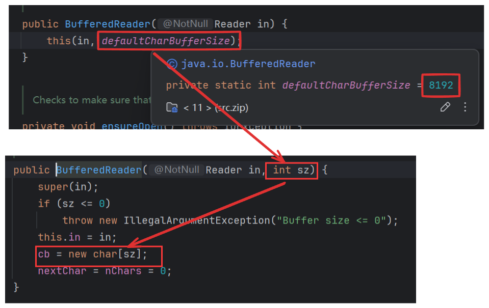

和字节缓冲流一样，字符缓冲流也可以自定义数组读取和写入，本质上是缓冲输入和缓冲输出中内置数组之间的数据搬运用数组来进行，效率更快：

# 2 BufferedReader方法

## 2.1 readLine()

```java
public String readLine(){};
```

> 读取一行字符串，读取到末尾返回`null`。
>
> **注意：**此方法不能读取换行符。


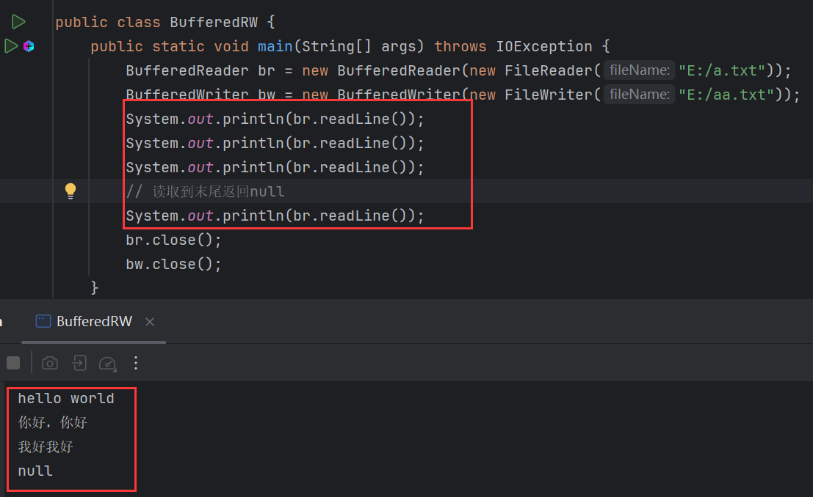

循环读取：

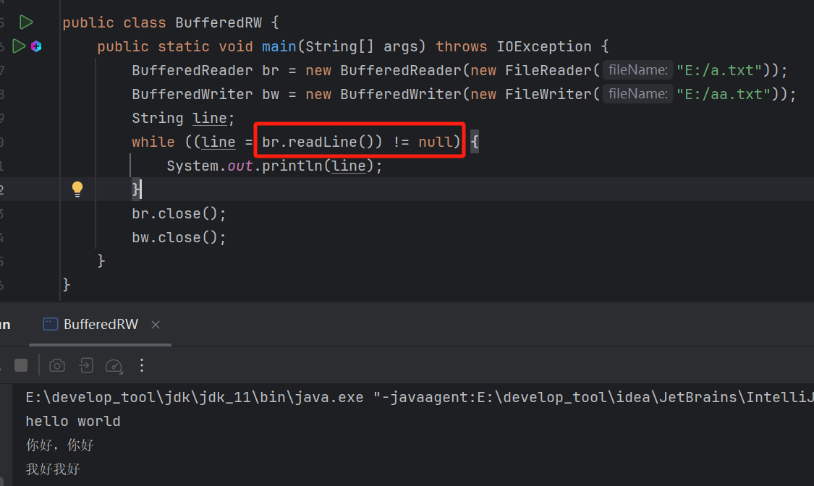

# 3 BufferedWriter方法

## 3.1 newLine()

```java
public void newLine(){};
```

> 写出换行符，具有跨平台性，不同平台换行符不同。

用`readLine()`拷贝：

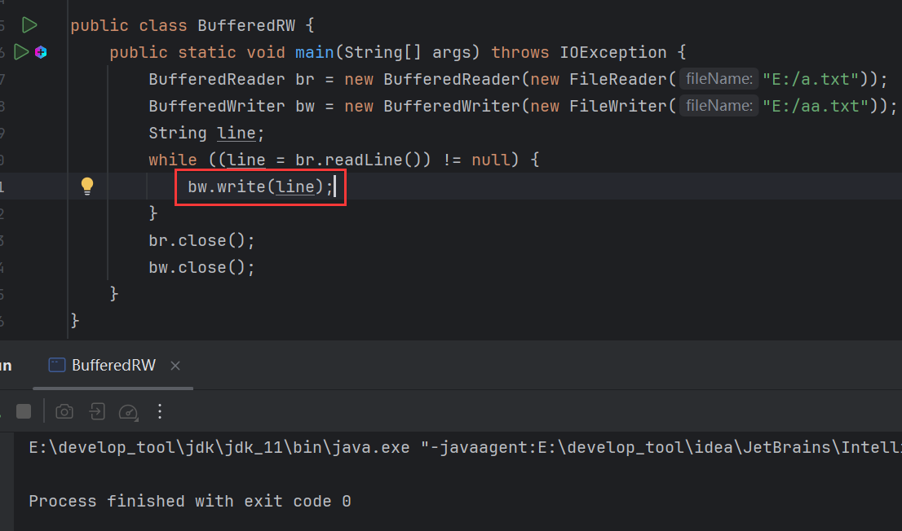

拷贝的内容不会换行，因为`readLine()`不能读取换行符：

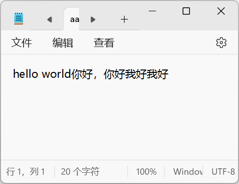

所以在写入之后，用`newLine()`写入换行符：

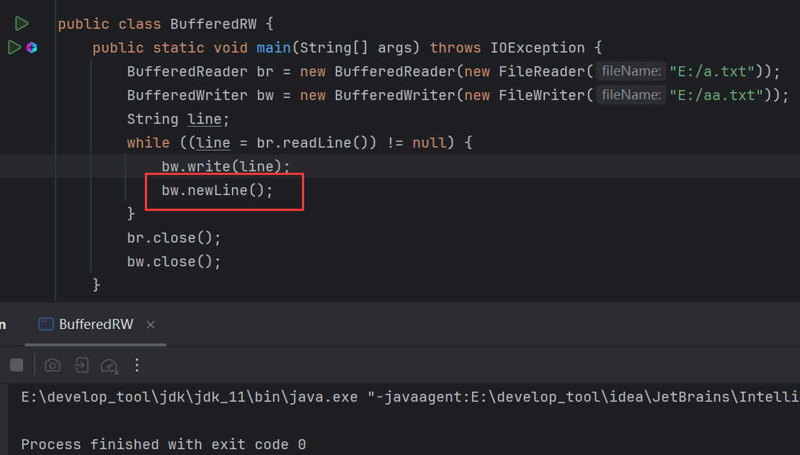

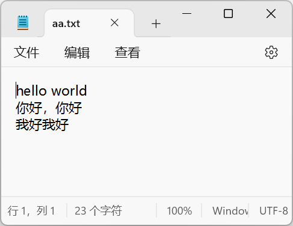


# 4 案例

## 4.1 内容排序

文件内容如下：

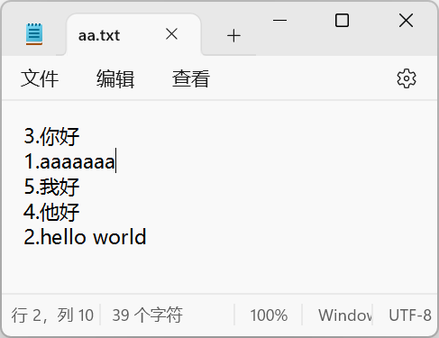

按照序号排序：

思路：

1. 读取文本文件，用字符流。
2. 读取时需要读取一整行，因此使用缓冲流，缓冲流才有`readLine()`。
3. 读取每一行内容。
4. 将内容存入`TreeSet`中，利用`TreeSet`排序的特点进行排序。
5. 遍历`TreeSet`，将内容覆写入文件。

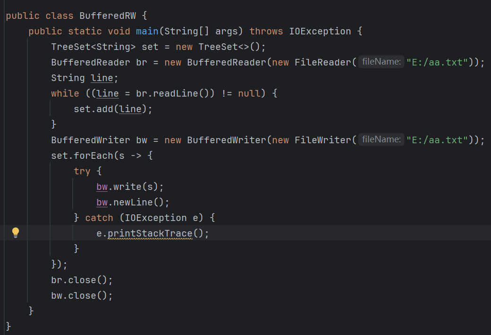

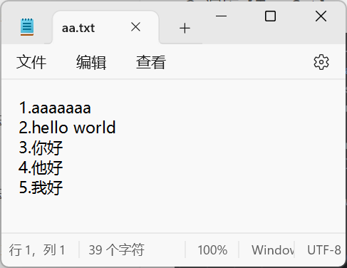

### 4.1.1 细节

输出流关联文件，若文件存在，会先清空文件，所以如果输出流写在读取的上面：

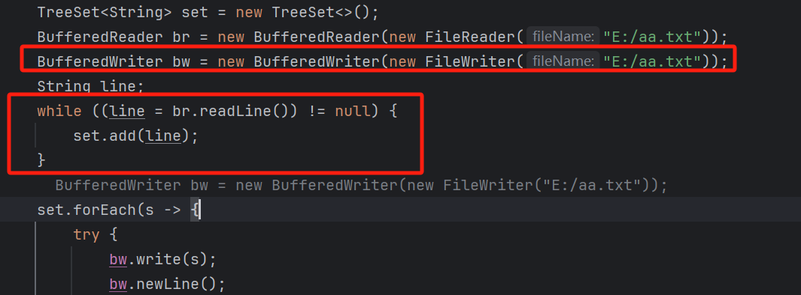

那么输出流一关联，文件内容被清空，下面的读取操作就无法读取到内容，导致写入到文件内容为空：

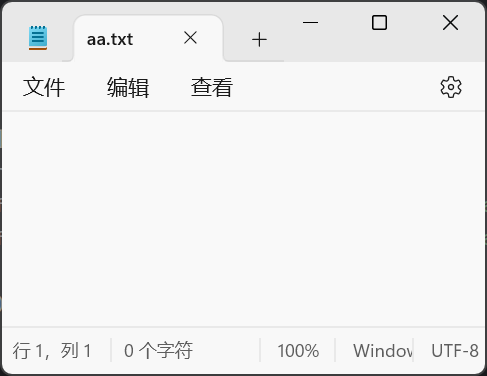

## 4.2 读取学生信息

现有三个学生对象：

- (张三，23)
- (李四，24)
- (王五，25)

将这些学生对象的信息保存到本地文件中，每个学生信息占一行，格式要求:

张三-23

李四-24

王五-25

随后读取这个文件，将学生信息读取到程序，封装为对象，并存入集合最后遍历打印集合中的学生信息。

```java
public static void main(String[] args) throws IOException {
    writeStu();
    readStu();
}

public static void writeStu() throws IOException {
    Student stu1 = new Student("张三", 23);
    Student stu2 = new Student("李四", 24);
    Student stu3 = new Student("王五", 25);
    Student[] students = new Student[]{stu1, stu2, stu3};
    BufferedWriter bw = new BufferedWriter(new FileWriter("E:/stu.txt"));
    for (int i = 0; i < students.length; i++) {
        bw.write(students[i].getName() + '-' + students[i].getAge());
        bw.newLine();
    }
    bw.close();
}

public static void readStu() throws IOException {
    List<Student> list = new ArrayList<>();
    BufferedReader br = new BufferedReader(new FileReader("E:/stu.txt"));
    String line;
    while((line = br.readLine()) != null) {
        String[] strs = line.split("-");
        Student stu = new Student(strs[0], Integer.parseInt(strs[1]));
        list.add(stu);
    }
    list.forEach(stu -> System.out.println(stu));
    br.close();
}
```

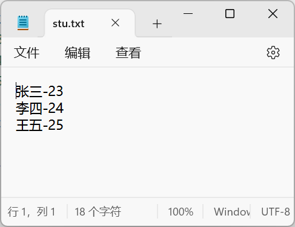

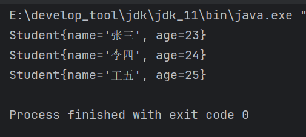