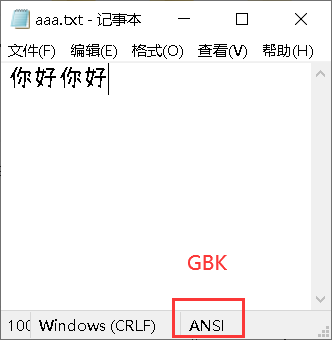
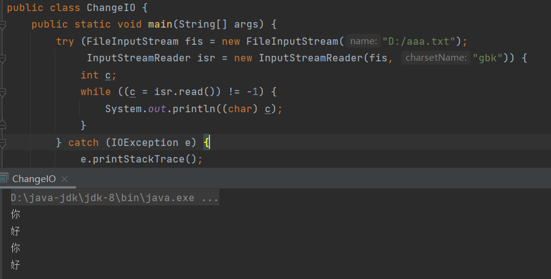
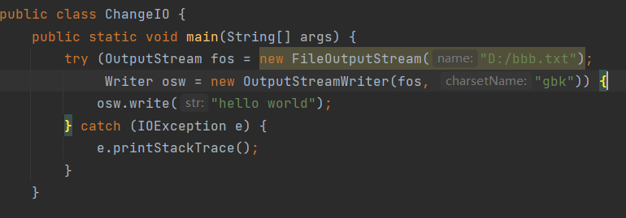

# 1 转换流

- 【InputStreamReader】，字符出入流的子类。
- 【OutputStreamWriter】，字符输出流的子类。

## 1.1 作用

> 1. 按照指定字符集编码，进行读写操作。
> 2. 将**字节流转为字符流**进行操作。

**注意：**【FileReader】和【FileWrite】不能指定字符集编码。

## 1.2 构造

```java
public InputStreamReader(InputStream in, String charsetName){};
```

> 按照指定的字符编码读取，传入字节输入流，不是传入字符流。



指定编码为GBK：



```java
public OutputStreamWriter(OtputStream out, String charsetName){};
```

> 按照指定的字符编码写出，传入字节输出流，不是传入字符流。

S