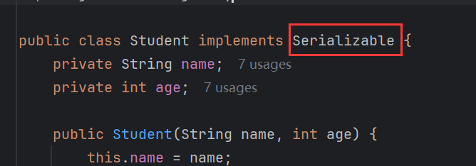
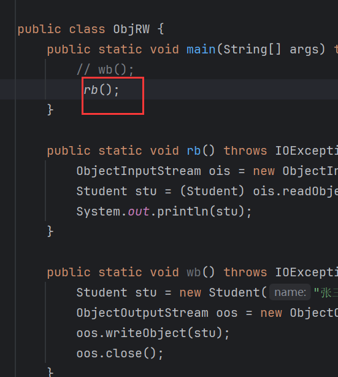
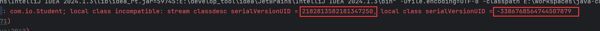
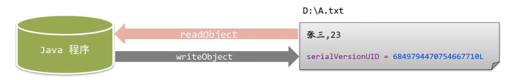

# 1 序列化流

> 在流中以**字节**的形式直接读写对象。

## 1.1 构造

```java
public ObjectInputStream(InputStream in){};
```

> 对象输入流关联文件，关联方式使用字节输入流。

```java
public ObjectOutputStream(OutputStream in){};
```

> 对象输出流关联文件，关联方式使用字节输出流

## 1.2 序列化和反序列化

- **序列化：**在流中将对象写出。
- **反序列化：**从流中读取对象。

## 1.3 writeObject()

```java
public void writeObject(){};
```

> `ObjectOutputStream`的方法，执行序列化。


## 1.4 Serializable

执行报错：


抛出异常`NotSerializableException`，`NotSerializableException`表示当示例需要`Serializable`接口时抛出该异常。即如果需要序列化或反序列化一个对象，那么这个对象必须实现`Serializable`接口：



写入的内容：


显示的是乱码，这属于正常现象，只要能反序列化为对象，显示什么无所谓。

`Serializable`接口是一个标识，只有实现了这个接口的类才能正常序列化，它自身并没有任何方法和属性：


## 1.5 readObject()

```java
public Object readObject(){};
```

> `ObjectInputStream`的方法，执行反序列化。


## 1.6 serialVersionUID

先写序列化：


然后改变`Student`类：


再反序列化：



报错：


抛出异常`InvalidClassException`，在运行时遇到以下问题会抛出此异常：

- 该类的串行版本与从流中读取的类描述符的版本不匹配。
- 该类包含未知的数据类型。
- 该类没有可访问的no-arg构造函数。

重点是第一个问题，第一个问题描述了版本，提到版本就绕不开版本号，在该异常的提示显示了版本号：



在流中的版本号2182813582181347250与本地类中的版本号-3386768564744507879不匹配。所以抛出了该错误。

原因就是因为改动了`Student`类导致版本号发生改变，流中的版本也就是从文件中读取的内容的版本是旧版本，而本地类中的版本是新版本，版本不匹配。

序列化流的操作流程：

若类实现了`Serializable`接口，其内部就会自动生成一个随机的`serialVersionUID`：


进行序列化的过程，除了会把对象信息写出，还会把`serialVersionUID`写出：


而在反序列化时，会读取文件中的`serialVersionUID`与类中的`serialVersionUID`进行对比：



如果一样，则不会报错，否则报错。

当类发生改变，就会重新生成了一个`serialVersionUID`。

解决方法就是写死版本号：


```java
// 自定义一个版本号，类型long
private static final long serialVersionUID = 1L;
```

### 1.6.1 设置自动生成


找到：Serializable  class without 'serialVersionUID'✔上


当类实现了`Serializable`就会抛出警告：


此时Alt+回车，就会自动生成`serialVersionUID`：


## 1.7 transient

> 关键字，瞬态。被修饰的字段不会参与序列化。

修饰年龄：


年龄不会参与序列化，那么在反序列化时，得到的年龄就是`int`的默认值0：


# 2 案例

序列化3个学生对象和反序列化：


在反序列化时，读取了3次，如果事先不知道有多少个对象，如何读取准确个数？

如果多读取一次：


就会报错；


`EOFException`表示在读取时，如果读取到文件末尾或流的末尾，就会抛出这个错误。

那么就可以结合循环完善，若抛出异常说明读取完成，结束循环：


另一种方法：

若一开始就使用集合存储学生对象吗，然后写入集合，那么只需读取一次，而`ArrayList`刚好实现了`Serializable`，可以进行序列化：


