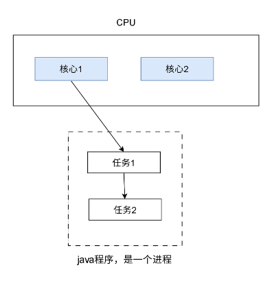
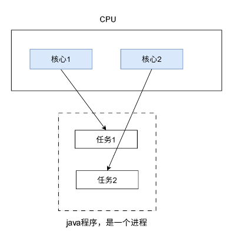
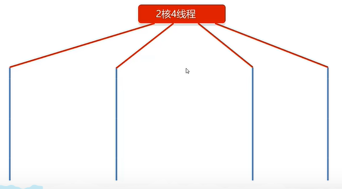
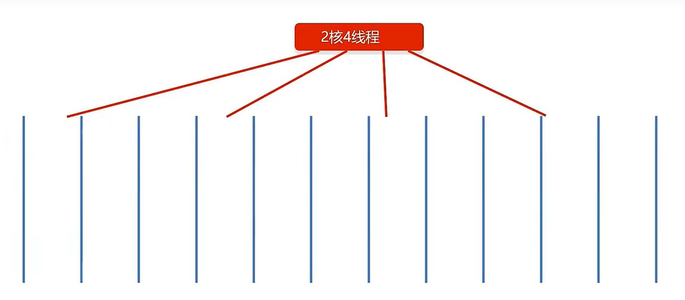

# 1 进程

**进程(Process)：**是计算机中的程序关于某数据集合上的一次运行活动，是系统进行资源分配的基本单位。

简单来说，进程就是程序的执行过程。

## 1.1 进程的特点

1. **独立性：**每一个进程都有自己的空间，在没有经过进程本身允许的情况下，一个进程不可以直接访问其它的进程空间。
2. **动态性：**进程是动态产生，动态消亡的。
3. **并发性：**任何进程都可以同其它进程一起并发执行。

## 1.2 并发与并行

1. **并行：**在同一时刻，有多个指令在多个CPU上同时执行。
2. **并发：**在同一时刻，有多个指令在单个CPU上交替执行。

## 1.3 多进程同时执行的本质

假设开启3个进程：

表面上，三个进程同时执行，看起来像是并行，实际上，它们是并发执行。

CPU会在3个进程之间来回交替执行，只不过从这个进程切换到另一个进程的过程非常快，快到人感觉不出来。所以才会误以为它们在并行操作，实际上，它们是并发操作。

## 1.4 细节

并行和并发可以同时存在，对于单核CPU而言，由于只有一个核，所有的进程操作都在这个核中进行，因此是并发操作。但是对于多核CPU而言，多个核中的进程之间，可以是并行操作。

# 2 线程

**线程(Thread) ：**进程可以同时执行多个任务，每个任务就是线程。

- 线程就是进程中干活的存在。
- 若没有线程，进程也跑不起来。
- 进程至少要有一个线程来干活。
- 进程启动时会自动启动一个线程，这个线程叫做主线程。

## 2.1 多线程图解

- 随着处理器上的核心数量越来越多，现在大多数计算机都比以往更加擅长并行计算。

- 一个线程，在一个时刻，只能运行在一个处理器核心上。

假设，CPU是两核，在这个java程序中有2个任务，若这个java程序是单线程，由于一个线程，在一个时刻，只能运行在一个处理器核心上，所以这个线程只能调度到1个核心来执行任务，在执行任务1的时候，任务2处于等待状态，只能等任务1执行完后，才能执行。而核心2是空闲状态，根本没有利用起来。

若程序是多线程，那就能将第2个核心调度起来，任务1交给核心1执行，任务2交给核心2执行，效率就提高了：

在这种情况下，核心1核2分别去执行任务1和2，任务1和2之间，是并行操作。若有3个任务，乃至更多任务，任务之间是如何执行的？

现在的CPU功能很强大，分为很多种，如：

- 2核4线程
- 4核8线程
- 8核16线程
- ......

以2核4线程为例，若只有4个任务，那么一个任务一个线程，线程之间是并行执行：

若任务超过4个，假设有12个任务：

这种时候，就不只是并行操作，而是并行和并发同时存在，4个线程会在多个任务之间来回切换，交替执行：

.gif)

所以，即便CPU的核心数量增多，也不一定只有并行操作，而是并行和并发同时存在。

## 2.2 存在的意义

- 提高执行效率。
- 同时处理多个任务。