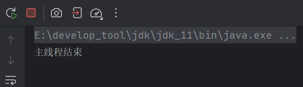
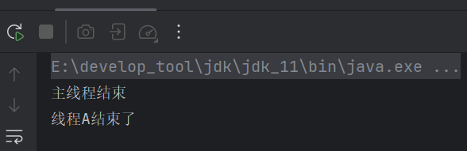
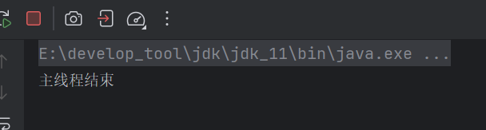
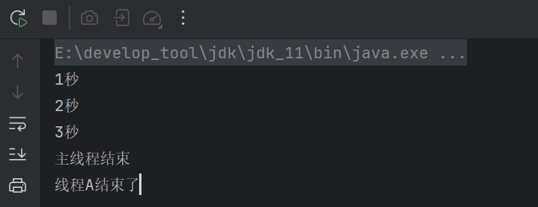
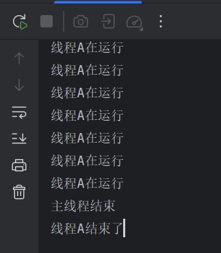

# 1 可见性

可见性就是一个线程改变了共享变量的值，其他线程能不能感知到。比如这样的例子：

```java
public class Test {
    private static boolean flag = true;

    public static void main(String[] args) {
        Thread thread = new Thread(() -> {
            while (flag) {
            }
            System.out.println(Thread.currentThread().getName() + "结束了");
        }, "线程A");
        thread.start();
        try {
            Thread.sleep(1000);
            flag = false;
        } catch (InterruptedException e) {
            throw new RuntimeException(e);
        }
        System.out.println("主线程结束");
    }
}
```

共享变量`flag`，主线程将变量改为`false`后，我们预想的情况是线程A结束循环并打印结束语句，然而实际的情况是线程A一直处于循环中：



原因就是线程A感知不到`flag`的变化，这跟线程内的副本和主内存有关。

共享变量`flag`存储在堆内存中，堆内存是主内存的一部分，因此`flag`也存储在主内存中，当线程访问主内存的变量时，并不是直接操作主内存的变量，而是会保存一个副本到自己的工作区间中，后续的操作都是对副本进行的。

当主线程将 `flag` 改变时，实际上改变的是主线程工作内存中的副本值（从 `true` 改为 `false`）。随后，在主线程结束，`false` 会被刷新到主内存。此时，主内存中的 `flag` 变为 `false`。然而，线程 A 在执行过程中，操作的是自己工作内存中的 `flag` 副本。当线程 A 从主内存中第一次读取到 `flag` 的值（`true`）后，就会在自己的工作内存中缓存该值。即使主内存中的 `flag` 已更新为 `false`，由于线程 A 没有再次从主内存读取 `flag` 的最新值，线程 A 仍然操作自己工作内存中的旧副本值 `true`。

这就导致了线程 A **未感知到主内存中 `flag` 的变化**。

如何让线程A感知到主内存中的值变化？

## 1.1 volatile

`volatile` 是 Java 中的一个关键字，它用于标记变量，确保多个线程之间对该变量的 **可见性** 和 **禁止缓存**。具体作用包括：

1. **保证可见性**

- 当一个线程修改了被 `volatile` 修饰的变量的值，修改后的值会立即更新到主内存。
- 在多线程环境下，`volatile` 变量不会被线程的 **缓存** 或 **优化**，每次访问都会直接读取主内存中的最新值。

2. **禁止指令重排序**

- 在没有 `volatile` 的情况下，JVM 可以对代码进行优化，可能会改变代码执行的顺序（即指令重排序）。而 `volatile` 会保证变量的写操作不会和后续的操作发生重排序，确保 **执行顺序的正确性**。

`volatile` 修饰的变量的值，在线程修改后，会立即更新到主内存中，在线程访问时都会从主内存中读取到自己的副本。这就保证了一个线程在自己的副本更新后，主内存的值也会立即同步，然后其他线程在访问时也不再是访问旧的副本，而是会重新读取主内存中新的值到自己的副本中。

```java
public class Test {
    private static volatile boolean flag = true;

    public static void main(String[] args) {
        Thread thread = new Thread(() -> {
            while (flag) {
            }
            System.out.println(Thread.currentThread().getName() + "结束了");
        }, "线程A");
        thread.start();
        try {
            Thread.sleep(1000);
            flag = false;
        } catch (InterruptedException e) {
            throw new RuntimeException(e);
        }
        System.out.println("主线程结束");
    }
}
```

用`volatile` 修饰`flag`，主线程修改了值，会同步到主内存中，而线程A每次访问都会从主内存中读取到自己的副本中，因此线程A能感知到`flag`的变化：


## 1.2 加锁保证可见性

除了`volatile`，加锁也能保证可见性：

当线程在同步代码块中更改了值，会强制更新主内存，其他线程获取锁时会强制从主内存读取数据，保证值的可见性。

```java
public class Test {
    private static boolean flag = true;

    public static void main(String[] args) {
        Thread thread = new Thread(() -> {
            synchronized (Test.class) {
                while (flag) {
                }
            }
            System.out.println(Thread.currentThread().getName() + "结束了");
        }, "线程A");
        thread.start();
        try {
            // 同样的锁保证值的而可见性
            synchronized (Test.class) {
                Thread.sleep(1000);
                flag = false;
            }
        } catch (InterruptedException e) {
            throw new RuntimeException(e);
        }
        System.out.println("主线程结束");
    }
}
```



这就是锁的机制：

> 当线程释放锁时，会将工作内存中的共享变量刷新到主内存；另一个线程获取锁时，会重新从主内存读取共享变量。

在我们上面的例子中，主线程和A线程上同一把锁，如果主线程先执行，那么主线程上锁，然后睡1秒，期间如果切换到线程A，由于【sleep()】不会释放锁，所以线程A无法进入同步代码块，因此也就无法执行循环，然后1秒后，主线程改为【false】，然后释放锁，会刷新主内存，线程A有机会执行时，主内存已经是【false】，当它执行时由于获取锁又会从主内存读取到【false】，因此不会陷入死循环。

### 1.2.1 加锁未必保证可见性

上面说加锁能保证有效性，但是有一个前提，那就是线程需要获取锁，才能从主内存获取最新的值到自己的副本中，如果线程在上锁后获取到的是旧值，而在上锁的期间一直无法释放锁，那么它就没有机会重新获取锁，如果这期主内存中的值变成了新值，线程任然无法感知到。

```java
public class Test {
    private static boolean flag = true;

    public static void main(String[] args) {
        Thread thread = new Thread(() -> {
            synchronized (Test.class){
                while (flag) {
                }
            }
            System.out.println(Thread.currentThread().getName() + "结束了");
        }, "线程A");
        thread.start();
        try {
            Thread.sleep(1000);
            flag = false;
        } catch (Exception e) {
            throw new RuntimeException(e);
        }
        System.out.println("主线程结束");
    }
}
```

在这个例子中，如果线程A在主线程改为【false】之前执行，那么线程A上锁后，就陷入死循环，此时主线程再改变为【false】，但是线程A陷入死循环，无法释放锁，也就没法重新读取主内存的值：



> ⚠注意：
>
> **在使用锁来保证可见性时，线程必须释放锁**。如果线程一直持有锁，当前线程无法从主内存中读取最新的值，而其他线程也可能无法获取锁并进行更新操作，这样就无法保证共享变量的可见性。

所以保证锁能释放，我们调整同步块的位置：

```java
public class Test {
    private static boolean flag = true;

    public static void main(String[] args) {
        Thread thread = new Thread(() -> {
            while (flag) {
                synchronized (Test.class) {
                }
            }
            System.out.println(Thread.currentThread().getName() + "结束了");
        }, "线程A");
        thread.start();
        try {
            int n = 0;
            while (n < 3) {
                System.out.println(++n + "秒");
                Thread.sleep(1000);
            }
            flag = false;
        } catch (Exception e) {
            throw new RuntimeException(e);
        }
        System.out.println("主线程结束");
    }
}
```

加上计数方便观察：



可见，只要A线程能释放锁，那么重新获取锁就会主内存中读取新的值。

## 1.3 标准输出流实现可见性

标准输出流底层存在同步代码块 ，因此也是一个加锁和释放锁的过程，所以在线程内部使用【System.out.println()】也能让线程重新读取主内存中的值到副本中：

```java
public class Test {
    private static boolean flag = true;

    public static void main(String[] args) {
        Thread thread = new Thread(() -> {
            while (flag) {
                System.out.println("线程A在运行");
            }
            System.out.println(Thread.currentThread().getName() + "结束了");
        }, "线程A");
        thread.start();
        try {
            Thread.sleep(1000);
            flag = false;
        } catch (Exception e) {
            throw new RuntimeException(e);
        }
        System.out.println("主线程结束");
    }
}
```



## 1.4 没有可见性同步时的可见性情况

在没有使用`volatile`或者锁时，可见性的情况如下：

**1、什么时候从主内存读取数据**：

线程会从 **主内存读取数据**，通常有以下几种情况：

- **线程第一次访问共享变量时**：当一个线程首次访问一个变量时，JVM 会从 **主内存** 中加载该变量的值到线程的 **工作内存**。
- **线程被调度切换时**：当线程切换（例如，线程A执行完被挂起，线程B开始执行）时，线程A在工作内存中的副本**可能**会丢失或被刷新，这时线程B会从 **主内存** 中读取共享变量的最新值。
- **线程自愿或强制刷新到主内存时**：有时，JVM 可能会在没有使用 `volatile` 或 `synchronized` 时，强制线程刷新工作内存中的数据到主内存，以保证内存一致性（虽然这种情况并不总是会发生，取决于 JMM 和具体实现）。

**2、什么时候写回主内存**：

线程对共享变量的修改只会在某些情况下写回主内存，如果没有使用 `volatile`或锁，常见情况包括：

- **线程结束时**：在很多情况下，线程的工作内存会在 **线程结束时** 刷新到主内存。这意味着线程在执行过程中做的任何更改都不会立即反映到主内存，而是要等到线程结束时才会更新主内存。
- **线程主动刷新**：当线程调用 `Thread.sleep()`、`Thread.yield()` 等方法时，可能会强制刷新其工作内存中的数据到主内存，尤其是在操作系统进行线程调度时。
- **操作系统的调度行为**：在一些操作系统中，线程被挂起或切换时，线程的工作内存会被刷新到主内存。这并不一定每次发生，但有时操作系统会触发刷新，尤其是为了保证线程间的内存一致性。

