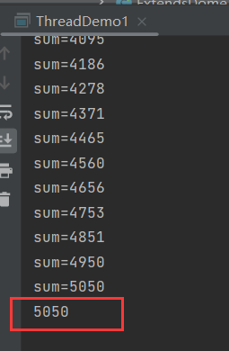

# 1 开启线程的方式

- 继承`Thread`类。
- 实现`Runnable`接口。
- 实现`Callable`接口。


# 2 Thread

开启线程的步骤：

1. 继承`Thread`。
2. 重写`run()`。
3. 将任务逻辑写在`run()`中。
4. 创建线程对象。
5. 调用`start()`，开启线程。

开启线程就是去执行任务，任务的逻辑就写在`run()`中。

继承`Thread`重写`run()`，以及传创建线程对象，用匿名内部类的方式简写：


## 2.1 细节

当调用`start()`开启线程时，会自动调用`run()`。

若不通过`start()`，而直接调用`run()`，仅仅是方法调用，而不是开启新线程：


两个线程开启后，CPU交替执行：


有错乱现象：


若是直接调用`run()`，没有开启新线程，那么就是在主线程中执行，不会有错乱现象：


# 3 java默认线程

java程序一旦启动，默认为多线程，默认开启两个线程：

1. 主线程。
2. 垃圾回收线程。

垃圾回收线程与垃圾回收器有关，java中的垃圾是自动清理的，这意味着会有一条线程监测垃圾的数量、清理垃圾等等。

举例：

重写`Object`中的`finalize()`。若对象被判定为垃圾，在被清理时就会执行`finalize()`：


创建匿名对象，没有任何变量去记录，也没有使用的地方，就会被判定为垃圾：


创建500W个垃圾对象，以触发垃圾清理：


`main()`处于主线程中，主线程与新开的线程交替执行：


若新开线程放到主线程执行之后，就不会有交替执行的现象：


因为程序有先后执行顺序，新开线程的动作需要在循环结束后才会执行，循环时，线程都没有开启，如何交替执行。


# 4 Runnable

这个方法开启线程的扩展性更好，因为继承只能单继承，如果类继承了父类，就不能继承`Thread`，但是实现可以多实现，实现了其他接口，还能实现`Runnable`。

开启线程的步骤：

1. 实现`Runnable`。
2. 重写`run()`。
3. 将任务执行逻辑写在`run()`中。
4. 创建线程资源对象。
5. 创建线程对象，将线程资源传入。
6. 线程对象调用`start()`，开启线程。


主线程任务：


交替执行：


# 5 Callable

`run()`没有返回值，若新线程执行完有返回值，可以实现`Callable`,重写`call()`，`call()`有返回值。

开启线程的步骤：

1. 实现`Callable`。
2. 重写`call()`。
3. 将任务执行逻辑写在`call()`中。
4. 创建线程资源对象。
5. 创建线程任务对象，将线程资源对象传入。
6. 创建线程对象，将线程任务对象传入。
7. 线程对象调用`start()`，开启线程。

与`Runnable`步骤大同小异，区别就是`call()`方法有返回值。而且`Callable`需要封装到线程任务对象中去，才能传入线程对象。

实现`Callable`时，需要指定泛型，返回值类型是什么，就指定为什么：


## 5.1 FutureTask

> `FutureTask`线程任务类，是`Runable`的实现类，可以封装`Callable`。

需要封装线程资源对象，才能传入线程对象中。线程任务对象接收泛型，类型同`Callable`的泛型：


主线程任务：


交替执行：


### 5.1.1 get()

```java
public V get(){};
```

> 返回`call()`的结果。

`call()`执行完成后会返回一个结果，而`FutureTask`封装了`Callable`，因此要拿到返回值，就需要调用`FutureTask`的`get()`：




### 5.1.2 细节

`get()`具有等待性，它需要等待线程执行完成后，才能拿到返回值，所以`get()`后面的代码会被迫跟着`get()`等待，只有`get()`拿到了值，后续代码才能继续执行：


若`get()`在`start()`之前，那么就会造成一直等待，`get()`需要线程返回结果，可线程在`get()`之后开启，线程需要等待`get()`执行完成，所以死循环了。

### 5.1.3 注意

如果同一个线程任务`FutureTask`，要开启多个线程，一定要重新创建`FutureTask`：


**为什么不用一个线程任务对象传入多个线程中呢？这样执行的结果依旧是一样的。**


这样写，虽然语法成面没有问题，但是逻辑层面存在大问题。开启两条线程，两条线程都有结果返回，按理来说，应该拿到两份结果才对，即便结果的值一样。所以应该创建两个任务对象，用各自的任务调用`get()`拿到各自的结果。

如果用一个任务对象，那么这些线程中拿到的结果都是同一个。

用==比较地址值：


为`ture`，说明两个变量指向同一个对象，即这两个线程中拿到的结果是同一份。

改为不同任务对象，那么返回的就不是同一份结果：

