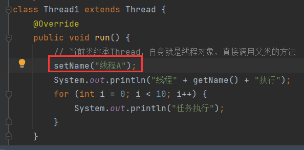

# 1 线程名有关方法

## 1.1 getName()

```java
public String getName(){};
```

> 返回此线程的名称。


默认的线程名带有编号，从0开始。

## 1.2 setName()

```java
public String getName(){};
```

> 设置线程的名称。




可见，不同线程可以同名。

不在`run()`中设置，在外面设置：


### 1.2.1 构造赋名

`Thread`的构造也可以设置线程名，因此自定义的线程对象，可以使用父类构造创建线程名：


## 1.3 currentThread()

```java
public static Thread currentThread(){};
```

> `Thread`的静态方法，获取当前的线程对象。


# 2 sleep()

```java
public void sleep(long time){};
```

> 让当前线程休眠指定时间，单位毫秒。


# 3 线程优先级

## 3.1 线程调度方式

- 抢占式调度。
- 非抢占式调度。

java采用抢占式调用，哪个线程抢占到CPU调度权，就执行哪个线程。

抢占式调度带有随机性(在控制台中交替执行的结果)。

非抢占式调用，就是轮流执行，一个线程执行一会儿，换另一个线程执行。

若某个线程的优先级很高，那么此线程抢到CPU执行权的概率就会增大。

## 3.2 setPriority()

```java
public void setPriority(int newPriority){};
```

> 设置线程的优先级，传入`int`表示优先级的级别。
>
> 级别范围从小到大：1 - 10，默认为5。

默认为5：


设置优先级：


## 3.3 getPriority()

```java
public final int getPriority(){};
```

> 获取线程的优先级。


# 4 守护线程

场景：

在一个聊天场景中，一个聊天窗口就是一个线程，在聊天期间，其中一人发送了文件，那么这个文件上传就是另一个传输任务的线程。假设，其中一人关闭了聊天框，那么上传的文件也会跟着关闭。当某一个线程结束，另一个线程跟着结束，这就是守护线程。

> 线程设置为守护线程后，它守护的线程如果关闭，它自己也会跟着关闭。

## 4.1 setDaemon()

```java
public final void setDaemon(boolean on){}
```

> 将线程设置为守护线程。


当线程A执行完后，线程B也会跟着结束：


**守护线程如何知道自己守护的是那条线程？**

其实守护线程并不需要知道自己守护哪条线程，守护线程实际上是当所有非守护线程执行完毕后才会结束。

如果再加一条线程：


那么线程B就会守护A和C都执行完后才会跟着结束，或者B线程在AC之前执行完然后结束。

这么看来，A线程一定先执行结束，但B不会跟着结束，因为还有非守护线程C在执行。