# 1 线程安全问题

案例：

某电影院目前正在上映国产大片，共有100张票，而它有3个窗口卖票，请设计一个程序模拟该电影院卖票过程。

思路：

有3个窗口卖票，每个窗口看作一个线程。票可以看作一个票类，它自身有票数属性，以及一个卖票方法。在3个线程中去操作票类的卖票方法：

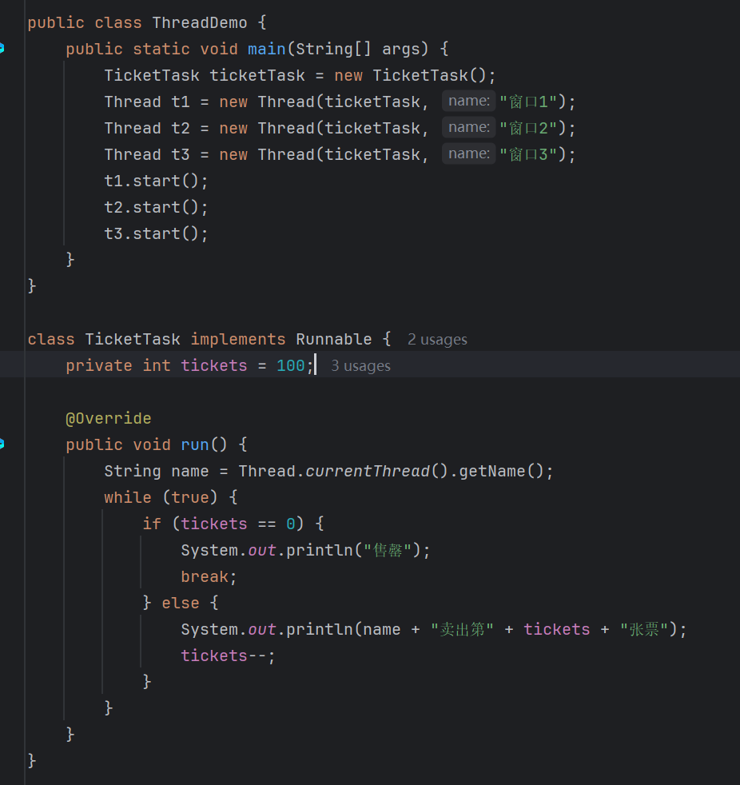

结果：

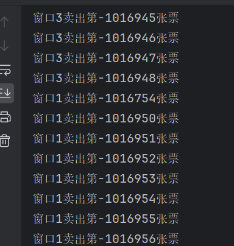

发现票数有负数的情况，因此修改逻辑：

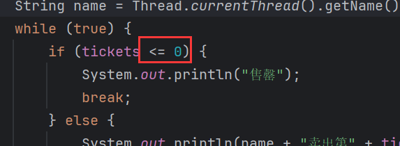

结果：

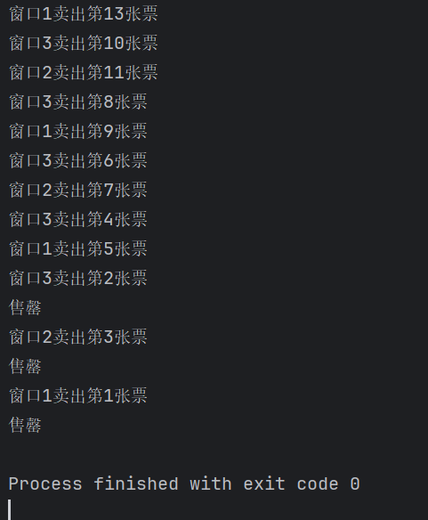

虽然不会卖出负数票，但是存在3个窗口同时卖出第100张票的情况：

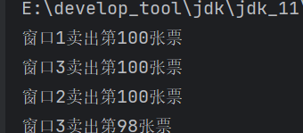

这就是线程不安全的问题。

## 1.1 发生时机

> 当多个线程，<font color=red>共享操作同一份资源</font>时，会出现线程不安全的问题。

## 1.2 发生原因

### 1.2.1 负数票的原因

首先分析卖出负数票的原因。为了方便分析，假设票只有1张。

假设线程1首先强到CPU执行权，它执行判断票数大于0，进入`else`分支执行打印语句：

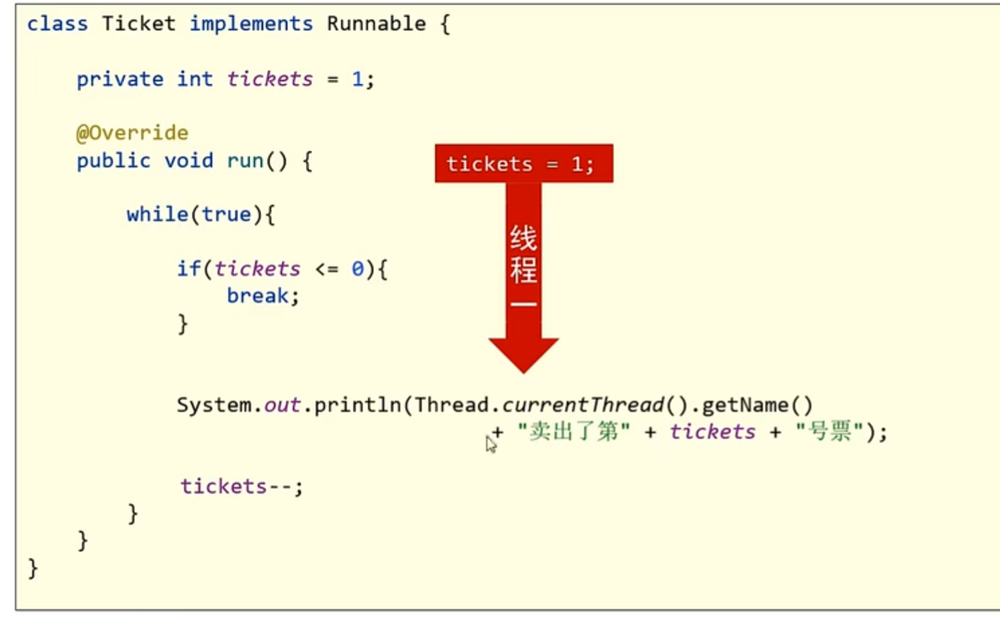

此时，线程1持有的`tickets`=1，然后准备执行票数-1时，CPU的执行权被线程2抢到：

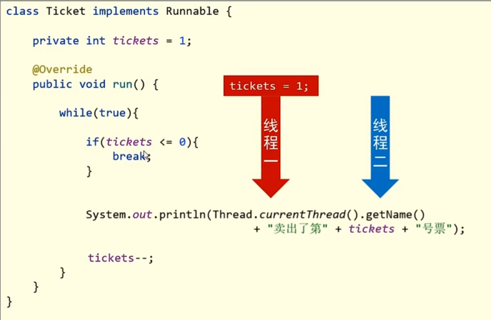

然后进行`if`判断，这个时候的`tickets`还是1，因为线程1还没来得及-1，执行权就被线程2抢走了：


所以走`else`分支，刚要打印，CPU执行权又被线程3抢到：

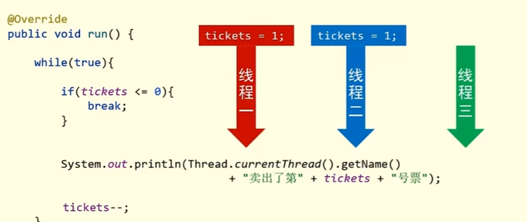

此时线程3持有的`tickets`数也是1：

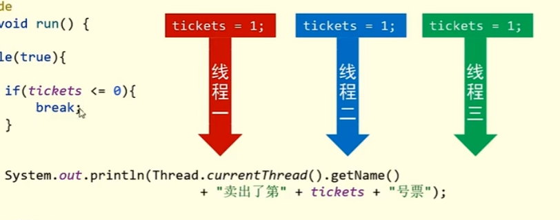

因为线程1和2都没有执行过减操作，现在3个线程`tickets`均为1，线程3进行`if`判断，走`else`分支，刚要打印，CPU执行权又被线程1抢到，线程1继续之前的执行，将`tickets`减1，`tickets`=0，由于`tickets`是共享资源，其他线程持有的`tickets`也会跟着改变：

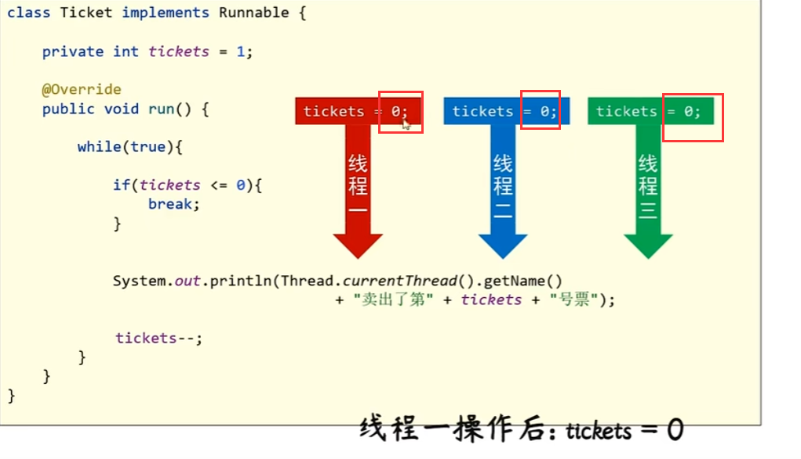

共享操作的数据，但凡有一条线程改变了数据，其他线程的数据也会跟着变。

线程1将`tickets`改为0以后，CPU被线程2抢到，打印卖出了第0张票，然后执行`tickets`-1操作，此时`tickets`=-1，然后CPU被线程3抢到，打印卖出了-1张票，然后执行`tickets`-1操作，此时`tickets`=-2。

这就是为什么会有负数票的原因。

### 1.2.2 重复票的原因

假设3条线程卡死在打印语句这里，持有的`tickets`均为1：

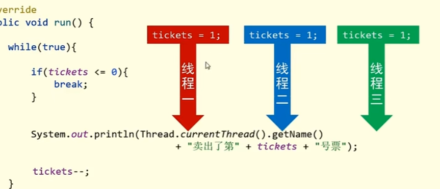

然后线程1执行打印语句，打印"卖出第1张票"，但是，它刚要执行`tickets`-1，CPU被线程2抢走，线程2持有的`tickets`也是1，于是也打印"卖出第1张票"，然后，它也刚要执行`tickets`-1时，CPU被线程3抢走，线程3持有的`tickets`也是1，它也打印"卖出第1张票"。

这就是打印重复票的原因。

## 1.3 锁机制 

分析负数票和重复票出现的原因，发现导致出现这种情况的本质就是CPU在多个线程之间来回切换执行。那么解决的方法也会简单，就是当一个线程在操作共享资源时，希望通过种机制能将这个操作过程保护起来，不让其他线程来抢占。等这个线程把操作执行完，再切换到其他线程：

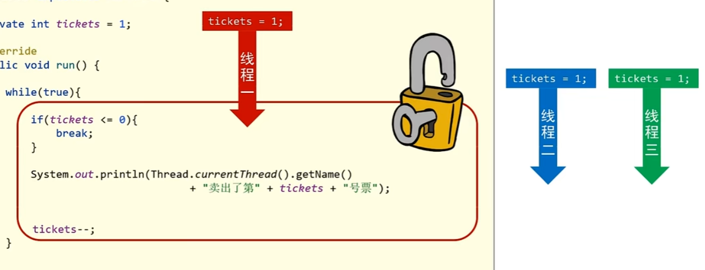

这种机制可以通过上锁来实现，将这段代码上锁，上锁就表示，线程过来执行，把这段执行过程保护起来，什么时候线程执行完，才能开锁，开锁后才能允许CPU切换到其他线程。


# 2 同步技术

> 将多条语句操作共享数据的代码给锁起来，让任意时刻只能有一个线程可以执行。

## 2.1 同步代码块

关键字`synchronized`。

同步代码块格式：

```java
synchronized(锁对象) {
    多条语句操作共享数据的代码
}
```

将需要上锁的代码块放入`{}`中，然后在`synchronized()`中放入锁对象，锁对象可以是任意对象。

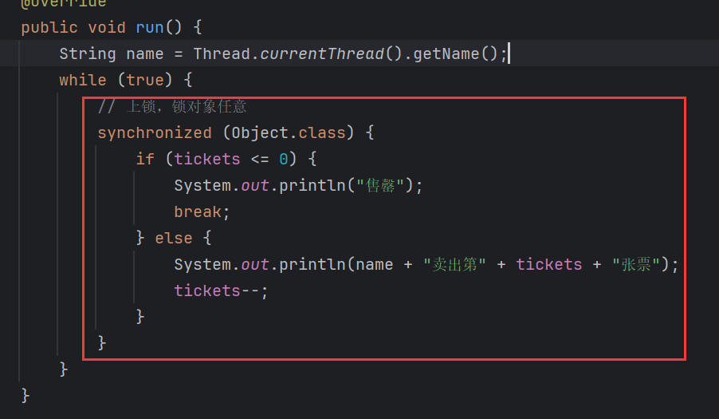

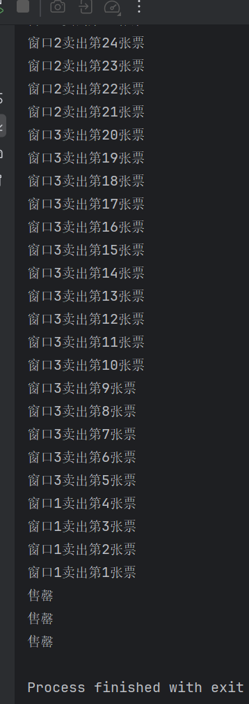

### 2.1.1 锁对象细节

还是一样的卖票操作，只不过换成继承`Thread`的方式：

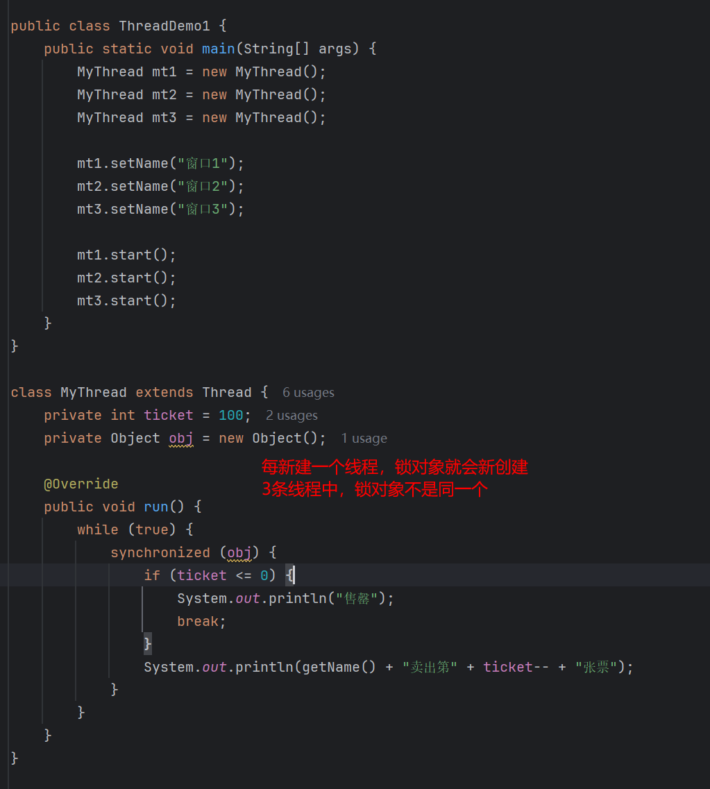

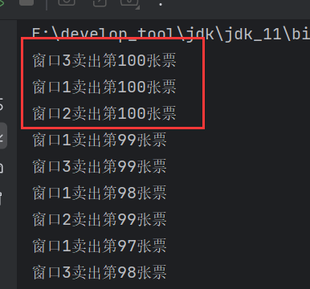

锁对象可以是任意对象，但是需要保证，多条线程使用的锁对象必须是同一把锁。否则这个线程上它的锁，那个线程上它那把锁，锁都不一样，无法相互影响，如何保证线程安全。

而且，这段代码还有一个问题，就是3个线程所持有的票也不是共享数据，每个线程独享自己的票数。因此，票和锁需要被`static`修饰，这样这两个数据就被该类所以对象所共享，且内存中只存在一份。


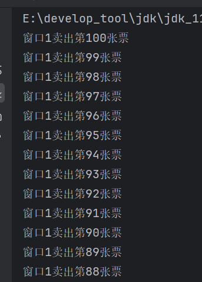

其实，锁对象还可以换成类的字节码对象，类的字节码在内存中只会加载一次，很符合锁对象：

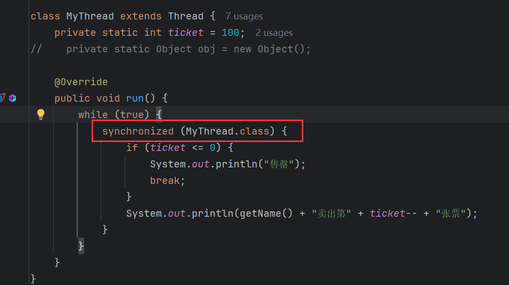

### 2.1.2 弊端

同步代码块，虽然可以保证线程安全，但是也会降低执行效率。因为一个线程上锁，其他线程只能等待。

> - 同步，即线程安全，效率低。
>
> - 不同步，即线程不安全，效率高。

## 2.2 同步方法

格式：

```java
public synchronized void method(){
    
}
```

> 在方法返回值类型前加上`synchronized`关键字，修饰该方法为同步方法。同步方法中的代码都是同步的。

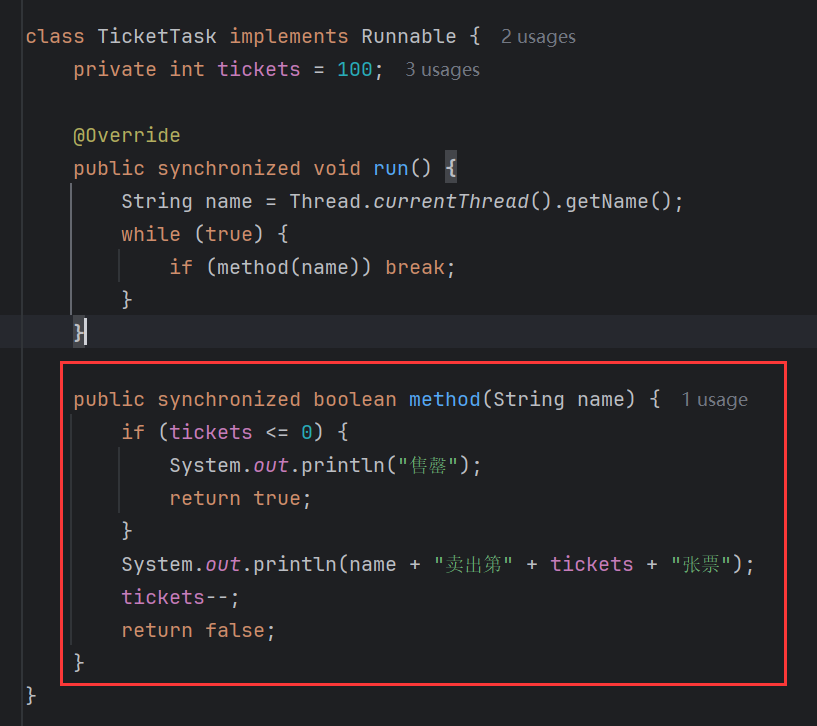

### 2.2.1 细节

同步方法也是有锁对象的，只是它隐藏了起来。

> - 静态同步方法锁对象：该类字节码对象。
>
> - 非静态同步方法锁对象：`this`。

用同步代码块来查看：

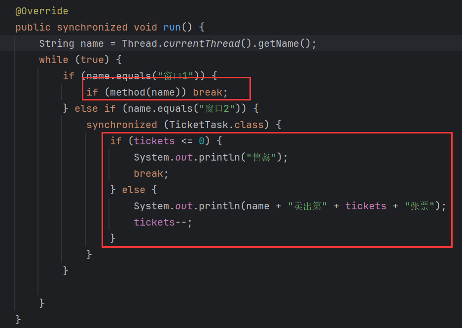

窗口1使用同步方法，窗口2使用同步代码块，同步代码块可以显示的看到锁对象，同步方法`method()`是非静态方法，它的锁对象是`this`而同步代码锁对象是字节码对象，两个锁对象不一致，线程不安全：


如果锁对象改成`this`，跟同步方法的锁对象一致，那么线程安全：


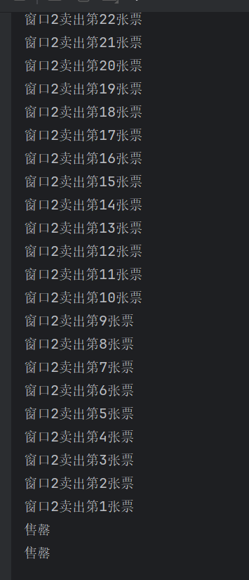

侧面说明，非静态同步方法的锁对象是`this`。

反过来，静态同步方法：

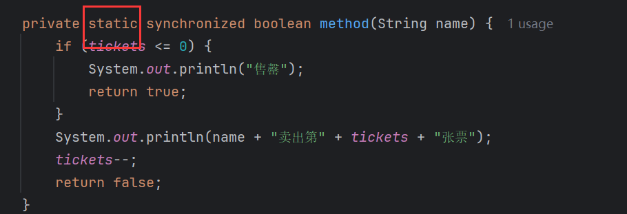

它的锁对象就是类的字节码对象，因此，同步代码块若锁对象为`this`，那么线程不安全：

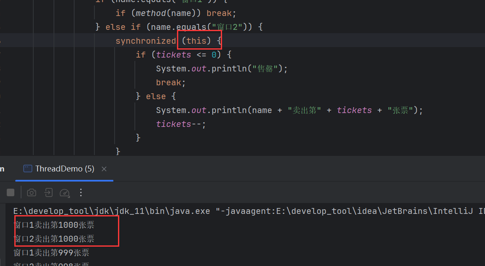

若为同类字节码对象，那么线程安全：

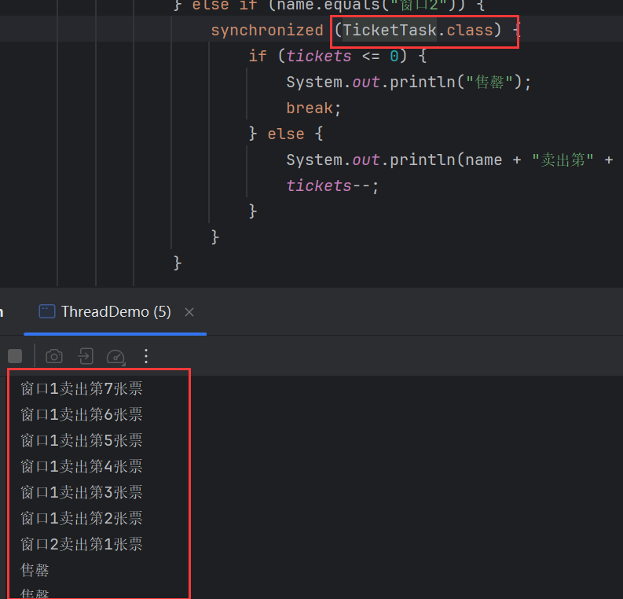

侧面说静态同步方法的锁对象是字节码对象。

由于，非静态同步方法的锁对象是`this`，所以当创建多个对象时，这些对象的非静态同步方法中的锁对象是不一样的。若多个线程使用这些同步方法就会导致线程不安全。要么只创建一个对象，保证`this`只有一份，要么用非静态同步方法，字节码文件被该类所以对象共享，不管创建多少个对象，锁对象的是同一个。