# 1 线程安全问题

案例：

某电影院目前正在上映国产大片，共有100张票，而它有3个窗口卖票，请设计一个程序模拟该电影院卖票过程。

思路：

有3个窗口卖票，每个窗口看作一个线程。票可以看作一个票类，它自身有票数属性，以及一个卖票方法。在3个线程中去操作票类的卖票方法：


结果：


发现票数有负数的情况，因此修改逻辑：


结果：


虽然不会卖出负数票，但是存在3个窗口同时卖出第100张票的情况：


这就是线程不安全的问题。

## 1.1 发生时机

> 当多个线程，<font color=red>共享操作同一份资源</font>时，会出现线程不安全的问题。

## 1.2 发生原因

### 1.2.1 负数票的原因

首先分析卖出负数票的原因。为了方便分析，假设票只有1张。

假设线程1首先强到CPU执行权，它执行判断票数大于0，进入`else`分支执行打印语句：


此时，线程1持有的`tickets`=1，然后准备执行票数-1时，CPU的执行权被线程2抢到：


然后进行`if`判断，这个时候的`tickets`还是1，因为线程1还没来得及-1，执行权就被线程2抢走了：

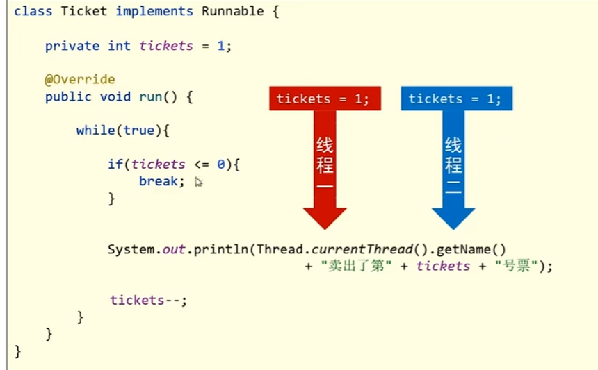

所以走`else`分支，刚要打印，CPU执行权又被线程3抢到：


此时线程3持有的`tickets`数也是1：


因为线程1和2都没有执行过减操作，现在3个线程`tickets`均为1，线程3进行`if`判断，走`else`分支，刚要打印，CPU执行权又被线程1抢到，线程1继续之前的执行，将`tickets`减1，`tickets`=0，由于`tickets`是共享资源，其他线程持有的`tickets`也会跟着改变：


共享操作的数据，但凡有一条线程改变了数据，其他线程的数据也会跟着变。

线程1将`tickets`改为0以后，CPU被线程2抢到，打印卖出了第0张票，然后执行`tickets`-1操作，此时`tickets`=-1，然后CPU被线程3抢到，打印卖出了-1张票，然后执行`tickets`-1操作，此时`tickets`=-2。

这就是为什么会有负数票的原因。

### 1.2.2 重复票的原因

假设3条线程卡死在打印语句这里，持有的`tickets`均为1：


然后线程1执行打印语句，打印"卖出第1张票"，但是，它刚要执行`tickets`-1，CPU被线程2抢走，线程2持有的`tickets`也是1，于是也打印"卖出第1张票"，然后，它也刚要执行`tickets`-1时，CPU被线程3抢走，线程3持有的`tickets`也是1，它也打印"卖出第1张票"。

这就是打印重复票的原因。

## 1.3 锁机制 

分析负数票和重复票出现的原因，发现导致出现这种情况的本质就是CPU在多个线程之间来回切换执行。那么解决的方法也会简单，就是当一个线程在操作共享资源时，希望通过种机制能将这个操作过程保护起来，不让其他线程来抢占。等这个线程把操作执行完，再切换到其他线程：


这种机制可以通过上锁来实现，将这段代码上锁，上锁就表示，线程过来执行，把这段执行过程保护起来，什么时候线程执行完，才能开锁，开锁后才能允许CPU切换到其他线程。


# 2 同步技术

> 将多条语句操作共享数据的代码给锁起来，让任意时刻只能有一个线程可以执行。

## 2.1 同步代码块

关键字`synchronized`。

同步代码块格式：

```java
synchronized(锁对象) {
    多条语句操作共享数据的代码
}
```

将需要上锁的代码块放入`{}`中，然后在`synchronized()`中放入锁对象，锁对象可以是任意对象。


### 2.1.1 锁对象细节

还是一样的卖票操作，只不过换成继承`Thread`的方式：


锁对象可以是任意对象，但是需要保证，多条线程使用的锁对象必须是同一把锁。否则这个线程上它的锁，那个线程上它那把锁，锁都不一样，无法相互影响，如何保证线程安全。

而且，这段代码还有一个问题，就是3个线程所持有的票也不是共享数据，每个线程独享自己的票数。因此，票和锁需要被`static`修饰，这样这两个数据就被该类所以对象所共享，且内存中只存在一份。

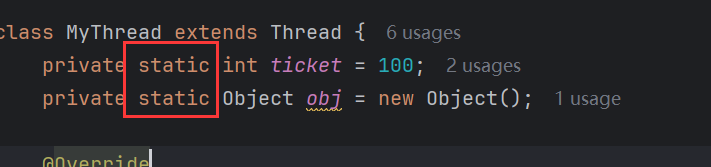


其实，锁对象还可以换成类的字节码对象，类的字节码在内存中只会加载一次，很符合锁对象：


### 2.1.2 弊端

同步代码块，虽然可以保证线程安全，但是也会降低执行效率。因为一个线程上锁，其他线程只能等待。

> - 同步，即线程安全，效率低。
>
> - 不同步，即线程不安全，效率高。

## 2.2 同步方法

格式：

```java
public synchronized void method(){
    
}
```

> 在方法返回值类型前加上`synchronized`关键字，修饰该方法为同步方法。同步方法中的代码都是同步的。


### 2.2.1 细节

同步方法也是有锁对象的，只是它隐藏了起来。

> - 静态同步方法锁对象：该类字节码对象。
>
> - 非静态同步方法锁对象：`this`。

用同步代码块来查看：


窗口1使用同步方法，窗口2使用同步代码块，同步代码块可以显示的看到锁对象，同步方法`method()`是非静态方法，它的锁对象是`this`而同步代码锁对象是字节码对象，两个锁对象不一致，线程不安全：

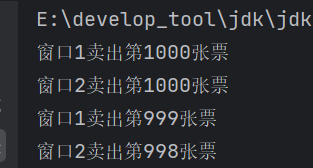

如果锁对象改成`this`，跟同步方法的锁对象一致，那么线程安全：

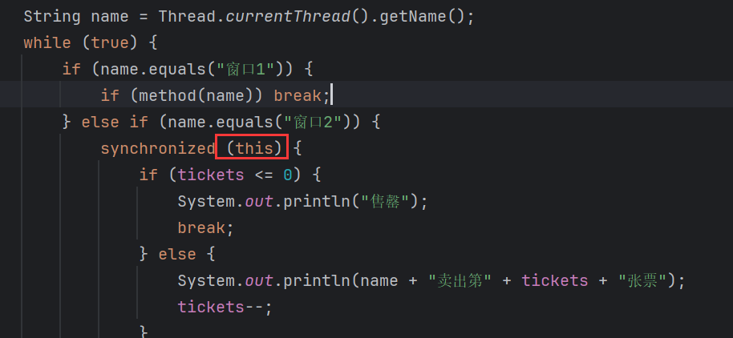


侧面说明，非静态同步方法的锁对象是`this`。

反过来，静态同步方法：


它的锁对象就是类的字节码对象，因此，同步代码块若锁对象为`this`，那么线程不安全：


若为同类字节码对象，那么线程安全：


侧面说静态同步方法的锁对象是字节码对象。

由于，非静态同步方法的锁对象是`this`，表示当前实例，所以当创建多少个对象，就有多少个`this`，这些实例即锁对象是不同的。若多个线程使用这些同步方法就会导致线程不安全。

解决方法是：要么只创建一个对象，保证`this`只有一份，要么用非静态同步方法，字节码文件被该类所以对象共享，且内存中只有一份，保证不管创建多少个对象，锁对象都是同一个。

## 2.3 Lock锁

> `Lock`可以清晰的看到哪里加了锁，哪里释放了锁。

它的格式为：

```java
// 上锁
lock.lock();
...
// 关锁
lock.unlock();
```

`Lock`是一个接口，它是通过调用方式来实现上锁和关锁。`Lock`体系中的锁的上锁和关锁方式继承至`Lock`接口，调用`lock()`为上锁，调用`unlock()`表示关锁。

### 2.3.1 ReentrantLock

```java
public ReentrantLock(){};
```

> `Lock`的实现类，表示互斥锁。

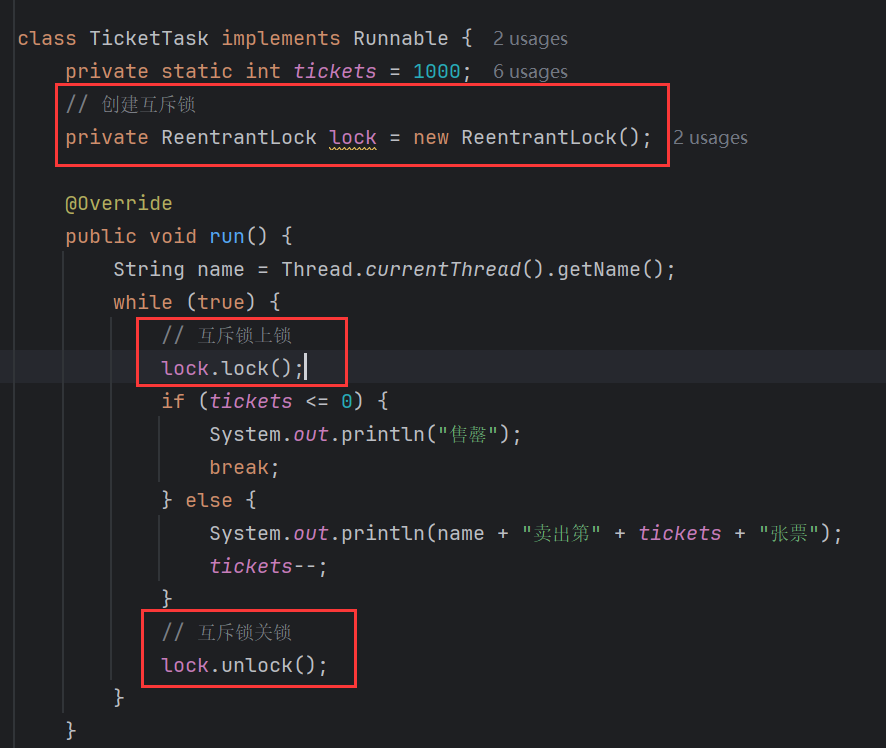

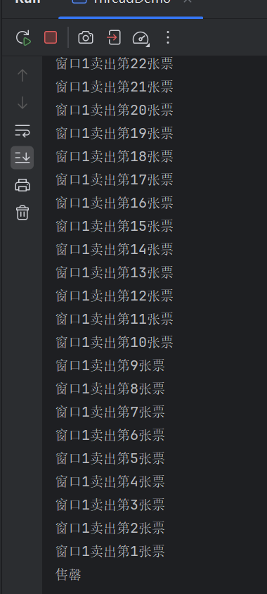

线程安全，票数正常卖出，但是票数卖光后，程序没有停止：


这是因为在票数判断这里没有关闭锁：

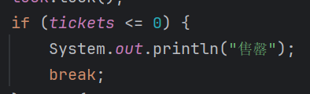

假设当前的票数为0，某个线程进入循环，判断条件，满足，打印出"售罄"，然后结束循环，循环被结束，后续的代码就无法执行，也就是没有执行关锁这一步：

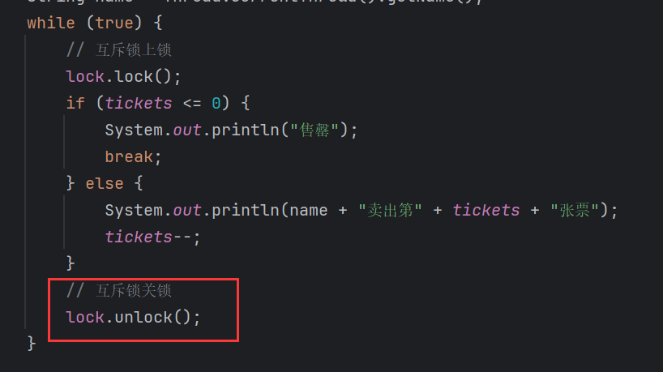

解决方法就是保证关锁一定被执行，用`finally`代码块：

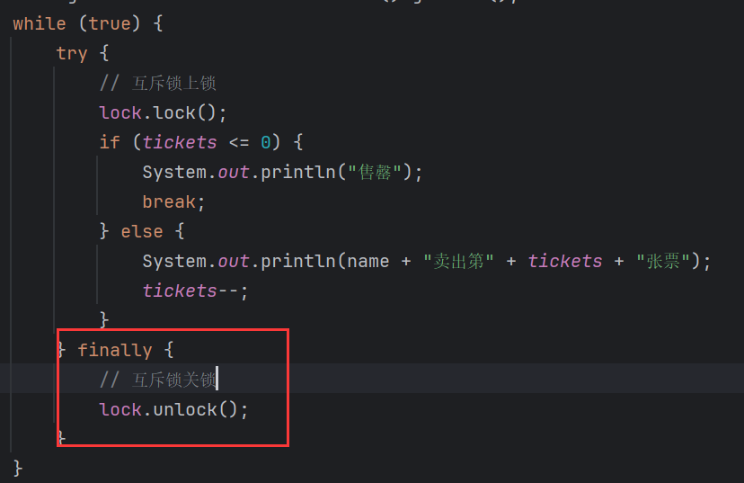

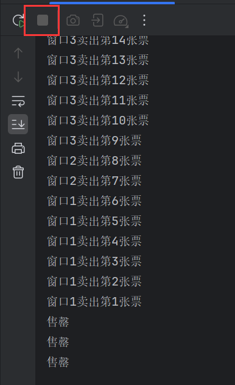

## 2.4 死锁

> 由于两个或者多个线程互相持有对方所需要的资源导致这些线程处于相互等待状态，导致程序无法继续执行。

产生死锁的情况：同步嵌套。

代码材料如下：

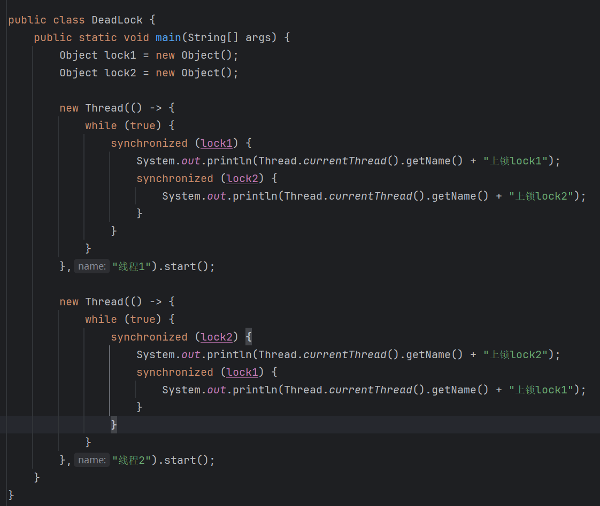

准备两个锁对象，`lock1`和`lock2`：

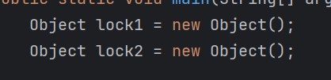

开启两个线程，在线程1中，使用同步嵌套，先上锁`lock1`，再上锁`lock2`：

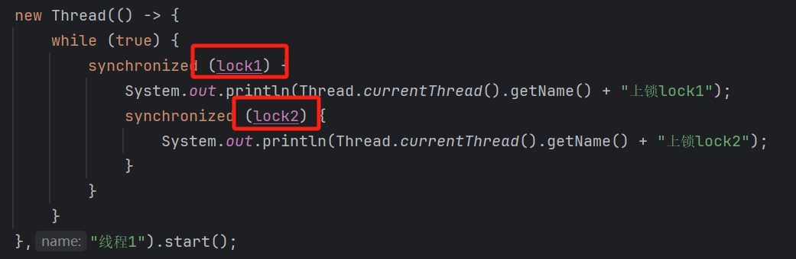

线程2反之：

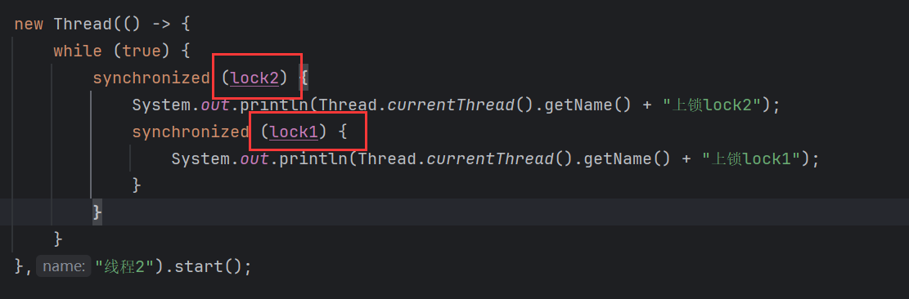

执行，程序卡死：

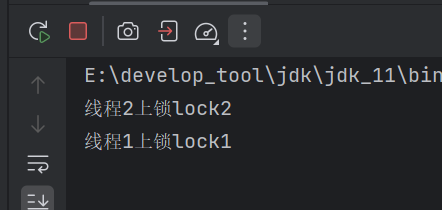

原因：

一开始代码是这样的：

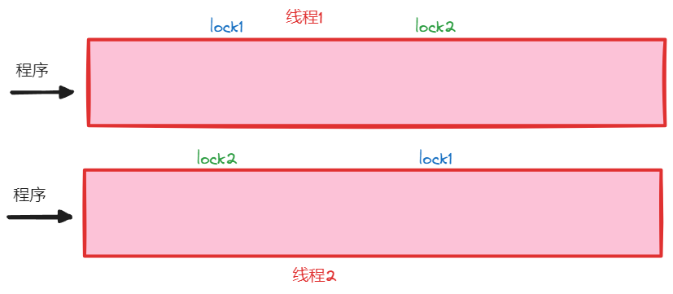

线程中还未上锁，假设线程1先执行，程序走到循环内，先上了`lock1`：

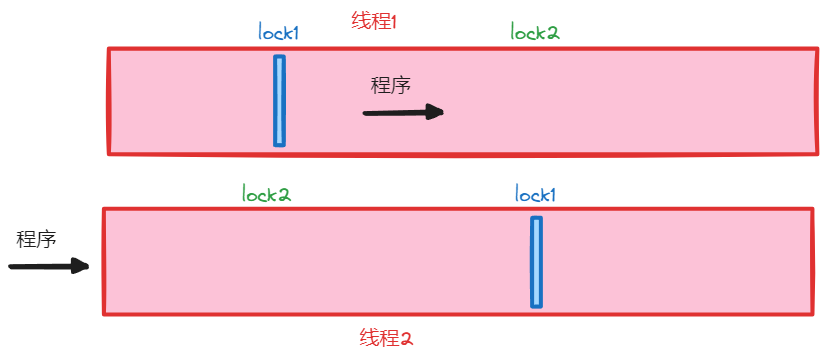

此时线程1上了锁，同样的线程2也会上锁，因为是同一个锁对象，<font color=red>**其中一个线程上了锁，其他用到这个锁对象的线程也会跟着上锁，这是死锁产生的关键点**</font>。然后当线程1继续执行打印出了语句，刚要执行上`lock2`锁的操作时，线程2抢到了执行权，它进入到循环，然后上锁`lock2`：

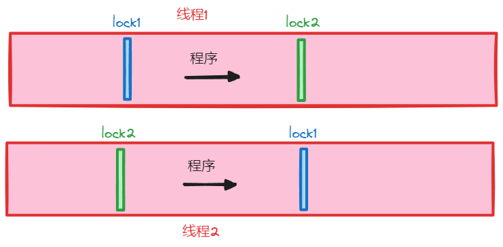

它一旦上锁`lock2`，线程1也会跟着上锁`lock2`。这时就产生了死锁。

此时线程2如果要继续执行下去，就需要等待`lock1`解锁，`lock1`是线程1上的锁，只有等到线程1将代码执行完，才能解锁，而线程1也遇到了锁`lock2`，`lock2`是线程2上的锁，它也需要等待线程2执行完以解锁`lock2`才能继续执行。这就造成线程1和线程2互相等待的情况，程序也就是卡死了。