# 1 线程通信

> 线程通信就是确保线程能够按照预定的顺序执行，并且能够安全地访问共享资源。

在之前的案例中，线程之间执行可以说是毫无顺序，抢占式调度，谁抢到算谁的。而线程通信能让线程之间按照指定顺序来执行，比如两条线程，可以让它们之间一条线程执行一次，交替下去。

**为什么要让线程按照指定顺序来执行呢？**

这很好理解，假如有两条线程A和B，线程A先抢到执行权，然后去执行任务，当A执行完后，完全有可能再次抢到执行权，极端一点，甚至整个任务周期都是由A线程来执行的，也就是B线程根本没有执行过，那么B线程开启就是在浪费资源。所以，某些情况下需要线程之间按照指定的顺序来执行。

## 1.1 线程通信好处

> - 确保线程能够按照预定的<font color=red>顺序执行</font>，并且能够<font color=red>安全</font>地访问共享资源(<font color=red>线程通信需要同步，同步带来线程安全</font>)。
> - 使多条线程更好的进行协同工作。


# 2 案例

有两个打印方法，用于打印字符，开启两条线程，不断的打印：

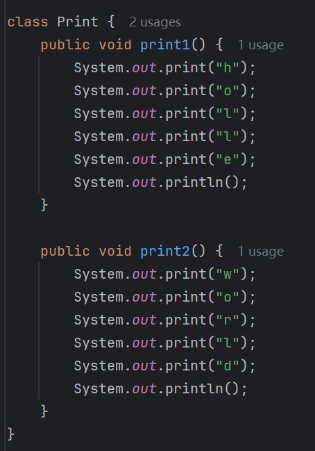

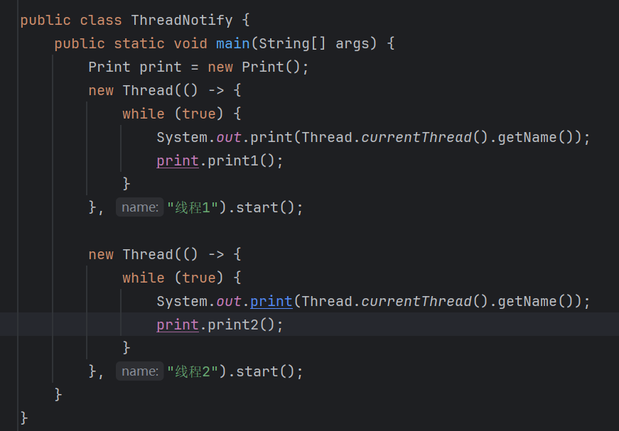

执行效果：

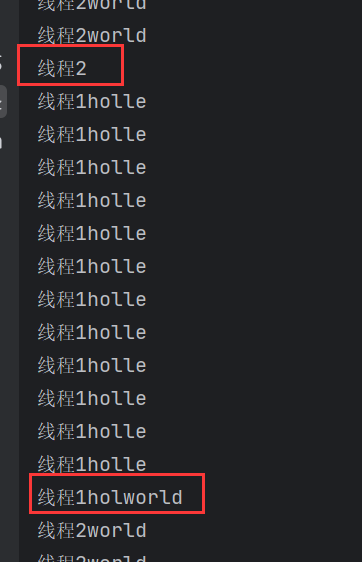

有打印错乱，还有没有打印的现象，因为线程没有同步，下面加上同步：

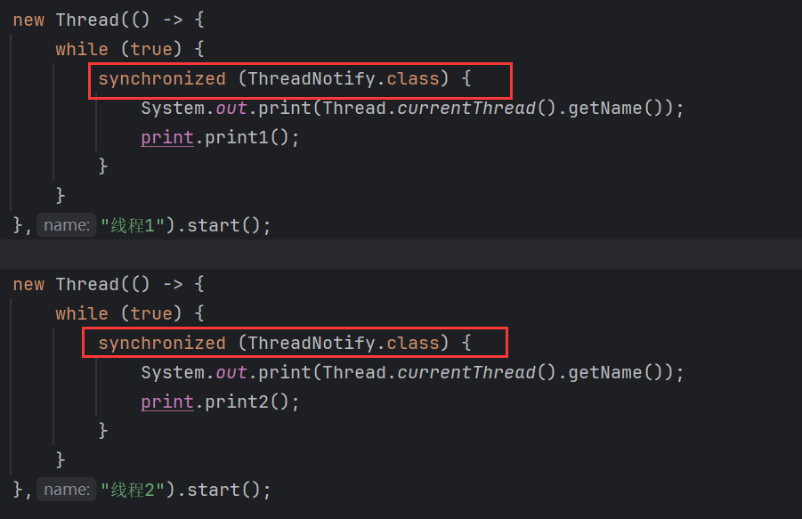

结果：

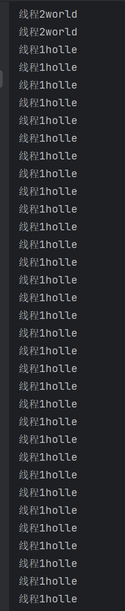

没有出现错乱问题，但是这两条线程没有执行顺序，在执行期间，执行次数也是随机的。如果想让两条线程交替执行，每一个线程执行一个，换另一个线程执行，就需要用到线程通信技术。

在`Print`中定义一个变量`flag`表示标记，默认值为1：

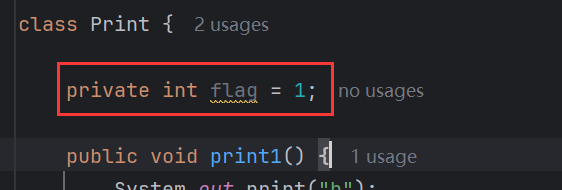

这个标记用于控制哪个线程执行，哪个线程等待，为1时，表示线程1执行，线程2等待，为2时，表示线程2执行，线程1等待。

那么在打印方法中需要这样操作：

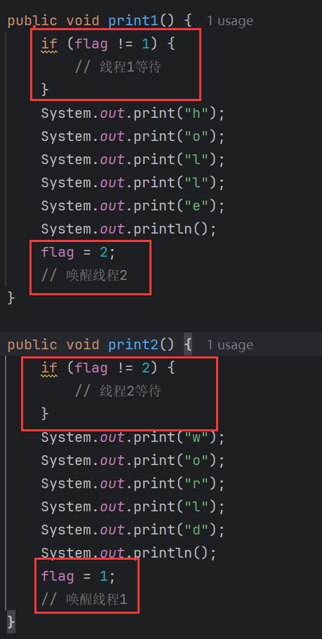

在`print1()`中打印内容之前，先判断`flag`是否为1，若不是，那么线程1就需要等待，等待线程2执行，若为1，那么线程1往下执行，打印完后，将`flag`改为2，然后唤醒线程2去执行，线程2与之相反。

如何让线程等待，又如何唤醒线程？

需要调用线程通信方法。


# 3 线程通信方法

## 3.1 wait()

```java
public void wait(){};
```

> `Object`中的方法，使当前线程等待。

## 3.2 notify()

```java
public void notify(){};
```

> `Object`中的方法，随机唤醒单个等待的线程。

## 3.3 注意

> 线程通信方法需要使用锁对象进行调用，且是同一把锁(同一个锁对象)。

线程通信方法需要用锁对象进行调用，而锁对象可以是任意对象，因此这也是为什么线程通信方法设计在`Object`中，就是为了方便任意的锁对象都能调用线程通信方法。

**为什么要用锁对象进行调用，而不用其他对象？**

## 3.4 案例实现

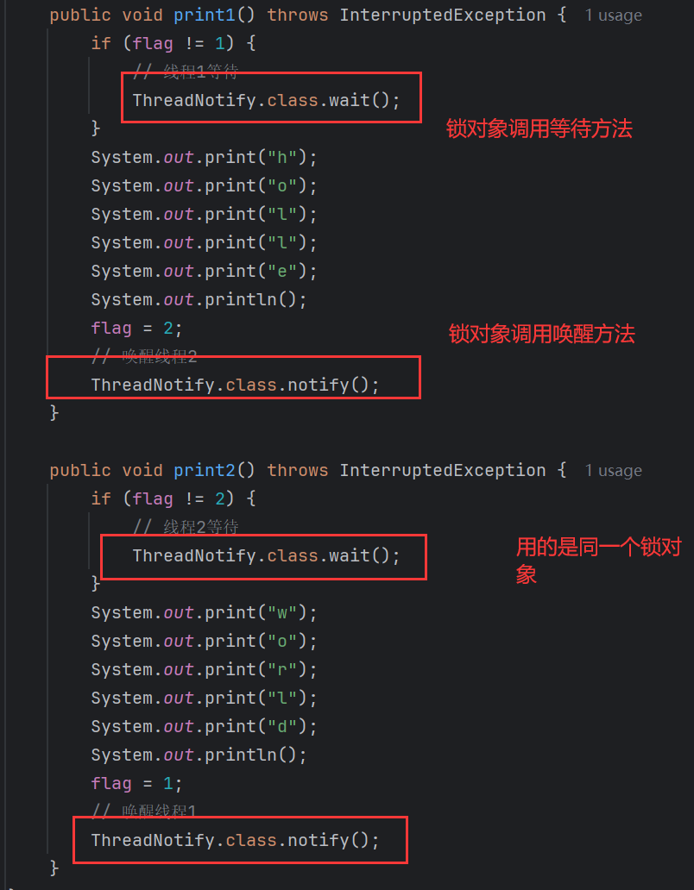

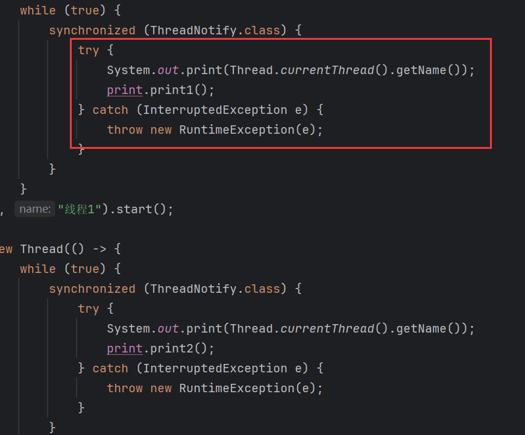

这里使用了`try...catch`因为，这里从重写了`Runnable`的`run()`，子类重写父类的方法时，不能抛出父类没有的异常，或比父类更大的异常。

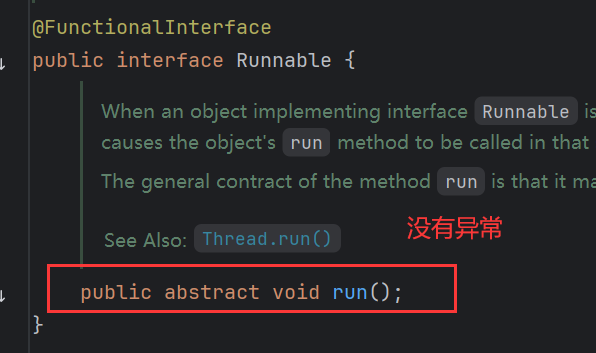

`run()`没有异常，所以此处也不能抛出异常，只有用`try...catch`捕获。

执行效果：

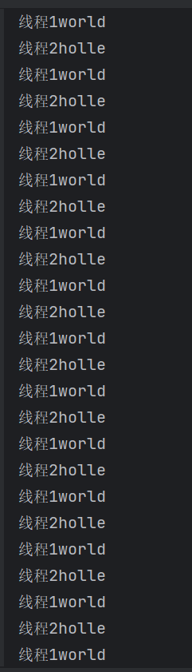

交替执行。

### 3.4.1 执行细节

假设是线程2先抢到执行权，线程2进行条件判断，此时`flag`为1，满足条件，线程2等待。

补充一个操作系统中线程的知识：

> **当一个线程进入等待状态时，CPU 会切换到其他可运行的线程**。这是现代操作系统中 **线程调度** 的基本工作原理，确保 CPU 资源被有效利用，不会浪费在等待的线程上。

也就是说线程2一旦等待，CPU就不会继续执行线程2，而是去执行其他可以运行的线程，当前可运行线程还剩下线程1，所以线程1开始执行。

线程1判断条件，不满足，然后打印字符，将`flag`改为2，接着唤醒随机的一个等待的线程，当前等待的线程只有线程2，那么只能唤醒线程2。

<font color=red>**注意**</font>：线程2被唤醒后，CPU不会马上去执行线程2，因为此时还在执行线程1，而且线程1加了锁，线程2只有等线程1执行完，即便线程1执行完，线程2也不一定会执行，因为还得跟线程1抢占CPU。

当线程1执行完，假设依然是线程1抢到执行权，然后进行条件判断，因为`flag`改为了2所以满足条件，线程1等待，轮到线程2执行。

<font color=red>**注意**</font>：`wait()`是在哪里等待就从哪里开始执行，即等待之前执行过的代码，轮到该线程执行时，就不会继续执行，而是接着等待之后的代码执行。

所以线程2会直接执行`wait()`之后的代码，打印字符，将`flag`改为1，唤醒线程1，线程2执行完，线程1和线程2抢占执行权，以此循环下去，就实现了交替打印的效果。

**假设第一次执行的是线程1，线程1最后会执行唤醒线程，此时没有等待的线程，那么它唤醒谁呢？**

无事发生，因为`notify()`可以空唤醒，这就好比喊了一声，每没人搭理。

### 3.4.2 三个线程

难度升级，处理3个线程，每个线程交替打印：

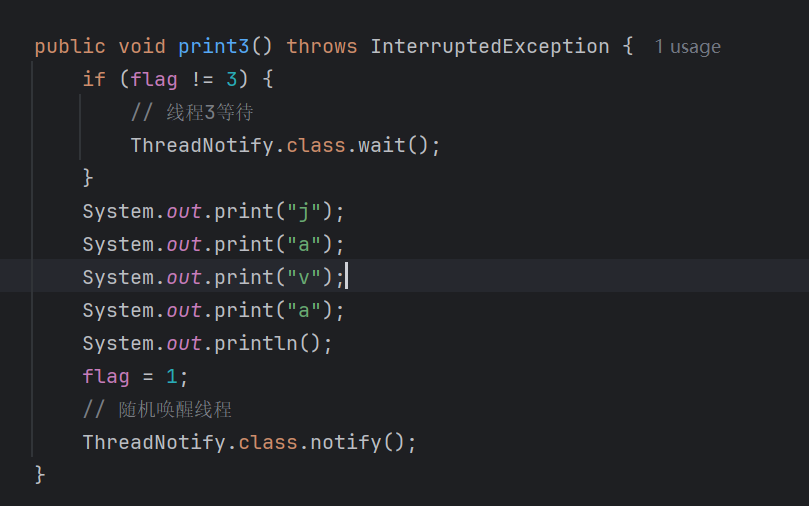

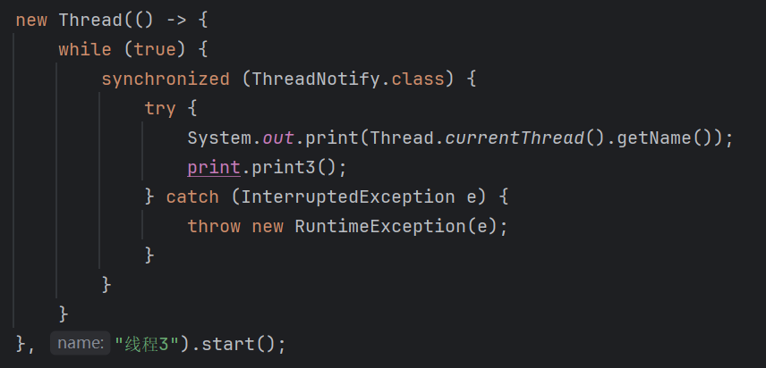

效果：

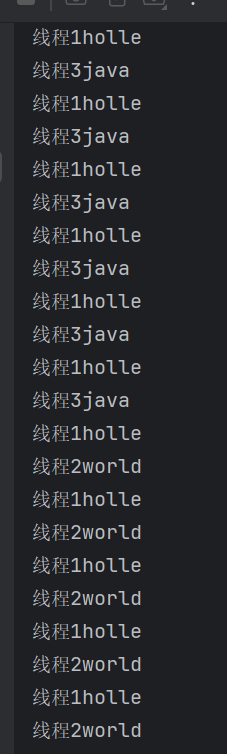

并没有交替打印，正确的打印应该是123的顺序。

分析一下执行细节：

假设线程2先执行，当前`flag`为1，满足条件，线程2等待，然后线程3抢到执行权，判断也满足条件，线程3等待，此时未等待线程只有1，因此线程1执行，不满足条件，线程1打印字符，将`flag`该为2，然后唤醒线程，由于`notify()`是随机唤醒线程，所以线程1不一定唤醒的就是线程2，也可能唤醒得是线程3，假设唤醒的是线程3，又根据`wait()`会从等待之后得代码开始执行，所以线程3不会再去执行条件判断，而是会执行打印。

这样就造成了线程1打印之后不是线程2打印，而是线程3打印，这就是为什么没有交替打印的原因。

分析发现，出现这种情况的原因在于`wait()`不会去执行等待之前的代码，导致线程3跳过了条件判断。如果线程3在唤醒后能反回去执行条件判断，那么它会一直等待，除非线程2执行，因为当前的`flag`为2，只有线程2能将其改为3。

**那么如何能让线程3返回去执行呢？**

只需改成`while`循环即可，即便从`wait()`之后开始只需，也会重新进入循环进行条件判断：

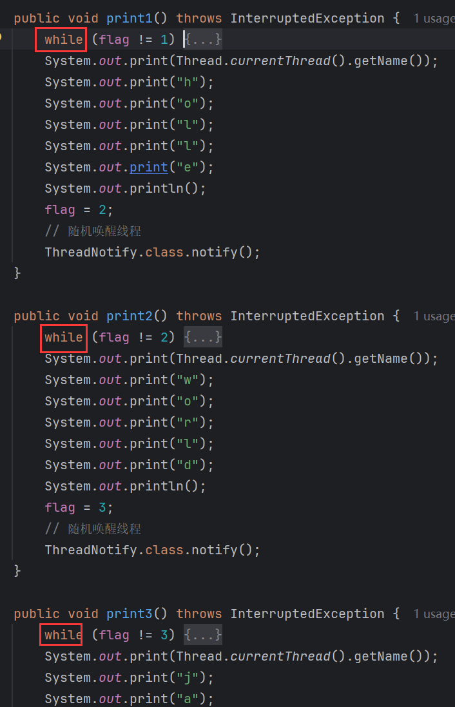

执行效果：

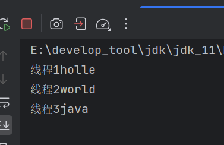

3个线程交替打印了一次之后就卡死了。

**为什么会卡死？**

假设还是线程2先执行，`flag`为1，线程2满足条件，进入等待，然后线程3抢到执行权，它也满足条件，也进入等待，现在只有线程1能执行，所以执行线程1，不满足条件，执行打印字符，然后将`flag`改为2，随机唤醒等待的线程，不一定唤醒线程2，如果唤醒的是线程3，那么线程3从`wait()`之后开始执行，进入循环，判断满足条件，线程3继续等待。此时仍然只有线程1能执行，所以线程1执行，判断满足条件，线程1等待。现在3个线程都在等待，程序卡死。

造成这个情况的原因就是线程1在唤醒等待线程时，是随机唤醒，不能精确的唤醒线程2。

## 3.5 notifyAll()

```java
public void notifyAll(){};
```

> `Object`中的方法，唤醒所有等待的线程。

改为用`notifyAll()`：

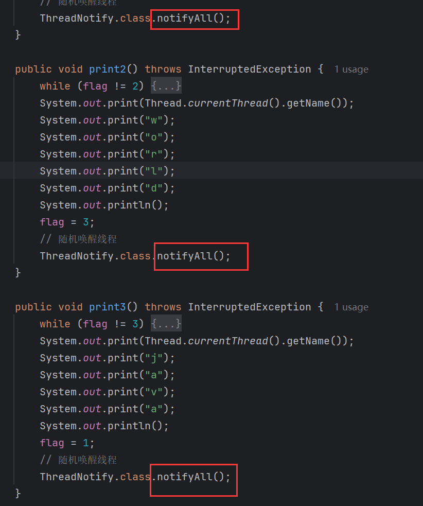

效果：

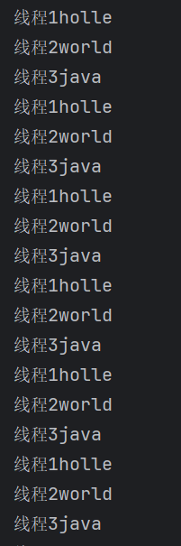

成功交替执行，顺序也是123。

执行分析：

假设线程2先执行，满足条件，等待，线程3抢到执行权，也满足条件，等待，线程1执行，不满足条件，执行打印，将`flag`改为1，然后唤醒所有等待线程。即2和3都会被唤醒，此时123线程都可以执行，它们抢夺执行权，假设是1抢到，由于`flag`为2，线程1等待，接着由23抢执行权，无论是2还是3，最后都是2执行，因为如果是3抢到，那么3会等待，最终还是2会执行。然后2会将`flag`改为3，然后唤醒所有线程，再去抢，一样的逻辑，123无论谁抢到最终都是3执行，因为`flag`为3，12会等待。然后3将`flag`改为1，然后唤醒12，123再去抢，发现了吗，由于唤醒了所有线程，所有线程都会有可能执行，但是由于`flag`的存在，导致`flag`所标记的线程才能执行，而其他线程只能等待，这就是为什么能交替执行的原因。