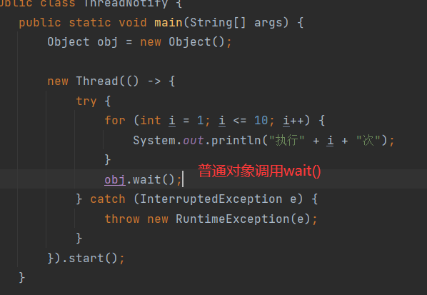
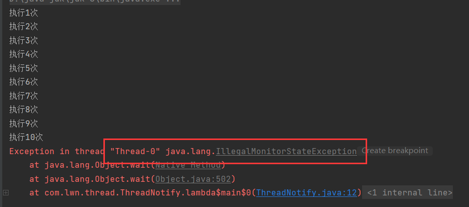
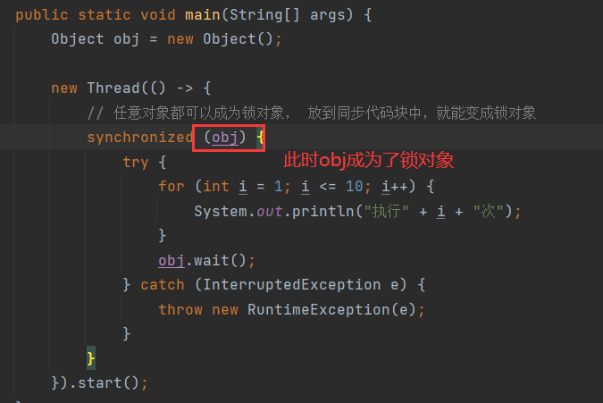
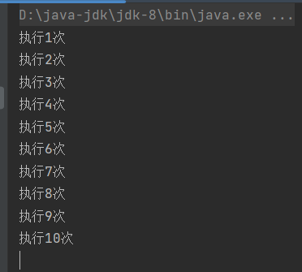
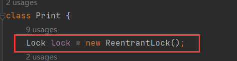
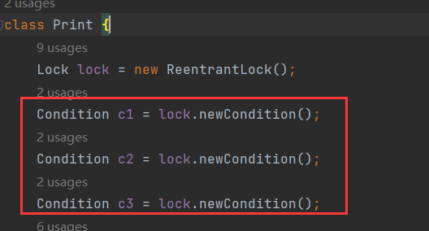
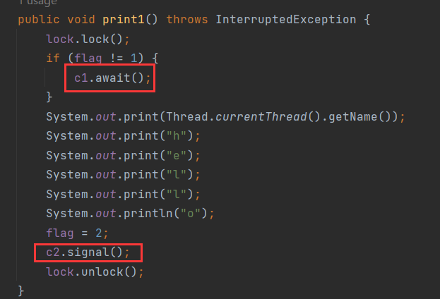
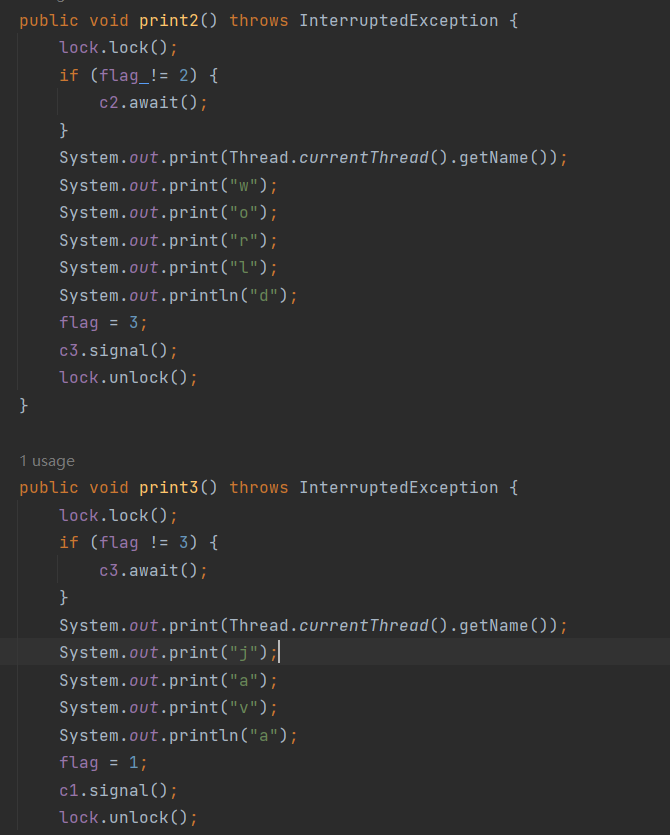
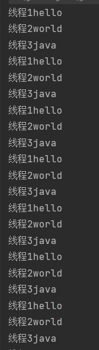

# 1 线程通信

> 线程通信就是确保线程能够按照预定的顺序执行，并且能够安全地访问共享资源。

在之前的案例中，线程之间执行可以说是毫无顺序，抢占式调度，谁抢到算谁的。而线程通信能让线程之间按照指定顺序来执行，比如两条线程，可以让它们之间一条线程执行一次，交替下去。

**为什么要让线程按照指定顺序来执行呢？**

这很好理解，假如有两条线程A和B，线程A先抢到执行权，然后去执行任务，当A执行完后，完全有可能再次抢到执行权，极端一点，甚至整个任务周期都是由A线程来执行的，也就是B线程根本没有执行过，那么B线程开启就是在浪费资源。所以，某些情况下需要线程之间按照指定的顺序来执行。

## 1.1 线程通信好处

> - 确保线程能够按照预定的<font color=red>顺序执行</font>，并且能够<font color=red>安全</font>地访问共享资源(<font color=red>线程通信需要同步，同步带来线程安全</font>)。
> - 使多条线程更好的进行协同工作。


# 2 案例

有两个打印方法，用于打印字符，开启两条线程，不断的打印：


执行效果：


有打印错乱，还有没有打印的现象，因为线程没有同步，下面加上同步：


结果：


没有出现错乱问题，但是这两条线程没有执行顺序，在执行期间，执行次数也是随机的。如果想让两条线程交替执行，每一个线程执行一个，换另一个线程执行，就需要用到线程通信技术。

在`Print`中定义一个变量`flag`表示标记，默认值为1：


这个标记用于控制哪个线程执行，哪个线程等待，为1时，表示线程1执行，线程2等待，为2时，表示线程2执行，线程1等待。

那么在打印方法中需要这样操作：


在`print1()`中打印内容之前，先判断`flag`是否为1，若不是，那么线程1就需要等待，等待线程2执行，若为1，那么线程1往下执行，打印完后，将`flag`改为2，然后唤醒线程2去执行，线程2与之相反。

如何让线程等待，又如何唤醒线程？

需要调用线程通信方法。


# 3 线程通信方法

## 3.1 wait()

```java
public void wait(){};
```

> `Object`中的方法，使当前线程等待。

## 3.2 notify()

```java
public void notify(){};
```

> `Object`中的方法，随机唤醒单个等待的线程。

## 3.3 注意

> 线程通信方法需要使用锁对象进行调用，且是同一把锁(同一个锁对象)。

线程通信方法需要用锁对象进行调用，而锁对象可以是任意对象，这也是线程通信方法设计在`Object`中的原因，就是为了方便任意的锁对象都能调用线程通信方法。

**为什么要保证同一个锁对象？**

因为线程通信的前提是线程同步，如果线程之间的锁对象不同，不能保证线程同步。

**为什么要用锁对象来调用线程通信方法，其他对象不是也能调用吗？**

锁对象和线程通信方法有着密切的关系。

举个例子，`wait()`方法会释放锁，如果普通对象调用`wait()`会直接抛出异常：





只有锁对象调用才不会抛出异常：





原因很简单，因为`wait()`会释放锁，如果在等待之前没有加锁，`wait()`就没锁可放，自然抛出了异常。

这两次示例都是用`obj`这个对象来调用，区别就是第一次没有上锁，不是锁对象，第二次上锁，是锁对象。第一次调用报错，第二次调用没有报错。

## 3.4 案例实现


这里使用了`try...catch`因为，这里从重写了`Runnable`的`run()`，子类重写父类的方法时，不能抛出父类没有的异常，或比父类更大的异常。


`run()`没有异常，所以此处也不能抛出异常，只有用`try...catch`捕获。

执行效果：


交替执行。

### 3.4.1 执行细节

假设线程2先抢到执行权，线程2进行条件判断，此时`flag`为1，满足条件，线程2等待。

补充一个操作系统中线程的知识：

> **当一个线程进入等待状态时，CPU 会切换到其他可运行的线程**。这是现代操作系统中 **线程调度** 的基本工作原理，确保 CPU 资源被有效利用，不会浪费在等待的线程上。

也就是说线程2一旦等待，CPU就不会继续执行线程2，而是去执行其他可以运行的线程。

从这点可以看出`wait()`的细节：

> `wait()`让当前线程等待，同时会<font color=red>释放</font>当前线程持有的<font color=red>锁</font>。

当前可运行线程还剩下线程1，所以线程1开始执行。

线程1判断条件，不满足，然后打印字符，将`flag`改为2，接着唤醒随机的一个等待的线程，当前等待的线程只有线程2，那么只能唤醒线程2。

<font color=red>**注意**</font>：线程2被唤醒后，CPU不会马上去执行线程2，因为此时还在执行线程1，而且线程1加了锁，线程2只有等线程1执行完。而且即便线程1执行完，线程2也不一定会执行，因为它还得跟线程1抢占CPU。

当线程1执行完，假设依然是线程1抢到执行权，然后进行条件判断，因为`flag`改为了2所以满足条件，线程1等待，轮到线程2执行。

<font color=red>**注意**</font>：`wait()`是在哪里等待就从哪里开始执行，即等待之前执行过的代码，轮到该线程执行时，就不会从头开始执行，而是接着`wait()`之后的代码执行。

所以线程2会直接执行`wait()`之后的代码，打印字符，将`flag`改为1，唤醒线程1，线程2执行完，线程1和线程2抢占执行权，以此循环下去，就实现了交替打印的效果。

**假设第一次执行的是线程1，线程1最后会执行唤醒线程，此时没有等待的线程，那么它唤醒谁呢？**

无事发生，因为`notify()`可以空唤醒，这就好比喊了一声，每没人搭理。

### 3.4.2 三个线程

难度升级，处理3个线程，每个线程交替打印：


效果：


并没有交替打印，正确的打印应该是123的顺序。

分析一下执行细节：

假设线程2先执行，当前`flag`为1，满足条件，线程2等待，然后线程3抢到执行权，判断也满足条件，线程3等待，此时未等待线程只有1，因此线程1执行，不满足条件，线程1打印字符，将`flag`改为2，然后唤醒线程，由于`notify()`是随机唤醒线程，所以线程1不一定唤醒的就是线程2，也可能唤醒得是线程3，假设唤醒的是线程3，**注意**线程3会从`wait()`之后的代码开始执行，所以线程3不会再去执行条件判断，而是会执行打印。

这样就造成了线程1打印之后不是线程2打印，而是线程3打印，这就是为什么没有按照规定顺序交替打印的原因。

分析发现，出现这种情况的原因在于`wait()`不会去执行等待之前的代码，导致线程3跳过了条件判断。如果线程3在唤醒后能反回去执行条件判断，就能让线程3等待，让线程2执行。

**那么如何能让线程3返回去执行呢？**

只需改成`while`循环即可，即便从`wait()`之后开始执行，也会重新进入循环进行条件判断：


执行效果：


3个线程交替打印了一次之后就卡死了。

**为什么会卡死？**

假设还是线程2先执行，`flag`为1，线程2满足条件，进入等待，然后线程3抢到执行权，它也满足条件，也进入等待，现在只有线程1能执行，线程1不满足条件，执行打印字符，然后将`flag`改为2，随机唤醒等待的线程，如果唤醒的是线程3，那么线程3从`wait()`之后开始执行，进入循环，判断满足条件，线程3继续等待。此时仍然只有线程1能执行，所以线程1执行，判断满足条件，线程1等待。现在3个线程都在等待，程序卡死。

造成这个情况的原因就是线程1在唤醒等待线程时，是随机唤醒，不能精确的唤醒线程2。

## 3.5 notifyAll()

```java
public void notifyAll(){};
```

> `Object`中的方法，唤醒所有等待的线程。

改为用`notifyAll()`：


效果：


成功交替执行，顺序也是123。

执行分析：

假设线程2先执行，满足条件，等待，线程3抢到执行权，也满足条件，等待，线程1执行，不满足条件，执行打印，将`flag`改为1，然后唤醒所有等待线程。即2和3都会被唤醒，此时123线程都可以执行，它们抢夺执行权，假设是1抢到，由于`flag`为2，线程1等待，接着由23抢执行权，无论是2还是3，最后都是2执行，因为如果是3抢到，那么3会等待，最终还是2会执行。然后2会将`flag`改为3，然后唤醒所有线程，再去抢，一样的逻辑，123无论谁抢到最终都是3执行，因为`flag`为3，12会等待。然后3将`flag`改为1，然后唤醒12，123再去抢，发现了吗，由于唤醒了所有线程，所有线程都会有可能执行，但是由于`flag`的存在，导致`flag`所标记的线程才能执行，而其他线程只能等待，这就是为什么能交替执行的原因。

由于是唤醒所有等待线程，所以某一个线程执行完后，相对于所以的线程都是就绪状态，所有的线程再去匹配`flag`，自然就能过滤出目标线程。

## 3.6 sleep()和wait()区别

1. `sleep()`是线程休眠，时间到了自动醒来，`wait()`是线程等待，需要其他线程调用`notify()`/`notifyAll()`将它唤醒。
2. `sleep()`在休眠时不会释放锁，而`wait()`在等待时会释放锁。

## 3.7 细节总结

- 线程通信方法必须用锁对象调用。

- `notify()`，随机唤醒单个等待线程，可以空调用。
- `notifyAll()`，唤醒所有等待的线程，可以空调用。
- `wait()`：
  - `wait()`不能空调用，调用之前必须上锁，否则抛出`IllegalMonitorStateException`。
  - `wait()`是从哪里开始的等待，就从哪里开始执行。若线程被唤醒，那么会从`wait()`之后的代码开始执行，不会从头开始执行。
  - `wait()`会释放锁。


# 4 案例优化

当前的案例实现效率较低，每次都要唤醒所有线程。因此用`ReentrantLock`锁对象来优化。

首先用`ReentrantLock`获取`Condition`对象。`Condition`表示线程状态。

然后调用`Condition`中等待和唤醒方法。

## 4.1 newCondition()

```java
public Condition await(){};
```

> `ReentrantLock`中的方法，返回一个`Condition`对象。

## 4.2 await()

```java
public void await(){};
```

> `Condition`中的等待方法，指定线程等待。

`await()`的细节同`wait()`。

## 4.3 signal()

```java
public void signal(){};
```

> `Condition`中的唤醒方法，唤醒单个指定的线程。

<font color=red>**注意**</font>：`signal()`指定唤醒，是唤醒与`Condition`绑定的线程，若线程未绑定，那么随机唤醒一个线程。

## 4.4 实现

`Condition`中的唤醒方法能指定线程唤醒，而不是随机唤醒。大致的原理是将当前线程与`Condition`绑定在一起，因为`Condition`表示线程状态，就可以用状态去找到绑定的线程，进而操作指定线程。

步骤是这样的，要用到`await()`和`signal()`需要用到`ReentrantLock`，所以用互斥锁来作为锁对象：



有3条线程，一个线程一个状态一共3个状态，因此创建3个`Condition`：



`c1`、`c2`、`c3`分别对应线程1、线程2和线程3。然后线程1满足条件等待，线程1绑定的是`c1`，所以用`c1`调用指定线程1等待，不满足执行，最后唤醒线程2，线程2与`c2`绑定所以用`c2`调用`signal()`指定唤醒线程2：



线程2和3同理：



最后执行：



### 4.4.1 执行细节

**`c1`、`c2`、`c3`如何与线程绑定关系的？**

3个线程同时执行，假设线程2先执行，线程2先上锁，然后判定满足条件，然后`c2`调用`await()`指定线程2等待。注意，这是`c2`第一次调用`await()`，它会绑定线程2。

> 从这点可以看出，只要在当前线程中使用了`Codition`对象调用`await()`，就能将该状态与当前线程绑定起来，绑定的时机是第一次调用`await()`。

`await()`和`wait()`一样，也会释放锁。当前可执行线程还有1和3，假设3先执行，3上锁，判定满足条件，同过`c3`调用`await()`指定线程3等待，此时是`c3`第一次调用`await()`，它会绑定线程3，线程3等待同时释放锁。只有线程1能执行，然后线程1上锁，判定不满足条件，线程1打印，然后将`flag`改为2，然后通过`c2`调用`signal()`指定唤醒，由于`c2`绑定的是线程2，所以唤醒的是线程2。

然后线程1释放锁，当前可执行线程是1和2，假如又是1执行，那么线程1上锁，然后判定满足条件，通过`c1`调用`await()`指定线程1等待，这是`c1`第一次调用`await()`，它会绑定线程1，线程1等待同时释放🔒，当前可执行线程只有线程2，所以线程2执行，上🔒，不满足条件，打印，`flag`改为3，通过`c3`调用`signal()`指定唤醒线程3，线程2释放🔒。

当前可执行线程为2和3，假设3执行，3上🔒，判定不满足条件，打印，`flag`改为1，通过`c1`调用`signal()`指定唤醒线程1，线程3释放🔒。以此类推。

第二种情况：

假设线程1先执行，线程1上🔒，判定不满足条件，打印，`flag`改为2，通过`c2`调用`signal()`指定唤醒，此时`c2`并没有绑定任何线程，所以`signal()`将随机唤醒一个线程。当前没有线程等待，所以无事发生。然后线程1释放🔒。

当前123线程就绪，假设线程1继续执行，判定满足条件，线程1通过`c1`调用`await()`等待，这是`c1`第一次调用`await()`，`c1`绑定线程1，线程1释放🔒，假设线程2执行，判定不满足条件，打印，`flag`改为3，线程2通过`c3`调用`signal()`指定唤醒，`c3`未绑定，随机唤醒，当前只有线程1等待，线程1被唤醒，线程2释放🔒。

当前还是123线程就绪，假设还是线程2执行，一样的套路，线程2会等待，这是`c2`第一次调用`await()`，`c2`绑定线程2，然后线程2释放🔒。

当前线程13就绪，假设线程3执行，判定不满足条件，打印，`flag`改为1，同过`c1`调用`signal()`唤醒指定线程，`c1`此时已经绑定线程1，所以会唤醒线程1，线程1没有等待，无事发生，线程3释放锁。

当前线程依旧是13就绪，假设还是3执行，一样的套路，线程3会等待，这是`c3`第一次调用`await()`，`c3`绑定线程3，然后线程3释放🔒。让其可执行线程还有线程1，线程1执行......以此类推。

综上：

- 当前线程中第一次调用`await()`，状态对象会绑定当前线程。
- 调用`signal()`唤醒状态对象绑定的线程，若状态对象未绑定线程，则随机唤醒一个线程。