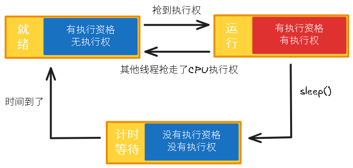
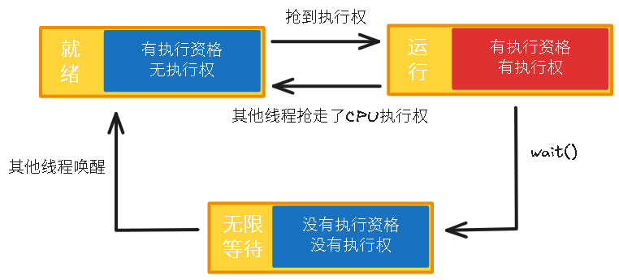
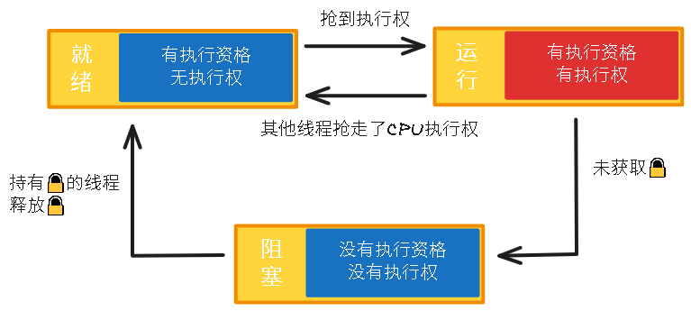
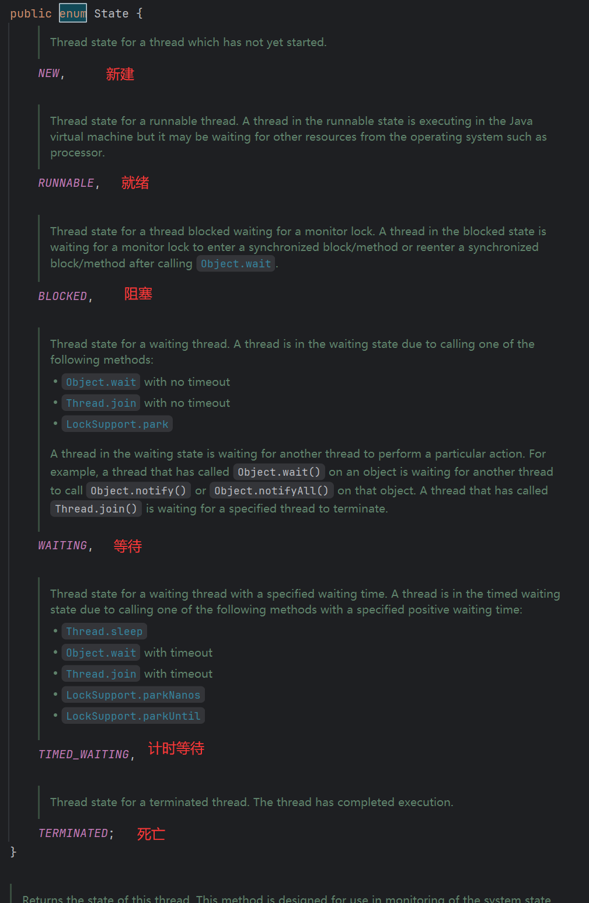
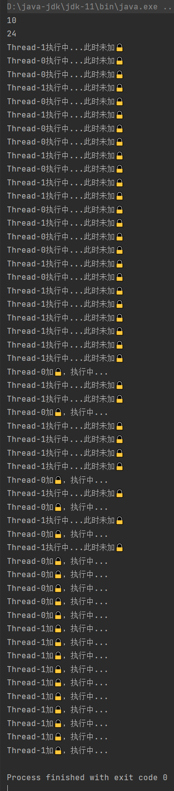
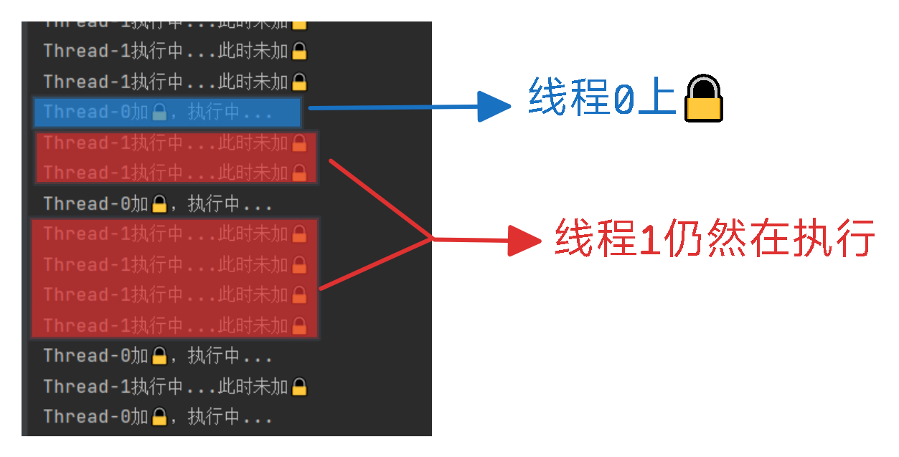
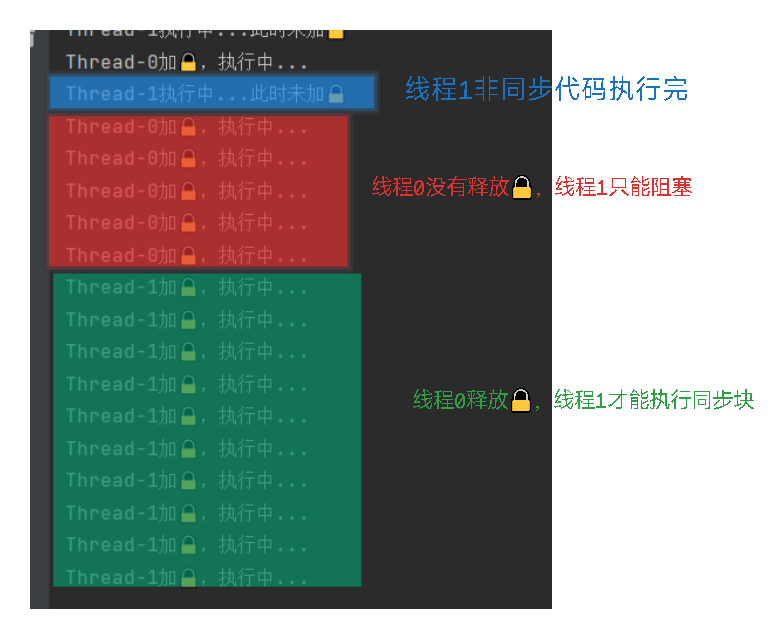

# 1 线程生命周期

线程在启动后会经理各种状态，线程被创建并启动以后，它并不是一启动就进入了执行状态，也不是一直处于执行状态。线程对象在不同的时期有不同的状态。

线程状态：

|          状态           |                时机                |
| :---------------------: | :--------------------------------: |
|        NEW(新建)        |            创建线程对象            |
|     RUNNABLE(就绪)      | `start()`调用，但没有抢到CPU执行权 |
|      BLOCKED(阻塞)      |   线程开始运行，但是没有获取到锁   |
|      WAITING(等待)      |            `wait()`调用            |
| TIMED_WAITING(计时等待) |           `sleep()`调用            |
|  TERMINATED(结束/死亡)  |       `run()`中代码执行完毕        |


# 2 生命周期情况图

- **执行资格**：可以理解为抢夺CPU执行权的资格，有资格的线程才能抢占CPU执行权，否则不能。

- **执行权**：线程执行的权力，只有抢到了CPU才有执行权，否则没有。

## 2.1 顺利执行

当创建一个线程对象，线程就处于新建状态：


当调用`start()`，线程处于就绪状态，需要与其他处于就绪状态的线程抢夺CPU执行权。此时的线程有执行资格，没有执行权：


当线程抢到CPU执行权，进入运行状态：


在运行期间执行`run()`中的代码，如果一切正常，`run()`运行结束，线程死亡，变成垃圾：


这种情况是最顺利的情况。

## 2.2 无执行权

若某个线程此时处于运行状态，但是其他线程抢到了CPU的执行权，那么该线程会回退到就绪状态：


<font color=red>**细节**</font>：当该线程再次抢到执行权时，会**接着上次执行的地方继续执行**，而不是从头开始执行。这是因为线程的执行状态（包括程序计数器、寄存器、栈等）会在抢占时被**保存**，以便它恢复时能够继续之前的执行。

## 2.3 休眠

若某个线程在运行状态期间调用了`sleep()`，它会进入计时等待状态，时间到了，<font color=red>会回退到就绪状态</font>。

处于计时等待状态：

- 没有执行资格
- 没有执行权



**回退到就绪状态意味着要和其他线程抢占执行权，若被其他线程抢到执行权，且这个线程比较耗，导致轮到此线程时，休眠了比预设时间更长的时间(其他线程占用耗时导致)?**

其实误差很小，因为`sleep()`不会释放当前线程的🔒，即便被其他线程抢占了执行权，它们在执行时由于没有🔒会进入阻塞状态，这就保证了休眠后只有这个线程能顺利执行。

## 2.4 等待

若某个线程在运行状态期间调用了`wait()`，它会进入等待状态，等待无限时间，直到它被其他线程唤醒，<font color=red>之后会回退到就绪状态</font>：

处于等待状态：

- 没有执行资格
- 没有执行权



<font color=red>**细节**</font>：若线程执行过程中进入等待状态，当其他线程将它唤醒后，它会进入就绪状态，当它再次抢到执行权，它会**接着上次执行的地方继续执行**，而不是从头开始执行。原因同上。

## 2.5 阻塞

若线程在运行到同步代码块时没有获取🔒，它会进入阻塞状态，直到持有🔒的线程释放🔒，<font color=red>之后会回退到就绪状态</font>：

处于阻塞状态：

- 没有执行资格
- 没有执行权



<font color=red>**细节**</font>：若线程执行过程中进入阻塞状态，当其他线程释放锁，它会进入就绪状态，当它再次抢到执行权，它会**接着上次执行的地方继续执行**，而不是从头开始执行。原因同上。[效果看这里](#4 非同步代码不受🔒影响)。

## 2.6 总结

- 只有就绪状态才能抢占CPU执行权。
- 运行状态，实际上就是执行`run()`中的代码。
- 阻塞、等待、计时等待这3种状态都是没有执行资格和执行权，意味着这3种状态无法参与抢占CPU执行权，也就无法执行。
- 阻塞、等待、计时等待这3种状态，重新开始执行都需要先回退到就绪状态。
- 若线程在执行中，因为某些原因(**阻塞、等待、计时等待、被抢占执行权**)导致它暂停执行，当他能再次执行时，它会**接着上次执行的地方继续执行**，而不是从头开始执行。这是因为线程的执行状态（包括程序计数器、寄存器、栈等）会在抢占时被**保存**，以便它恢复时能够继续之前的执行。


# 3 线程状态枚举类

在java中有一个枚举类`State`，存放着线程的状态：




# 4 非同步代码不受🔒影响

线程上🔒，只影响同步代码，不会影响到非同步代码，下面是一个例子：

```java
public class Test {
    public static void main(String[] args) {
        Runnable task = () -> {
            Random random = new Random();
            int n = random.nextInt(21) + 10;
            System.out.println(n);
            String name = Thread.currentThread().getName();
            for (int i = 0; i < n; i++) {
                System.out.println(name + "执行中...此时未加🔒");
            }
            synchronized (Test.class) {
                for (int i = 0; i < 10; i++) {
                    System.out.println(name + "加🔒，执行中...");
                }
            }
        };

        Thread thread1 = new Thread(task);
        Thread thread2 = new Thread(task);
        thread1.start();
        thread2.start();
    }
}
```

这个例子中，我先定义了一个任务，任务先执行打印的部分，产生一个随机数然后打印对应次数，这部分是没有加🔒的，因此是非同步代码：

```java
Random random = new Random();
int n = random.nextInt(21) + 10;	// 10 - 30 之间的随机数
System.out.println(n);
String name = Thread.currentThread().getName();
for (int i = 0; i < n; i++) {
    System.out.println(name + "执行中...此时未加🔒");
}
```

打印完后代码上🔒，再打印10次，这部分则是同步代码：

```java
synchronized (Test.class) {
    for (int i = 0; i < 10; i++) {
        System.out.println(name + "加🔒，执行中...");
    }
}
```

然后开启两个线程执行，结果如下：



```
10
24
Thread-1执行中...此时未加🔒
Thread-0执行中...此时未加🔒
Thread-0执行中...此时未加🔒
Thread-1执行中...此时未加🔒
Thread-0执行中...此时未加🔒
Thread-1执行中...此时未加🔒
Thread-0执行中...此时未加🔒
Thread-0执行中...此时未加🔒
Thread-1执行中...此时未加🔒
Thread-0执行中...此时未加🔒
Thread-1执行中...此时未加🔒
Thread-1执行中...此时未加🔒
Thread-0执行中...此时未加🔒
Thread-1执行中...此时未加🔒
Thread-0执行中...此时未加🔒
Thread-0执行中...此时未加🔒
Thread-1执行中...此时未加🔒
Thread-0执行中...此时未加🔒
Thread-1执行中...此时未加🔒
Thread-1执行中...此时未加🔒
Thread-1执行中...此时未加🔒
Thread-1执行中...此时未加🔒
Thread-1执行中...此时未加🔒
Thread-1执行中...此时未加🔒
Thread-1执行中...此时未加🔒
Thread-0加🔒，执行中...
Thread-1执行中...此时未加🔒
Thread-1执行中...此时未加🔒
Thread-0加🔒，执行中...
Thread-1执行中...此时未加🔒
Thread-1执行中...此时未加🔒
Thread-1执行中...此时未加🔒
Thread-1执行中...此时未加🔒
Thread-0加🔒，执行中...
Thread-1执行中...此时未加🔒
Thread-0加🔒，执行中...
Thread-1执行中...此时未加🔒
Thread-0加🔒，执行中...
Thread-1执行中...此时未加🔒
Thread-0加🔒，执行中...
Thread-0加🔒，执行中...
Thread-0加🔒，执行中...
Thread-0加🔒，执行中...
Thread-0加🔒，执行中...
Thread-1加🔒，执行中...
Thread-1加🔒，执行中...
Thread-1加🔒，执行中...
Thread-1加🔒，执行中...
Thread-1加🔒，执行中...
Thread-1加🔒，执行中...
Thread-1加🔒，执行中...
Thread-1加🔒，执行中...
Thread-1加🔒，执行中...
Thread-1加🔒，执行中...

Process finished with exit code 0
```

线程0产生的随机数是10，线程1产生的随机数是24，线程0和1交替打印10和24次，此时执行的是非同步代码，线程0打印的次数少，因此线程0会率先打印完然后入同步代码。线程0上🔒后，观察线程1仍然再继续执行：



线程1仍然在执行，执行的是非同步代码。当线程1将24次打印完后，也进入同步代码块，不过此时线程0仍然在执行同步代码还没有释放🔒，因此线程1阻塞，直到线程0执行完后，才能执行：



当线程0上🔒时，线程1仍然在执行非同步代码，说明上锁不会影响到非同步代码。

当线程0释放锁，线程1获取到🔒后，可以看到，线程1 在`加🔒，执行中...`的部分是连续执行的，它不会从头开始，而是从它被阻塞之前停下的位置开始执行。