# 1 线程池

系统创建一个线程的成本是比较高的，因为它涉及到与操作系统交互。当程序中需要创建大量生存期很短暂的线程时，频繁的创建和销毁线程，就会严重浪费系统资源。

> 将线程对象交给线程池维护，可以降低系统成本从而提升程序的性能。

在实际开发中：

<font color=red>**强制要求**</font>：线程资源必须通过线程池提供，不允许在应用中自行显式创建线程。

说明︰线程池的好处是减少在创建和销毁线程上所消耗的时间以及系统资源的开销，解决资源不足的问题。如果不使用线程池，有可能造成系统创建大量同类线程而导致消耗完内存或者“过度切换”的问题。


# 2 JDK自带的线程池

`Executors`是JDK提供的类，它提供了静态方法来创建线程池对象。

<font color=red>**强制要求**</font>：线程池不允许使用`Executors`去创建，而是通过`ThreadPoolExecutor`的方式，这样的处理方式可以更加明确线程池的运行规则，规避资源耗尽的风险。

以下`Executors`创建线程池的方式仅做了解。

## 2.1 newCachedThreadPool()

```java
public static ExecutorServer newCachedThreadPool(){};
```

> 创建一个默认的线程池。

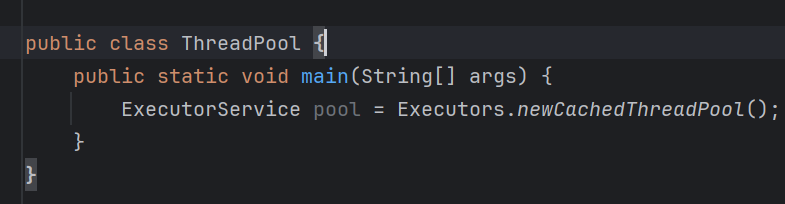

### 2.1.1 submit()

```java
public Future submit(Runnable run){};
```

> 往线程池中提交一个任务，返回一个`Future`对象。

线程池创建好后，内部只是线程对象。要执行任务，需要为线程对象提交用于执行的任务，传入的参数为`Runnable`或`Callable`：

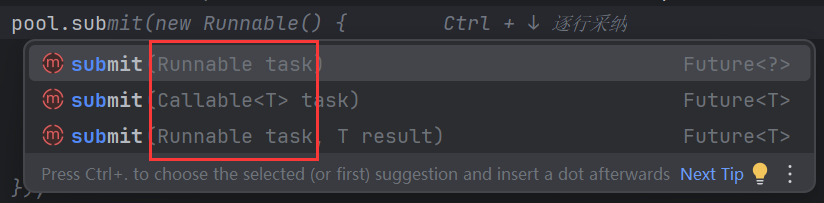

任务会自动交由**线程池**进行调度，**不需要手动调用任务的执行方法**。一旦任务被成功提交，线程池会根据当前的线程资源和任务队列的情况**自动处理任务**。

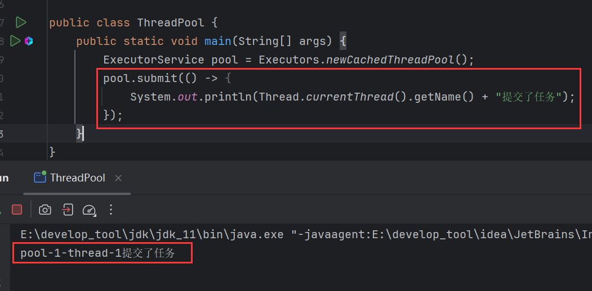

当前线程名是线程池名称+线程默认名。

### 2.1.2 shutdown()

```java
public void shutdown(){};
```

> 关闭线程池。

线程池默认是不会关闭的：

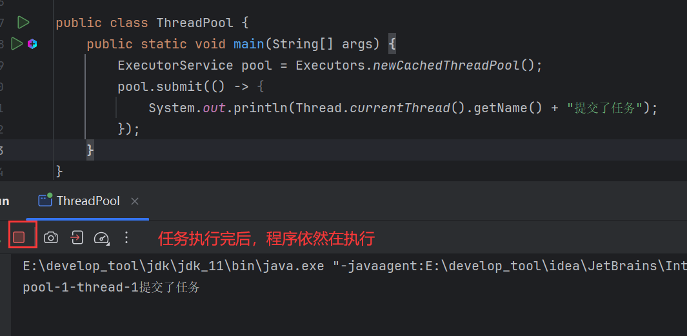

这很好理解，因为即便一个任务执行完，可能还要下一个任务要执行，需要提供给其他任务。

但是可以手动关闭：

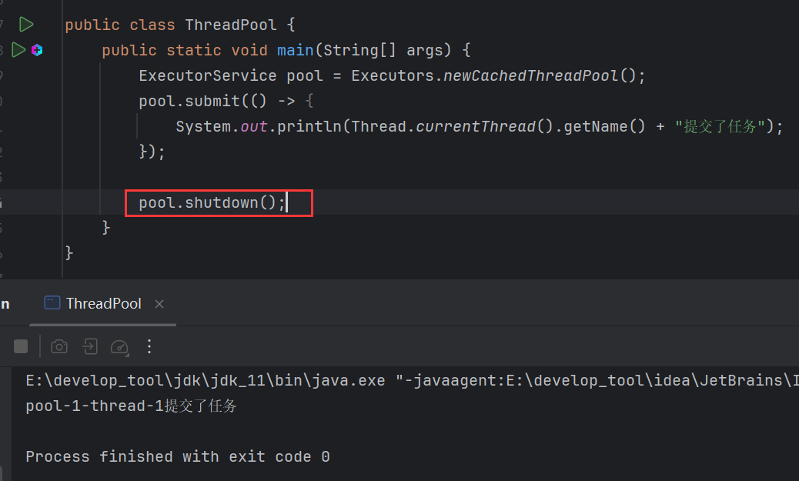

### 2.1.3 线程对象复用

线程对象复用现象，循环提交300个任务：

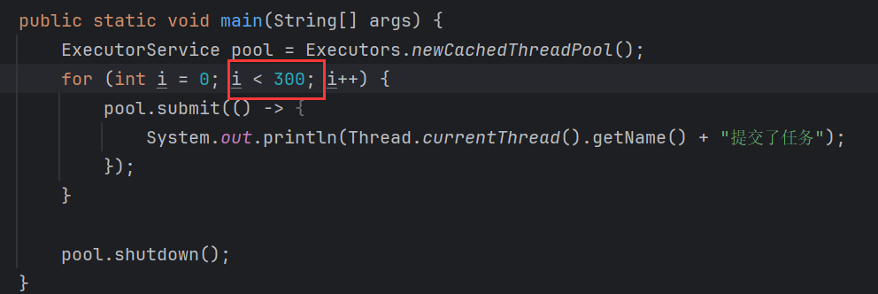

线程对象被重复使用：

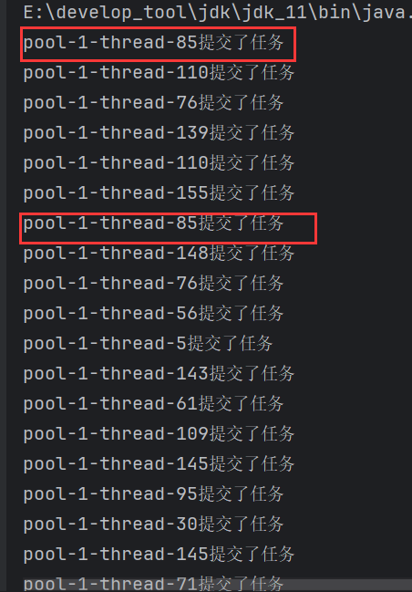

### 2.1.4 最大线程数

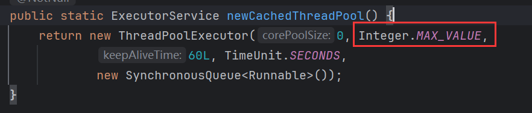

源码中返回一个`ThreadPoolExecutor`，这就是一个线程池对象。通过源码可以看到，第2个参数传入一个数字，这个就是指定线程对象的数量，`Integer.MAX_VALUE`是java中整型的最大值，有20多个亿。

不推荐使用`newCachedThreadPool()`来创建线程池，因为它创建的线程池，最大数量有20多亿，没有必要创建这么多。

## 2.2 newFixedThreadPool()

```java
public ExecutorServer newFixedThreadPool(int num){};
```

> JDK提供的另一个创建线程池的方法，可以指定最大线程数量。

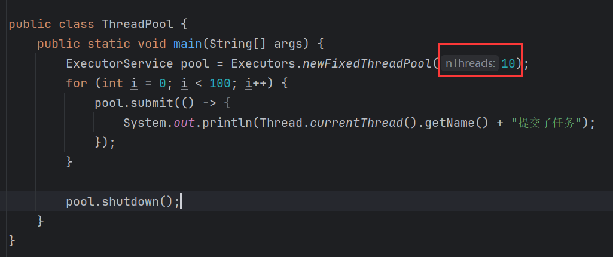

重复使用10个线程对象：

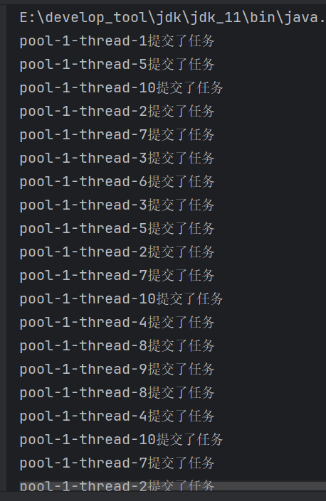

但是这种方式创建线程池也是不推荐的，因为它内部除了指定数量，还会指定其他参数：

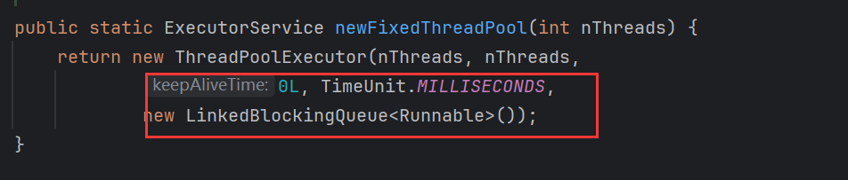

这些参数是java设定死的，无法做的灵活应对复杂的项目场景。

## 2.3 弊端

用JDK提供的方法创建线程池有以下弊端：

**一、`newCachedThreadPool()`**

允许的创建线程数量为`Integer.MAX_VALUE`，可能会创建大量的线程，从而导致OOM(内存溢出异常)。

**二、`FixedThreadPool`和`SignalThreadPool`**

允许的请求队列长度为`Integer.MAX VALUE`，可能会堆积大量的请求，从而导致 OOM。


# 3 自定义线程池

JDK提供的线程池内部的配置是写死的，多数情况下，需要根据项目的实际情况来设置对应的线程池配置。

自定义线程池就是手动创建`ThreadPoolExecutor`对象。`ThreadPoolExecutor`就是线程池对象，`newCachedThreadPool()`和`newFixedThreadPool()`返回的也是`ThreadPoolExecutor`。

`ThreadPoolExecutor`的构造方法中可以配置多种线程池参数。可以根据实际情况灵活创建线程池。

## 3.1 ThreadPoolExecutor

```java
new ThreadPoolExecutor(
	int corePoolSize,
    int maximumPoolSize,
    long keepAliveTime,
    TimeUnit tu,
    BlockingQueue<Runnable> workQueue,
    ThreadFactory threadFactory,
    RejectedExecutionHandler handler
){};
```

> 构造，创建线程池，同时根据传入的参数配置线程池。

这个构造是配置项最多的构造，其中7个参数介绍如下：

- corePoolSize：核心线程数
- maximumPoolSize：最大线程数量
- keepAliveTime：空闲时间
- TimeUnit：空闲时间的单位
- workQueue：任务队列
- threadFactory：线程对象任务工厂
- handler：拒绝策略

### 3.1.1 核心线程数

如果将线程池理解为饭店，那么核心线程数就可以理解为正式员工。有正式员工就有临时员工，线程也一样，有核心线程就有临时线程。

无论饭店（线程池）有多忙或不忙，正式员工是稳定存在的。这对应于线程池的**核心线程数**，这些线程会始终保持在池中，即使没有任务可做，核心线程通常不会被销毁。

在旺季（任务繁多）时，正式员工忙不过来，老板会雇佣临时员工。这类员工可以快速加入工作，帮助处理任务。对于线程池来说，当任务量超过核心线程处理能力时，线程池会动态创建**非核心线程（临时线程）**来处理更多任务。

当旺季结束，任务减少，临时员工会逐渐被裁掉（对应于线程池的**空闲线程超时机制**），即：如果临时线程在一段时间内没有任务处理，它们将被销毁。

### 3.1.2 最大线程数量

就是核心线程数+临时线程数，是线程池中允许同时存在的**最大线程数**。

### 3.1.3 空闲时间

针对于临时线程，当临时线程有一段时间没有任务执行，且这段时间超过了空闲时间，线程池就会销毁临时线程。所以空闲时间实际上是设置临时线程的存活时间。

### 3.1.4 时间单位

设置空闲时间的单位，接收`TimeUnit`，`TimeUnit`是一个枚举类，它内部定义常用的时间单位，如：

- `NANOSECONDS`（纳秒）：表示时间单位为纳秒（10^-9 秒）。

- `MICROSECONDS`（微秒）：表示时间单位为微秒（10^-6 秒）。

- `MILLISECONDS`（毫秒）：表示时间单位为毫秒（10^-3 秒）。

- `SECONDS`（秒）：表示时间单位为秒。

- `MINUTES`（分钟）：表示时间单位为分钟。

- `HOURS`（小时）：表示时间单位为小时。

- `DAYS`（天）：表示时间单位为天。

### 3.1.5 任务队列

当饭店的员工都在服务客人时，又来了一批新的客人，只能让他们排队等待。

如果所有的核心线程和临时线程都在处理任务时，新的任务（顾客）只能排队等待。任务排队的地方就是任务队列。

任务队列是线程池中管理任务的关键部分，它决定了新任务的处理顺序和方式。同时指定最大排队数量。

任务队列分为两种：

- 有界队列
- 无界队列

见名知意，有界队列就是有界限的队列，需要指定最大排队数量，最多允许多少个任务排队。通过`ArrayBlockingQueue`的构造创建，传入最大排队数。

无界队列就是没有界限的队列，它不需要指定数量，通过`LinkedBlockingQueue`构造创建，但它并非真的没有界限，它的最大排队数为`Integser.MAX_VALUE`，即整型的最大值：

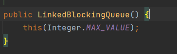

### 3.1.6 线程对象任务工厂

线程对象任务工厂专门负责创建线程对象，可以理解为饭店招聘员工的渠道。由这个工厂来生产线程对象。

一般采用`Executors`提供的默认线程工厂：

```java
Executors.defaultThreadFactory()
```

### 3.1.7 拒绝策略

当**任务队列**已满，并且线程池中的线程（核心线程和临时线程）都在忙于执行任务时，新的任务无法进入队列，此时就需要**拒绝策略**来处理这些多余的任务。拒绝策略定义了在线程池无法接收新任务时，应该如何处理这些任务。

`ThreadPoolExecutor`内部定义了拒绝策略，通过调用它提供的<font color=red>**静态内部类**</font>：

|           策略选项(内部类构造)           |                       说明                       |
| :--------------------------------------: | :----------------------------------------------: |
|     ThreadPoolExecutor.AbortPolicy()     | 丢弃新任务，抛出`RejectedExecutionException`异常 |
|    ThreadPoolExecutor.DiscardPolicy()    |             丢弃新任务，但不抛出异常             |
| ThreadPoolExecutor.Discard0ldestPolicy() |       抛弃等待最久的任务，将新任务加入队列       |
|  ThreadPoolExecutor.CallerRunsPolicy()   |     调用任务的run( )方法，绕过线程池直接执行     |

`ThreadPoolExecutor.AbortPolicy()`是默认拒绝策略，也推荐使用这种策略，因为抛出异常方便优化。

## 3.2 演示

创建线程池：

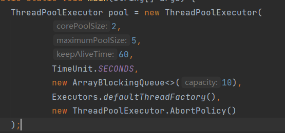

核心线程数为2，最大线程数为5，空闲时间为60秒，任务队列最大排队数为10，使用默认线程工厂，和默认拒绝策略。

同样使用`submit()`来提交任务：

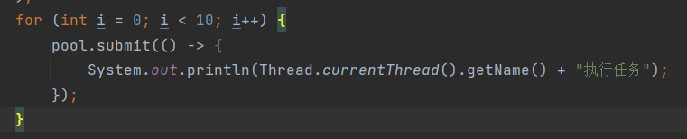

结果：

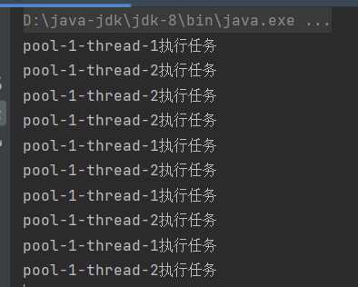

### 3.2.1 细节1

目前只有核心线程在工作，并没有创建临时线程，增加任务：

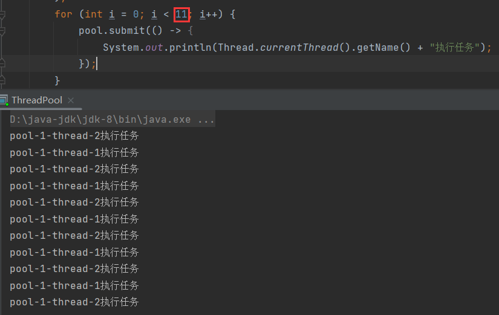

依然没有临时线程，再次增加：

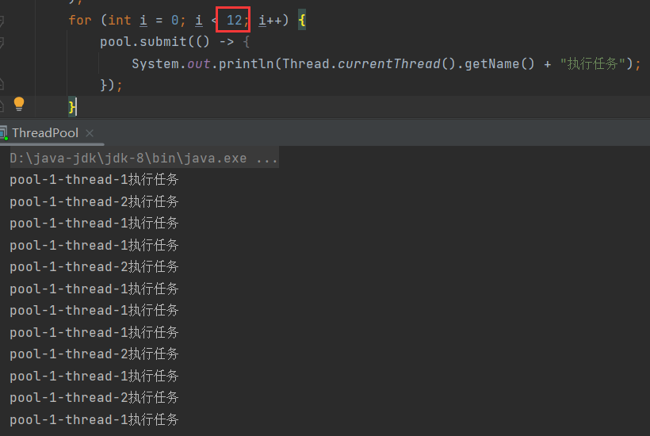

也没有，再次增加：

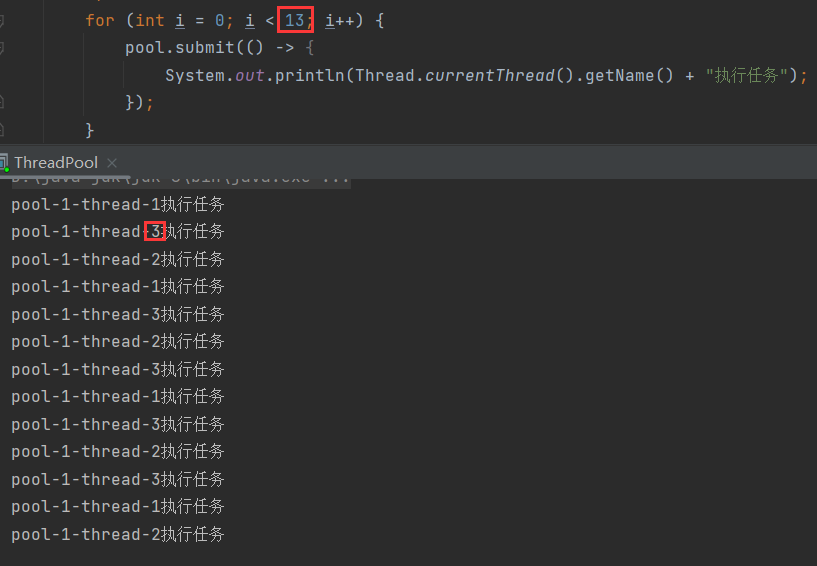

创建了临时线程，这是第一细节：

> 当 任务数量 > 核心线程数 + 最大排队数 时，线程池才会创建临时线程。

### 3.2.2 细节2

当前核心数为2，任务队列最大排队数为10，一共创建13个任务，13 > 2 + 10，因此创建了临时线程。

若再次增加任务：

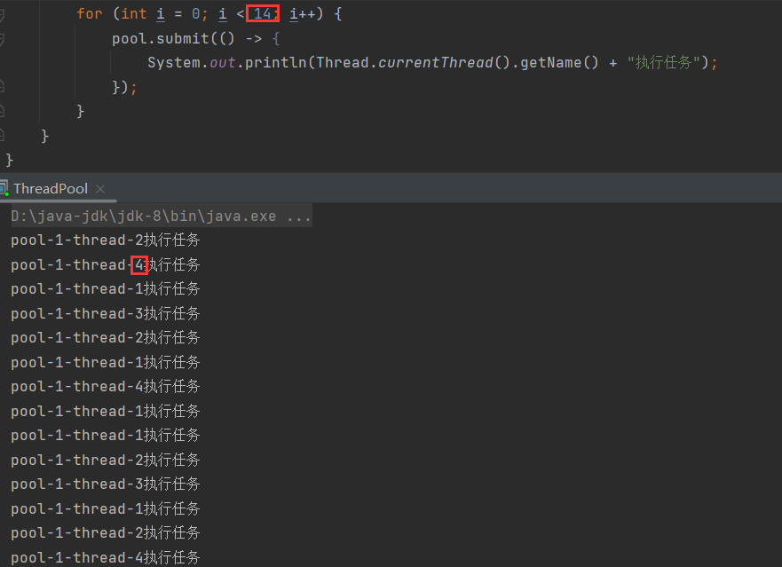

则再次创建临时线程，再次增加任务：

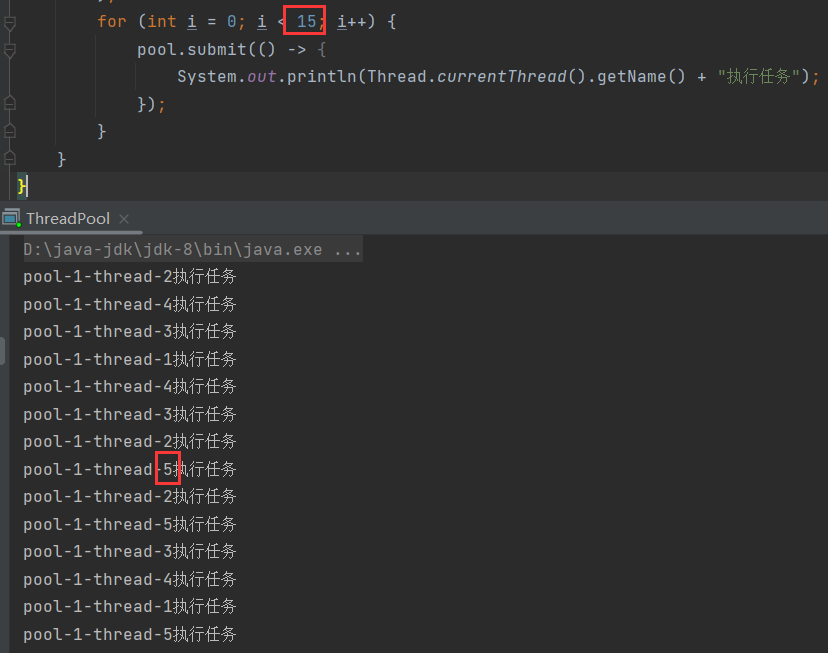

再次创建临时线程，此时一共有5个线程，2个核心线程，3个临时线程，线程池的线程数已经满了。若再次增加任务：

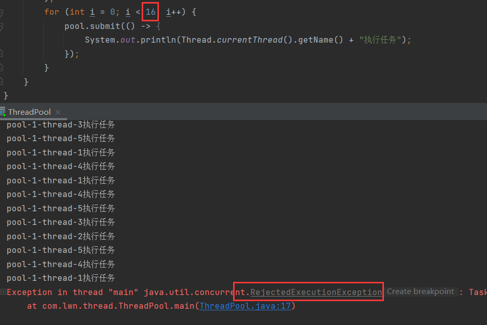

则会抛出异常。因为当前任务队列以满，也没有空余的线程来执行新任务，所以会拒绝任务，根据拒绝策略，将抛弃新任务，并抛出异常。

虽然抛出了异常，但并不影响其他线程的执行：

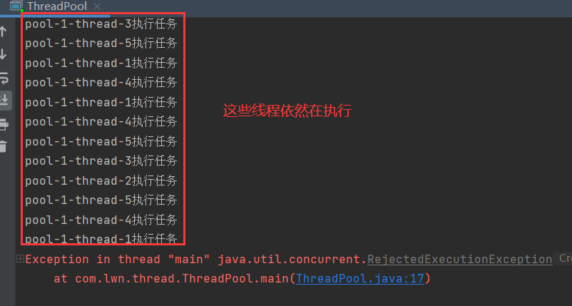

这就是第二个细节：

> 当 任务数量 > 最大线程数 + 最大排队数 时，会拒绝任务，按照拒绝策略执行。

**总结**：

- 任务数量 > 核心线程数 + 最大排队数 时创建临时线程。

- 任务数量 > 最大线程数 + 最大排队数 时开启拒绝策略。

### 3.2.3 注意

- 核心线程数不能 < 0，至少需要一个线程来工作。
- 最大线程数不能 <= 0，且必须 >= 核心线程数。
- 空闲时间不能 < 0
- 任务队列不能为`null`
- 线程任务工厂不能为`null`
- 拒绝策略不能为`null`