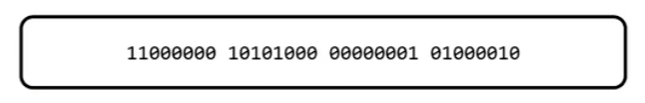
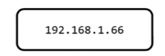
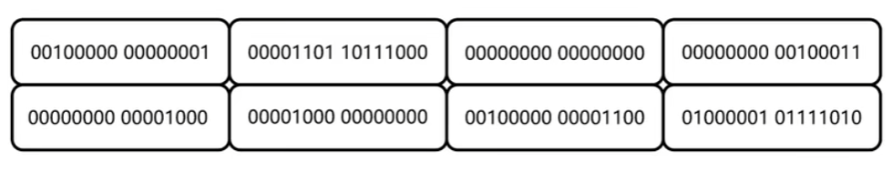
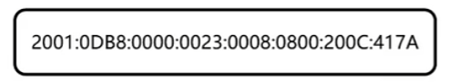
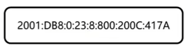
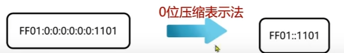
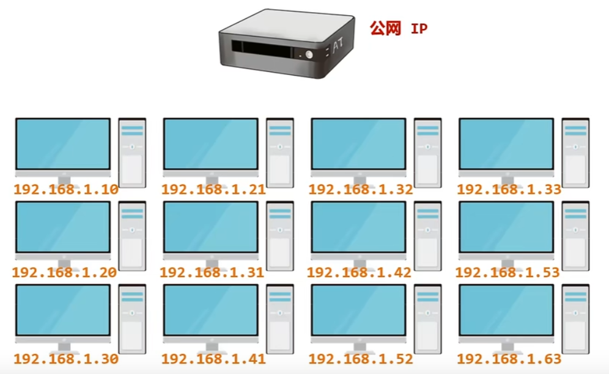
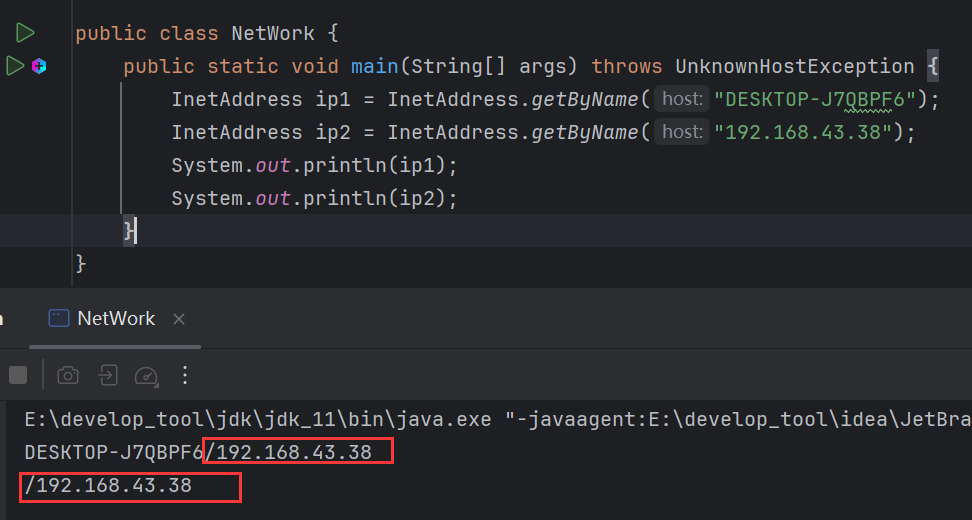
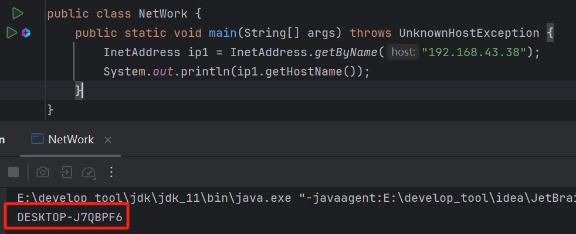
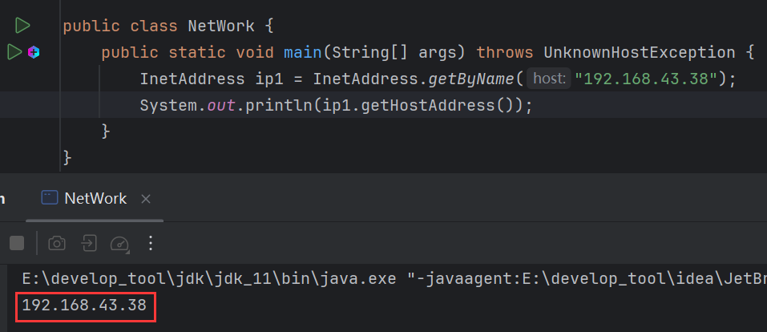

# 1 网络编程

指在<font color=red>网络通信协议</font>下，不同计算机上运行的程序，进行数据传输。


# 2 软件架构分类

- CS架构
- BS架构

CS架构：即Client Server(客户端 服务端)，在用户本地有一个客户端程序，在远程有一个服务器程序。

CS架构优缺点：

- 优点：画面精美，功能丰富用户体验度更高
- 缺点：
  - 需要开发客户端，也需要开发服务端
  - 用户需要下载和更新的时候太麻烦

BS架构：即Browser Server (浏览器端 服务器端)，只需要一个浏览器，用户通过不同的网址，访问不同的服务器端程序。

优缺点：

- 优点：
  - 不需要开发客户端，只需要开发服务端
  - 用户不需要下载，打开浏览器就能使用
- 缺点：如果应用过大，用户体验会受到影响


# 3 网络编程3要素

- IP：设备在网络中的唯一标识
- 端口：程序在设备中的唯一标识
- 协议：数据在网络中传输的规则，常见的协议有UDP、TCP、http、https、ftp

## 3.1 IP

IP全称：Internet Protocol，是互联网协议地址，也称IP地址，是分配给上网设备的数字标签。简单来说就是上网设备在网络上的地址，是唯一的。

IP分为两种：

- IPv4
- IPv6

**IPv4**：

全称：Internet Protocol version 4，互联网通信协议第四版，采用32位地址长度，分成4组。

一共32比特位，分4组，一组8位，8位为1字节，一共4个字节。

内部由2进制组成：



为了方便连通，这组2进制数据采用了点分10进制的表示法来表示：



也就是平时经常看见的IP地址。

**IPv6**：

全称：Internet Protocol version 6，互联网通信协议第六版。由于互联网的蓬勃发展，IP地址的需求量愈来愈大，而IPv4的模式下IP的总数是有限的，所以推出了IPv6，IPv6采用128位地址长度，分成8组。



每组16位，一组2字节，一共8组，总共16字节。

为了方便查看，IPv6采用冒分16进制表示法展示：



这个表示法存在一个省略规则，如果这个数的前位为0，那么可以省略：



如果4个数都是0，那么以0表示。

若中间有多个连续的0，则采用0位压缩法表示：



### 3.1.1 IPv4地址分类形式

IPv4目前分为公网地址(万维网使用)和私有地址(局域网使用)。

以192.168.开头的就是私有地址，范围即为192.168.0.0—192.168.255.255专门为组织机构内部使用，以此节省IP。

比如网吧中有多台电脑，但是不可能为每台电脑都分配一个IP地址，真正的做法是采用一个交换机，交换机连接公网IP，它分配给下面的电脑的IP就是私网IP：



### 3.1.2 特殊IP

127.0.0.1：也可以是localhost是回送地址也称本地回环地址，也称本机IP，永远只会寻找当前所在本机。

### 3.1.3 IP和网址

在浏览器中输入网址并不是直接访问这个网址对应的服务器，而是先访问DNS服务器，由DSN服务器解析网址，然后返回网址对应的IP地址，接着浏览器再去访问这个IP，才能真正访问到目标服务器。

## 3.2 端口号

端口号是应用程序在设备中唯一的标识。

端口号由两个字节表示的整数，取值范围：0~65535。

其中0~1023之间的端口号用于一些知名的网络服务或者应用。自己使用1024以上的端口号就可以。

<font color=red>**注意**</font>：一个端口号只能被一个应用程序使用。

## 3.3 协议

计算机网络中，连接和通信的规则被称为网络通信协议。

**UDP协议**：

- 用户数据报协议(User Datagram Protocol)，UDP是<font color=red>面向无连接通</font>信协议。
- 速度快，有大小限制一次最多发送64K，数据不安全，易丢失数据。

> 所谓面向无连接，就是不管有没有连接成功，不管有没有对方，都能发出数据。

**场景**：

- 网络会议
- 语言通话
- 在线视频

**TCP协议**：

- 传输控制协议TCP(Transmission Control Protocol)，TCP协议是<font color=red>面向连接</font>的通信协议。
- 速度慢，没有大小限制，数据安全。

> 面向连接，就是确保成功连接到对方，才可以发送数据。

**场景**：

- 下载软件
- 文字聊天
- 发送邮件

# 4 InetAddress

【InetAddress】是java提供的类，表示IP地址。提供对IP地址的获取和操作方法。

## 4.1 getByName()

```java
public static InetAddress getByName(String host){};
```

> 将IP封装为【InetAddress】。还可以传入主机名进行封装。



## 4.2 getHostName()

```java
public String getHostName(){};
```

> 获取此IP地址的主机名。



## 4.3 getHostAddress()

```java
public String getHostAddress(){};
```

> 返回文本显示中的IP地址字符串。

