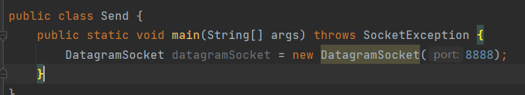
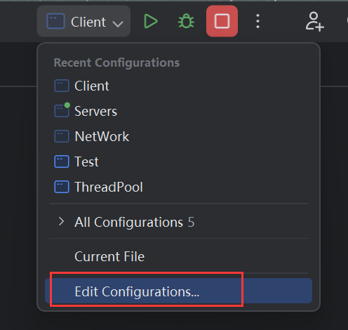
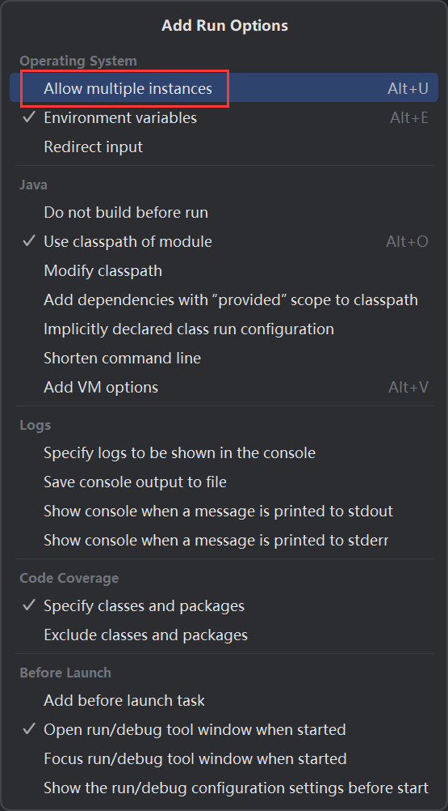

# 1 UDP收发数据

`DatagramSocket`：站点，驿站对象。

`DatagramPacket`：数据包，包裹对象。

## 1.1 发送数据

步骤如下：

1. 创建`DatagramSocket`对象，用于发送数据。
2. 打包数据，即将数据封装在`DatagramPacket`对象中。
3. 调用`DatagramSocket`的`send()`发送数据。
4. 关闭资源，因为底层采用流来发送是数据。

以发快递来举例，`DatagramSocket`可以理解为驿站，发送包裹的地方。在发送快递前，需要对东西进行打包，数据也一样，在发送前也要对数据进行打包，将其封装在`DatagramPacket`。打包好后，驿站会发车将包裹送往目的地，这一步就对应`send()`方法，将数据发送到目的地，最后关闭资源。

## 1.2 接收数据

步骤如下：

1. 创建`DatagramSocket`对象，用于接收数据。
2. 创建数据包对象`DatagramPacket`。
3. 调用`DatagramSocket`的`receive()`接收发送过来的数据，将数据封装到`DatagramPacket`中。
4. 从`DatagramPacket`中解析出数据
5. 关闭资源。

`DatagramSocket`是驿站，那么它不止能发生数据，还能接收数据，要接收数据的前提是需要有一个地方来接收，所以要创建`DatagramSocket`。然后调用`receive()`接收数据，也就是接收到包裹，包裹是`DatagramPacket`，数据封装在其中，需要将数据拿出来，这个过程就是解析数据，最后再关闭资源。

## 1.3 示例

首先创建发送方站点：

在创建`DatagramSocket`时需要指定端口号，如果没有指定，那么其底层会随机创建一个端口号：

接下来就是准备数据，然后打包数据：

`DatagramPackte`的构造器有很多种：

采用倒数第二种封装数据：

它接收4个参数：

- 字节数组。
- 数据大小。
- IP地址，需要将IP封装为`InetAddress`对象。
- 端口号。

数据需要转换为字节数组才能封装到`DatagramPacket`中。

快递在打包的时候需要称重，数据大小就可以理解为包裹重量。

在发送快递时，需要指定快递的收件地址，这里的 `InetAddress` 对象就是数据包要发送的目标IP地址，它决定了数据将要发送到哪里。

端口对应的则是具体收件人。

收货地址就是本地主机，而收件人就是占用9999端口的程序。

然后调用`send()`，包裹装车发货，将数据发送出去：

最后释放资源：

演示：

因为UDP是面向无连接协议，所以即使没有接收方，也不会报错：

下面是接收方：

同样需要创建一个`DatagramSocke`，快递包裹依然需要驿站来接收：

指定端口为9999，然后调用`receive()`接收并解析包裹：

`receive()`需要传入`DatagramPacket`作为参数：

因此需要提前准备好`DatagramPacket`来接收数据，此时需要用到第一种构造器：

传入接收数据的数组以及这个数组的大小：

数据解析到字节数组中：

将字节数组转换为字符串：

最后关闭资源：

接下来启动两个站点，首先启动接收方，确保发送方发出数据，接收方一定能接收到数据：

发送方发送：

接收方接收：

打印出现乱码，是因为发送的内容没有填满字节数组，导致字节数组无效部分被解析为乱码，可以调用`DatagramPacket`的`getLength()`获取数据的有效长度：

### 1.3.1 注意

`receive()`方法会阻塞线程，直到接收到数据，这也是为什么，接收方在未接收到数据之前程序会一直等待：

如果要拿到发送方的地址，可以用接收方的数据包对象，就像收快递，快递上不止有收获地址，还有发货地址：

# 2 聊天室

按照下面的要求实现程序：

UDP发送数据：数据来自于键盘录入，直到输入的数据是886，发送数据结束。

UDP接收数据：因为接收端不知道发送端什么时候停止发送，故采用死循环接收。

客户端：

服务端：

效果：

模拟多人聊天场景，客户端多开：

启动单程序多开：

多客户端：

但是抛出了端口占用异常，因为站点绑定的端口写死：

多个程序绑定相同端口导致。

因此不写端口，让它随机绑定，即可解决：

效果：

