# 1 TCP协议

面向连接协议。

客户向服务端发送请求，服务端需要响应客户端才能建立连接。

## 1.1 步骤

TCP与UDP不同，TCP严格区分客户端和服务端，即所创建的对象不同。

**客户端步骤**：

1、创建【Socket】对象，指定连接的服务端IP和端口。

2、通过【Socket】获取传输数据的流对象。

调用方法【getOutputStream()】，获取【OutputStream】。

调用方法【getInputStream()】，获取【InputStream】。

**注意**：此处的输入流和输出流不再关联文件，而是关联服务端：

- 输出流：向服务端发送数据。
- 输入流：从服务端读取数据。

3、通过流对象收发数据。

4、释放资源。

**服务端步骤**：

1、创建【ServerSocket】对象，指定端口号。

2、调用【accpet()】响应客户端的请求，响应成功返回【Socket】对象。

3、通过这个【Socket】获取传输数据的流：

这里的流关联的是客户端：

- 输出流：向客户端发送数据。
- 输入流：从客户端读取数据。

4、通过流对象收发数据。

5、释放资源。

## 1.2 演示

首先是客户端，创建【Socket】指定连接的IP和端口：

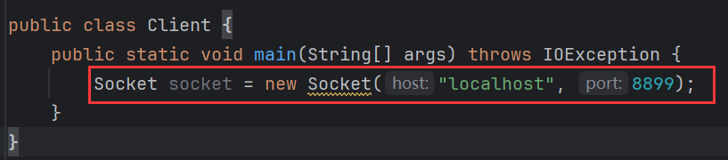

创建流对象：

向服务端写入数据：

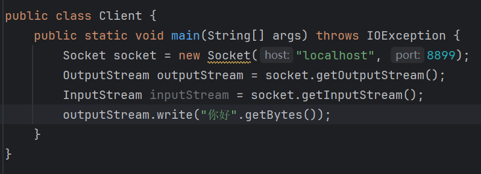

然后是服务端：

创建【SocketServer】，指定端口：

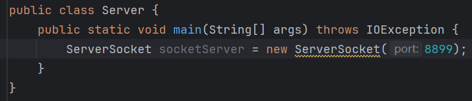

响应客户端的请求：

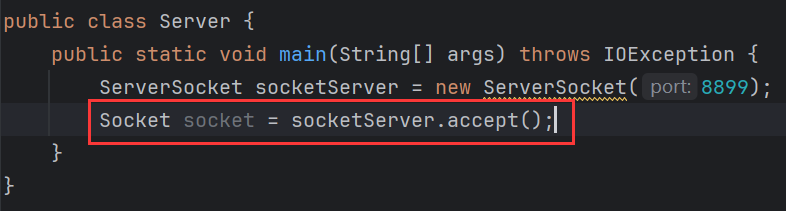

获取流对象：

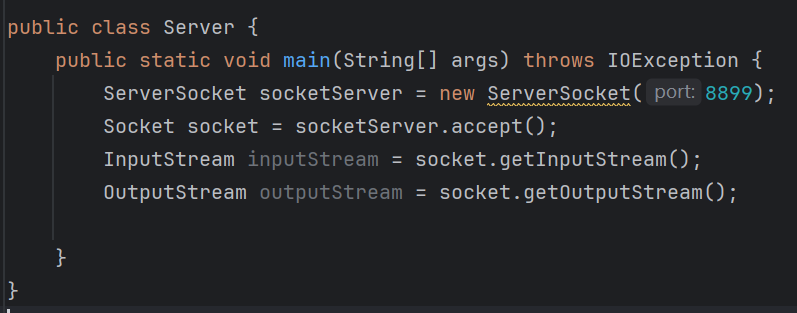

读取客户端发送的数据：

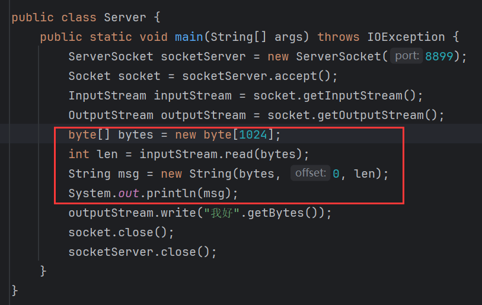

向客户端写入数据：

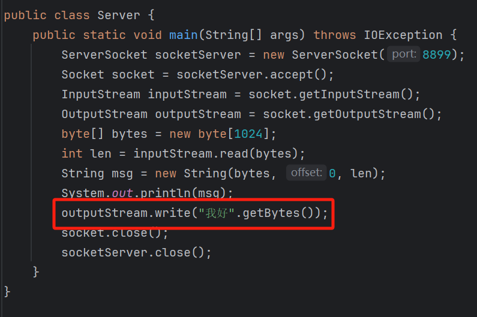

关闭资源：

【socket.close()】是关闭客户端连接，【socketServer.close()】是关闭服务器。

客户端读取服务端发送的数据：

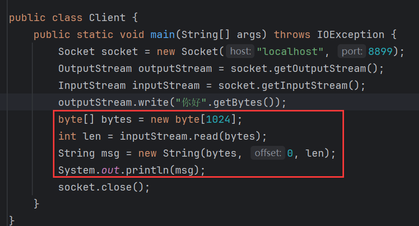

关闭资源；

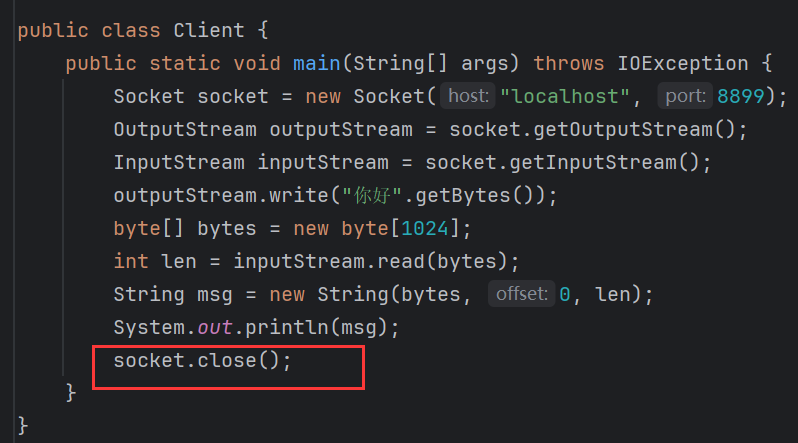

效果：

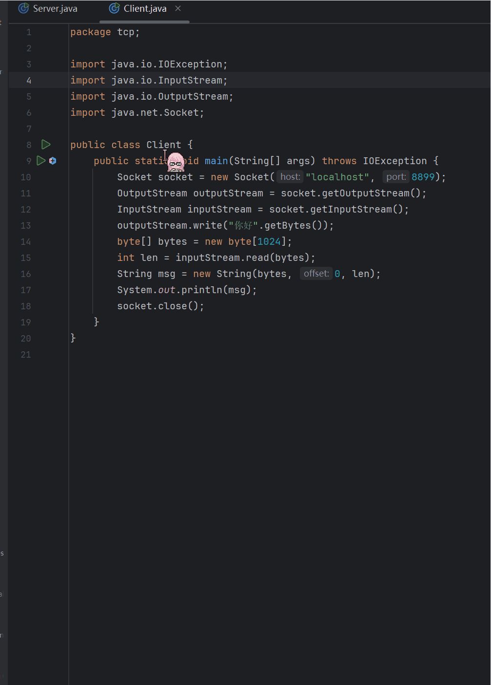

服务端通过【socket】调用【getInetAddress()】可以拿到客户端的IP对象：

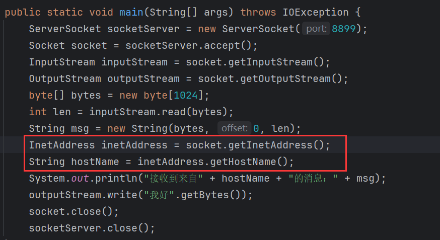

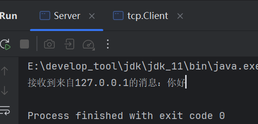