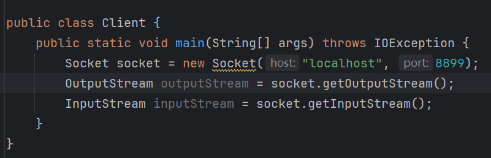
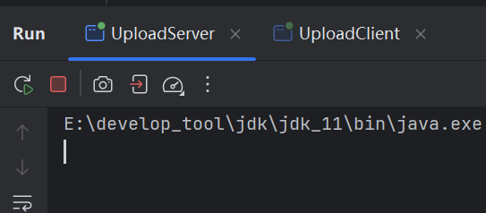
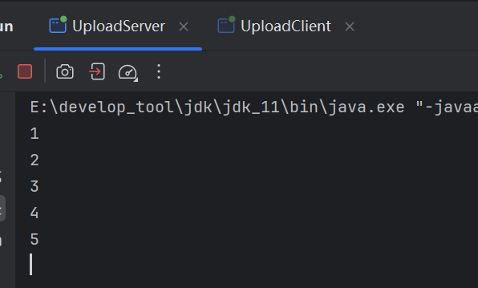

# 1 TCP协议

面向连接协议。

客户向服务端发送请求，服务端需要响应客户端才能建立连接。

## 1.1 步骤

TCP与UDP不同，TCP严格区分客户端和服务端，即所创建的对象不同。

**客户端步骤**：

1、创建`Socket`对象，指定连接的服务端IP和端口。

2、通过`Socket`获取传输数据的流对象。

调用方法`getOutputStream()`，获取`OutputStream`。

调用方法`getInputStream()`，获取`InputStream`。

<font color=red>**注意**</font>：此处的输入流和输出流不再关联文件，而是关联服务端：

- 输出流：向服务端发送数据。
- 输入流：从服务端读取数据。

3、通过流对象收发数据。

4、释放资源。

**服务端步骤**：

1、创建`ServerSocket`对象，指定端口号。

2、调用`accpet()`响应客户端的请求，响应成功返回`Socket`对象，这一步是两端建立连接。

3、通过这个`Socket`获取传输数据的流：

这里的流关联的是客户端：

- 输出流：向客户端发送数据。
- 输入流：从客户端读取数据。

4、通过流对象收发数据。

5、释放资源。

> 用`Socket`获取的流对象，可以理解为网络IO，与文件IO的操作类似，但是在细节上有区别。

## 1.2 演示

首先是客户端，创建`Socket`指定连接的IP和端口：


创建流对象：



向服务端写入数据：


然后是服务端：

创建`SocketServer`，指定端口：


响应客户端的请求：


获取流对象：


读取客户端发送的数据：


向客户端写入数据：


关闭资源：

`socket.close()`是关闭客户端连接，`socketServer.close()`是关闭服务器。

客户端读取服务端发送的数据：


关闭资源；


效果：


服务端通过`socket`调用`getInetAddress()`可以拿到客户端的IP对象：


# 2 TCP握手和挥手

TCP的握手和挥手为：

- 三次握手(建立连接)
- 四次挥手(断开连接)

## 2.1 三次握手

客户端向服务端发送请求(第一次握手)。

服务端接收到请求，会向客户端响应请求(第二次握手)。

响应之后，由客户端再次发送一个确认的请求到服务端，连接才会建立(第三次握手)。

第一次握手，客户端发送的是`SYN`(读音同森)包：


第二次握手，服务端接收到`SYN`包，会向客户端发送一个`ACK`(读音同阿克)包，连同发送过来的`SYN`一起：


客户端收到`ACK`包，会再次将`ACK`发送给服务端：


服务端收到才能建立连接。

如果服务端能接收到`SYN`包，说明客户端发送没有问题，服务端接收没有问题。

如果客户端接收到`SYN`+`ACK`包，说明服务端发送没有问题，客户端接收没有问题。

Q：两次握手就能测出两端的接收能力有没有问题，按理来说，两次握手就完全可以建立连接，为什么要第三次握手？

A：假设是两次，客户端向服务端发送`SYN`包，但是这个包由于网络拥堵，滞留在某个节点，没有发送到服务器。


这时，客户端就会再次发送一个`SYN`包。如果第二个发送成功，那么服务端就会响应`SYN`+`ACK`包：


在二次握手的情况下，此时以建立连接：


但是，之前滞留的`SYN`包突然又成功发送到服务端，那么服务端又会发送`SYN`+`ACK`包给客户端。


此时，服务端认为是两次连接，而客户端，只认为是一次连接，因为之前的`SYN`没有发送成功，重新发送后，之前发送的连接是失效的。

那么对于服务端而言，这第二次连接就造成了不必要的消耗，浪费了资源。

如果是三次握手，需要客户端将`ACK`包发送回服务端，才算是建立连接，如果此时滞留的`SYN`包成功发送到服务端，那么服务端会响应`SYN`+`ACK`包给客户端，但是客户端认为之前滞留的请求是无效的，就不会发送`ACK`包给服务端，服务端接收不到`ACK`包，就不会与客户端建立连接。

所以，三次握手确保准确连接，不会造成资源浪费。

## 2.2 四次挥手

> 四次挥手确保连接断开，且数据处理完毕。

客户端向服务端发送取消连接的请求：


服务端收到请求，但不会直接断开，而是响应给客户端表示收到客户端的取消请求，但是为了保证数据传输完毕，需要客户端等待一会儿：


当服务端将最后的数据处理完毕后，就会再次给客户端响应一个确认取消的消息：


最后，客户端也发送一个确认取消的请求，连接断开：


# 3 文件上传案例

通过TCP，模拟网络文件上传。

客户端上传本地文件，服务端接收。

首先创建客户端，客户端需要网络流IO向服务端传输数据，还需要文件IO从文件和磁盘之间读写数据：


服务端：


客户端上传文件，需要提供文件名以及文件内容，先写出文件名到服务端：

为了方便写出，将字节流转换为字符流，这样能直接以字符串写出：


客户端接收文件名，采用字符缓冲流读取，可以一次性读取一行文本：


拿到文件名，服务端返回一个标识给客户端，客户端通过标识来决定是否开始上传文件：


服务端接收数据，写入到本地目录中：


客户端打印响应结果：


最后关流；


执行：




客户端和服务端都卡主了。

下面分析原因，首先能卡住的地方就是客户端可能没有与服务端建立连接：


测试：


有结果打印，说明连接正常。

## 3.1 readLine()阻塞问题

接着分析，在`readLine()`这里很有可能卡住：


如果没有读到数据，或者没有读取到换行符，那么`readLine()`可能还会卡住：

测试：


很显然，卡在`readLine()`这里。为什么会卡住？这是因为`readLine()`是读取一行文本，当读取到换行符才会结束读取，如果没有换行符就会卡住，在第7章有说明：


而客户端写入文件名时，并没有写入换行符：


导致服务端在读取时阻塞。

> 使用网络流写入字符串时，如果用`readLine()`文本，务必写入换行符，否则会造成阻塞。

写出换行符：


效果：


## 3.2 flush()未刷出问题

依然卡住，为什么？

因为字符流内置数组，如果数据没有装满数组，那么不会自动写出，除非关流或调用`flush()`，所以：


效果：


文件名读取成功，但是程序依然卡住，原因还是因为换行符和刷出，这次出现在标识符这一步：


如法炮制：


还有其他地方：


再次运行：


## 3.3 网络IO未关闭问题

依然卡住，接着分析发现在上传文件这里也会卡住：


如果`while`一直不退出，也会造成阻塞，测试：


结果：



确实是`while`卡住了，为什么`while`没有停止？循环终止条件是读取到-1，说明没有读取到-1。-1是在文件IO中读取到文件末尾的结束标记，而在网络IO中没有关联文件，所以网络IO无法读到-1。既然没有-1标记，那么就制造一个标记，在客户端写入完毕后，客户端需要手动写出一个结束标记：

### 3.3.1  shutdownOutput()

```java
public void shutdownOutput(){}
```

> `Socket`的方法，关闭网络输出流管道，简单来说就是给出一个结束标记-1。


再次执行：


上传成功：


## 3.4 文件名重复问题

如果多个客户端上传同名文件，导致文件名重复，出现文件覆盖问题，可以使用`UUID`类来解决：


`UUID`生产随机性较高的字符串。

用`UUID`当作文件名：


每次上传的文件名就是随机的，避免文件覆盖：


## 3.5 多线程上传

客户端不可能只有一个，若多个用户同时上传，那么必须采用多线程处理，否则若第一个用户上传大文件，那么其他用只能排队。

服务端是不会关闭的，会一直运行：


一个上传就是一个任务，所以可以定义一个上传任务类：


将处理上传的逻辑迁移过来：


在服务端，开启线程：


处理报错：


但是没有`ServerSocket`：


因为`ServerSocket`在服务端获取，像这种本类中需要用到的资源在其他类中，可以采用通用的解决方法，就是在本来中定义资源然后用构造来初始化：


效果：


## 3.6 线程池优化

手动创建线程开销很大，所以用线程池优化；


